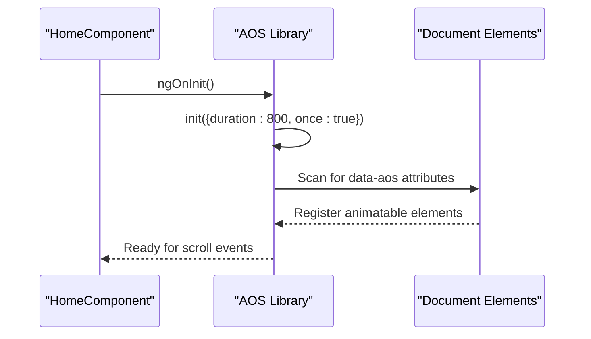
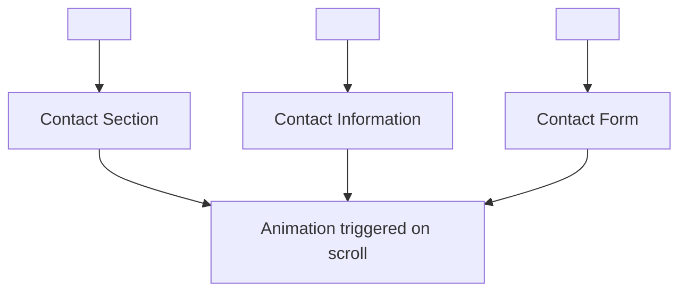
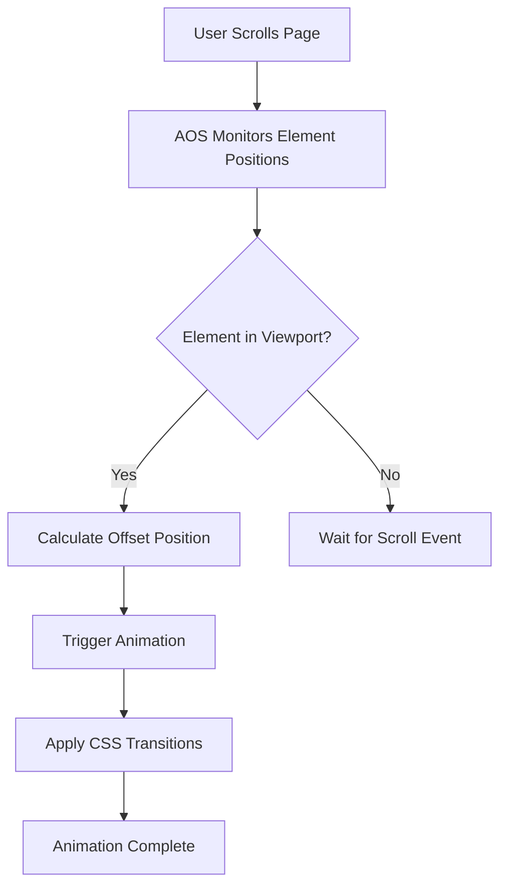
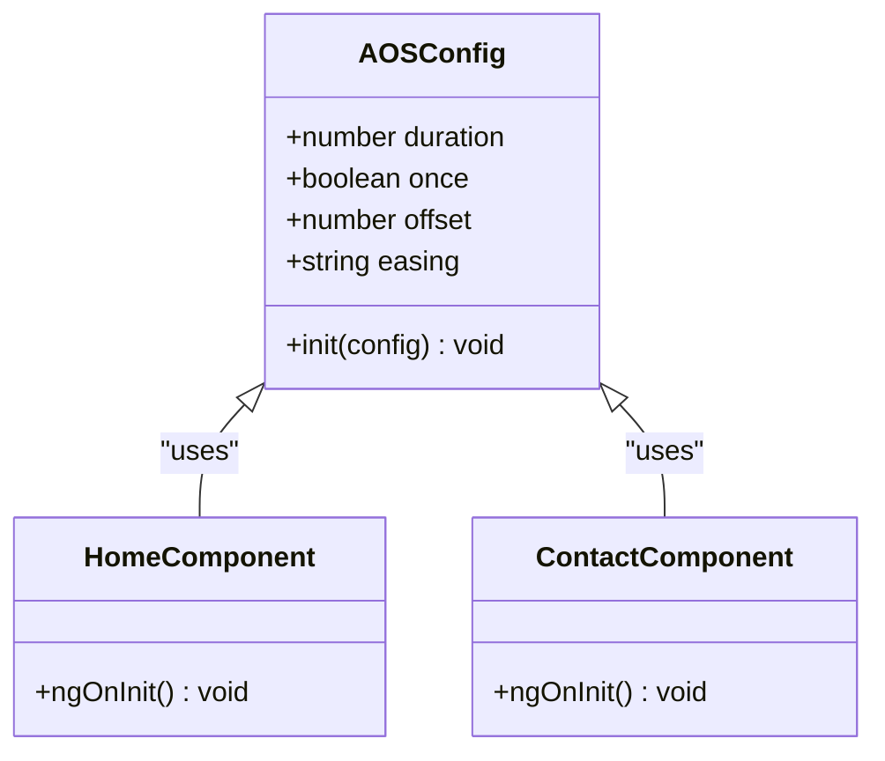
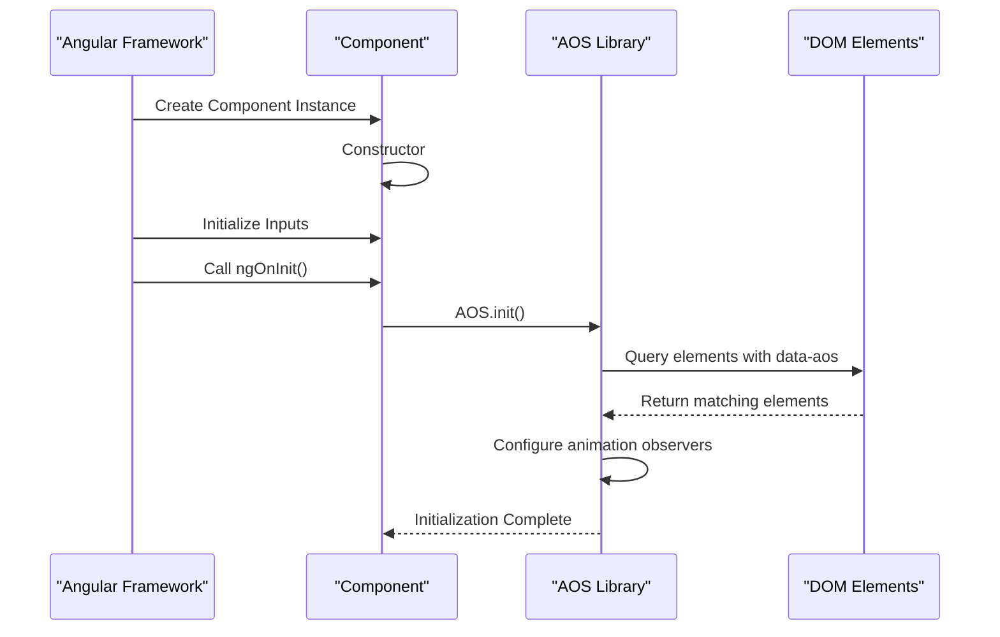

# Animation System (AOS Integration)

<cite>
**Referenced Files in This Document**   
- [home.component.ts](file://src/app/home/home.component.ts)
- [home.component.html](file://src/app/home/home.component.html)
- [contact.component.ts](file://src/app/contact/contact.component.ts)
- [contact.component.html](file://src/app/contact/contact.component.html)
- [scroll.service.ts](file://src/app/home/service/scroll.service.ts)
- [package.json](file://package.json)
- [styles.scss](file://src/styles.scss)
</cite>

## Table of Contents
1. [Introduction](#introduction)
2. [AOS Initialization and Configuration](#aos-initialization-and-configuration)
3. [Animation Implementation in Templates](#animation-implementation-in-templates)
4. [Scroll Position and Animation Triggering](#scroll-position-and-animation-triggering)
5. [AOS Configuration Options](#aos-configuration-options)
6. [Animation Patterns Across Pages](#animation-patterns-across-pages)
7. [Lifecycle Integration with Angular](#lifecycle-integration-with-angular)
8. [Common Issues and Solutions](#common-issues-and-solutions)

## Introduction
The KVS Furniture website implements scroll-triggered animations using the AOS (Animate On Scroll) library to enhance user experience with dynamic visual effects. This documentation details the integration, configuration, and implementation of AOS across the Angular application, focusing on how animations are triggered by scroll position and configured for optimal performance.

## AOS Initialization and Configuration

The AOS library is initialized in the `ngOnInit` lifecycle hook of Angular components, ensuring that animations are set up after the component's view has been rendered. The initialization occurs in both the HomeComponent and ContactComponent, with specific configuration options tailored to each page's requirements.

In the HomeComponent, AOS is initialized with a duration of 800 milliseconds and the `once` option set to true, meaning animations will only play once when elements come into view:



**Diagram sources**
- [home.component.ts](file://src/app/home/home.component.ts#L98-L102)
- [contact.component.ts](file://src/app/contact/contact.component.ts#L17-L19)

**Section sources**
- [home.component.ts](file://src/app/home/home.component.ts#L98-L102)
- [contact.component.ts](file://src/app/contact/contact.component.ts#L17-L19)

## Animation Implementation in Templates

Animations are implemented in component templates using the `data-aos` attribute, which specifies the animation type to be applied when elements enter the viewport. The attribute is added directly to HTML elements that should be animated, with various animation types used throughout the application.

The ContactComponent demonstrates multiple animation patterns in its template, using different `data-aos` values to create a staggered entrance effect:



**Diagram sources**
- [contact.component.html](file://src/app/contact/contact.component.html#L1)
- [contact.component.html](file://src/app/contact/contact.component.html#L10)
- [contact.component.html](file://src/app/contact/contact.component.html#L49)

**Section sources**
- [contact.component.html](file://src/app/contact/contact.component.html#L1-L77)
- [home.component.html](file://src/app/home/home.component.html#L1-L205)

## Scroll Position and Animation Triggering

The AOS library calculates animation triggering based on the element's position relative to the viewport. When a user scrolls and an element with a `data-aos` attribute enters the defined offset area, the animation is triggered. The library uses Intersection Observer API internally to detect when elements become visible.

The offset calculation determines how far an element must be from the viewport edge before the animation starts. Elements are animated when they reach the threshold defined by the offset, creating a smooth entrance effect as users scroll through the page.



**Diagram sources**
- [home.component.ts](file://src/app/home/home.component.ts#L98-L102)
- [contact.component.ts](file://src/app/contact/contact.component.ts#L17-L19)

**Section sources**
- [home.component.ts](file://src/app/home/home.component.ts#L98-L102)
- [contact.component.ts](file://src/app/contact/contact.component.ts#L17-L19)

## AOS Configuration Options

The AOS library is configured with specific options to control animation behavior. The primary configuration parameters used in the application include:

- **duration**: Specifies the animation duration in milliseconds
- **once**: Determines whether animations should play only once or on every scroll in/out
- **offset**: Defines the offset from the viewport edge that triggers the animation
- **easing**: Controls the timing function of the animation (not explicitly set, using default)

The configuration is applied globally to all animatable elements within a component, ensuring consistent animation behavior across related content sections.



**Diagram sources**
- [home.component.ts](file://src/app/home/home.component.ts#L98-L102)
- [contact.component.ts](file://src/app/contact/contact.component.ts#L17-L19)

**Section sources**
- [home.component.ts](file://src/app/home/home.component.ts#L98-L102)
- [contact.component.ts](file://src/app/contact/contact.component.ts#L17-L19)

## Animation Patterns Across Pages

The application implements different animation patterns across various pages to create a cohesive yet varied user experience. The HomeComponent and ContactComponent use distinct animation strategies tailored to their content types and user interaction patterns.

On the Contact page, a combination of fade-up, fade-right, and fade-left animations creates a dynamic entrance for the contact form and information sections. This staggered approach guides the user's attention through the content in a logical sequence.

```mermaid
erDiagram
ANIMATION_TYPE ||--o{ ELEMENT : "applied to"
ANIMATION_TYPE {
string name
string description
}
ELEMENT ||--o{ CONFIGURATION : "has"
ELEMENT {
string selector
string type
}
CONFIGURATION {
number duration
boolean once
number offset
}
ANIMATION_TYPE }|--|{ CONFIGURATION : "defines behavior"
ANIMATION_TYPE {
"fade-up" "Elements fade in from bottom"
"fade-down" "Elements fade in from top"
"fade-right" "Elements fade in from right"
"fade-left" "Elements fade in from left"
}
```

**Diagram sources**
- [contact.component.html](file://src/app/contact/contact.component.html#L1)
- [contact.component.html](file://src/app/contact/contact.component.html#L10)
- [contact.component.html](file://src/app/contact/contact.component.html#L49)

**Section sources**
- [contact.component.html](file://src/app/contact/contact.component.html#L1-L77)
- [home.component.html](file://src/app/home/home.component.html#L1-L205)

## Lifecycle Integration with Angular

The AOS integration is carefully timed with Angular's view rendering lifecycle to ensure animations work correctly. By initializing AOS in the `ngOnInit` lifecycle hook, the library can properly scan and configure elements after Angular has completed rendering the component's view.

This timing is crucial because AOS needs access to the DOM elements with `data-aos` attributes, which are only available after Angular has processed the component template and created the view.



**Diagram sources**
- [home.component.ts](file://src/app/home/home.component.ts#L98-L102)
- [contact.component.ts](file://src/app/contact/contact.component.ts#L17-L19)

**Section sources**
- [home.component.ts](file://src/app/home/home.component.ts#L98-L102)
- [contact.component.ts](file://src/app/contact/contact.component.ts#L17-L19)

## Common Issues and Solutions

A common issue with AOS in Angular applications is animations not triggering on route changes. This occurs because AOS is typically initialized only once when a component is first created, and subsequent visits to the same route may not reinitialize the animations.

The current implementation addresses this by initializing AOS in the `ngOnInit` hook, which is called each time the component is instantiated. However, for more complex routing scenarios, additional solutions may be required, such as:

- Manually calling `AOS.refresh()` after route changes
- Using Angular's Router events to reinitialize AOS
- Implementing a service to manage AOS lifecycle across routes

The application currently relies on component-level initialization, which works effectively for the current routing structure but may need enhancement for more complex navigation patterns.

**Section sources**
- [home.component.ts](file://src/app/home/home.component.ts#L98-L102)
- [contact.component.ts](file://src/app/contact/contact.component.ts#L17-L19)