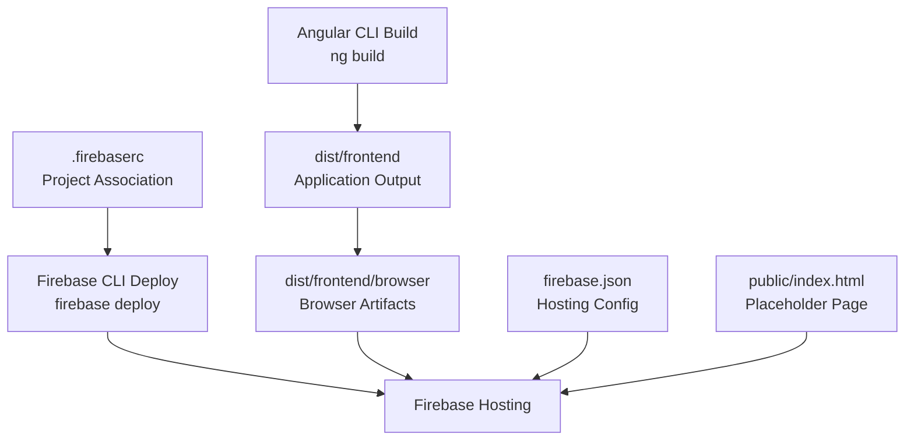
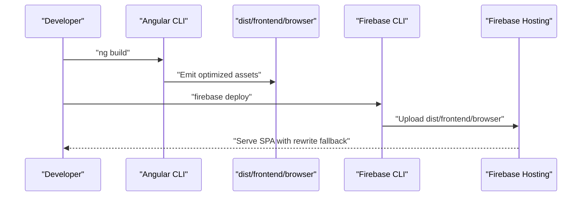
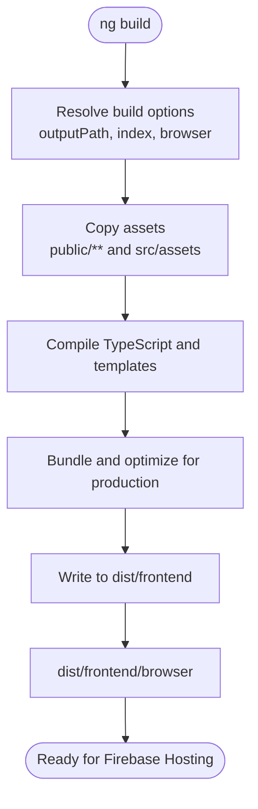
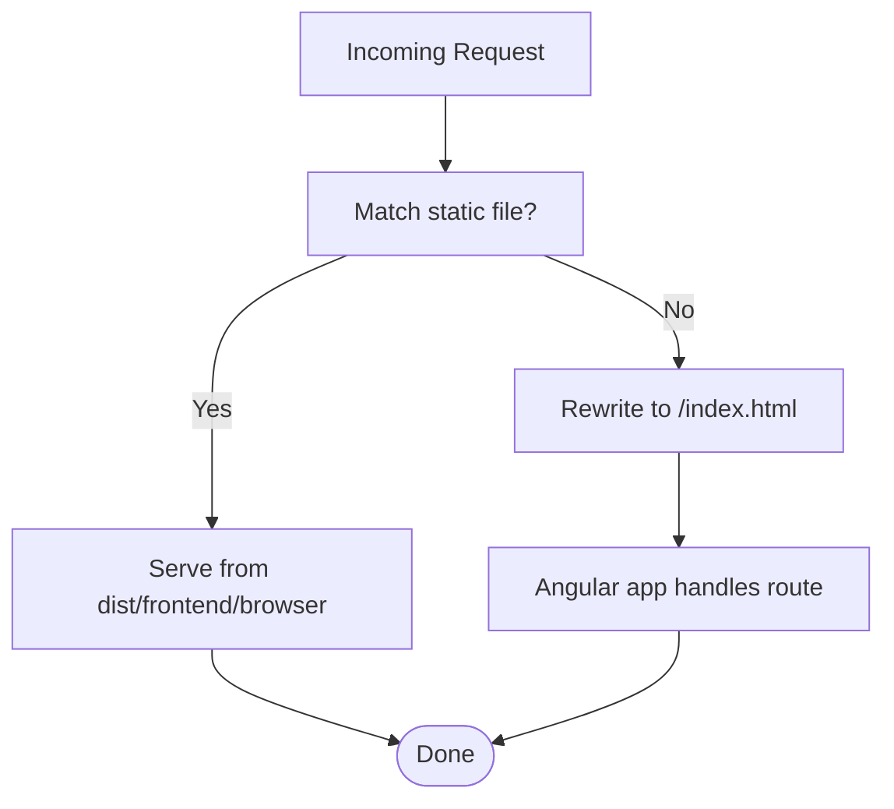
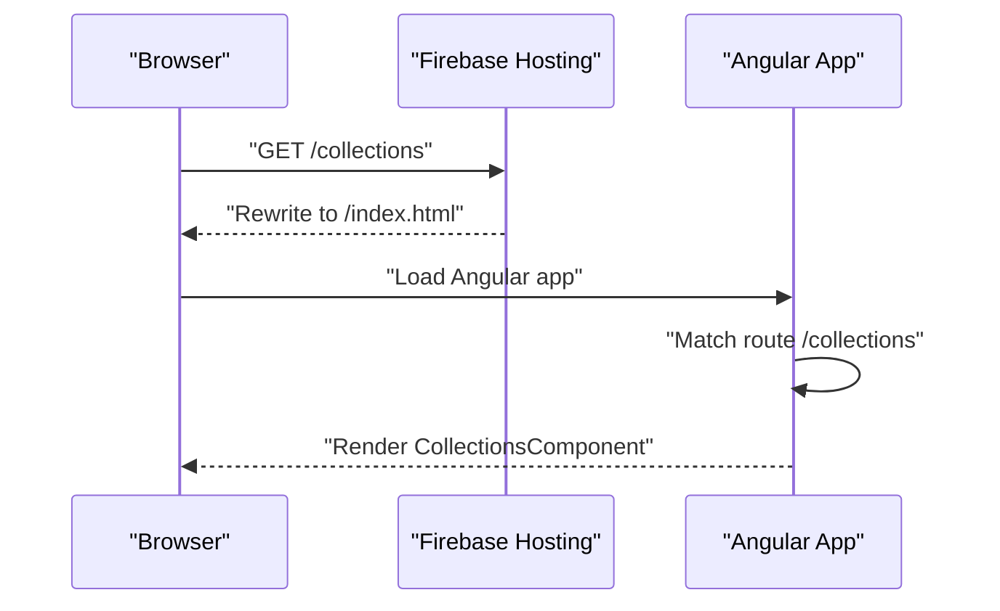
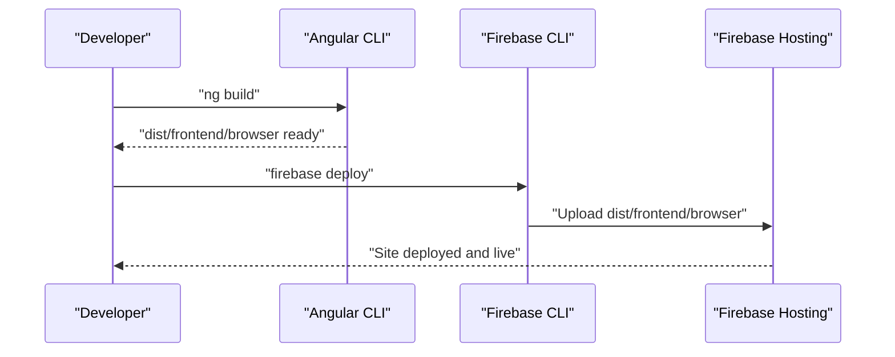
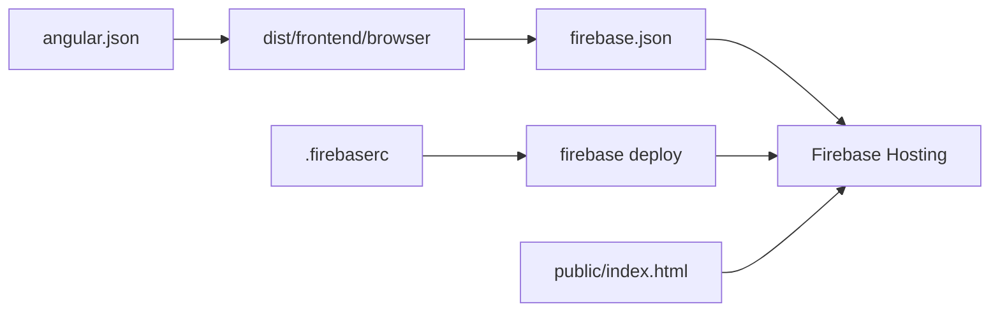

# Build & Deployment (Firebase Hosting)

<cite>
**Referenced Files in This Document**
- [angular.json](file://angular.json)
- [firebase.json](file://firebase.json)
- [.firebaserc](file://.firebaserc)
- [public/index.html](file://public/index.html)
- [src/index.html](file://src/index.html)
- [src/app/app.routes.ts](file://src/app/app.routes.ts)
- [src/app/app.config.ts](file://src/app/app.config.ts)
- [package.json](file://package.json)
- [README.md](file://README.md)
</cite>

## Table of Contents
1. [Introduction](#introduction)
2. [Project Structure](#project-structure)
3. [Core Components](#core-components)
4. [Architecture Overview](#architecture-overview)
5. [Detailed Component Analysis](#detailed-component-analysis)
6. [Dependency Analysis](#dependency-analysis)
7. [Performance Considerations](#performance-considerations)
8. [Troubleshooting Guide](#troubleshooting-guide)
9. [Conclusion](#conclusion)
10. [Appendices](#appendices)

## Introduction
This section documents the build and deployment pipeline for an Angular application hosted on Firebase. It explains how the Angular CLI build process produces optimized assets under the dist/ directory, how Firebase Hosting is configured to serve the Angular application as a single-page app (SPA), and how the Firebase CLI deploys the built artifacts. It also covers the role of .firebaserc, the SPA routing rewrite mechanism, and best practices for environment configuration and continuous deployment.

## Project Structure
The project follows a standard Angular workspace layout with a dedicated public/ directory for static assets and an Angular application under src/. Firebase Hosting configuration is centralized in firebase.json, while project association is defined in .firebaserc. The Angular build output is directed to dist/frontend, and the browser build artifacts are served from dist/frontend/browser.

**Diagram sources**
- [angular.json](file://angular.json#L18-L45)
- [firebase.json](file://firebase.json#L1-L16)
- [.firebaserc](file://.firebaserc#L1-L6)
- [public/index.html](file://public/index.html#L1-L90)

**Section sources**
- [angular.json](file://angular.json#L18-L45)
- [firebase.json](file://firebase.json#L1-L16)
- [.firebaserc](file://.firebaserc#L1-L6)
- [public/index.html](file://public/index.html#L1-L90)

## Core Components
- Angular CLI build configuration: Defines the output directory, index file, assets, styles, scripts, and build configurations (production, development).
- Firebase Hosting configuration: Specifies the public directory, ignore patterns, and SPA rewrite rules.
- Project association: Associates the local project with a Firebase project via .firebaserc.
- SPA routing placeholder: Uses public/index.html as the fallback HTML served by Firebase Hosting for client-side navigation.
- Environment and scripts: Scripts in package.json orchestrate builds and development workflows.

Key responsibilities:
- angular.json: Controls how the Angular CLI compiles and packages the application, including asset inclusion and optimization settings.
- firebase.json: Instructs Firebase Hosting where to serve static files and how to route unmatched requests to the SPA entry point.
- .firebaserc: Provides the default Firebase project identifier used by the Firebase CLI.
- public/index.html: Acts as the SPA fallback page shown by Firebase Hosting when a route is not found.
- package.json: Exposes build and serve commands used locally and in CI environments.

**Section sources**
- [angular.json](file://angular.json#L18-L45)
- [firebase.json](file://firebase.json#L1-L16)
- [.firebaserc](file://.firebaserc#L1-L6)
- [public/index.html](file://public/index.html#L1-L90)
- [package.json](file://package.json#L1-L20)

## Architecture Overview
The build and deployment pipeline integrates Angular’s build system with Firebase Hosting. The Angular CLI emits optimized assets to dist/frontend/browser. The Firebase CLI deploys these assets to the configured Firebase project, and Firebase Hosting serves them with SPA routing enabled via a rewrite rule.

**Diagram sources**
- [angular.json](file://angular.json#L18-L45)
- [firebase.json](file://firebase.json#L1-L16)
- [package.json](file://package.json#L1-L20)

## Detailed Component Analysis

### Angular CLI Build Process and Output
- Output path: The Angular CLI writes compiled assets to dist/frontend based on the build architect configuration.
- Index and browser entry: The build uses src/index.html as the application entry and compiles src/main.ts as the browser bundle.
- Assets: The build copies assets from public and src/assets into the output directory.
- Styles and scripts: Global styles and third-party scripts are included as configured.
- Build configurations: Production configuration applies budgets and optimizations; development disables optimization and enables source maps.

**Diagram sources**
- [angular.json](file://angular.json#L18-L45)

**Section sources**
- [angular.json](file://angular.json#L18-L45)
- [README.md](file://README.md#L29-L38)

### Firebase Hosting Configuration
- Public directory: Firebase Hosting serves files from dist/frontend/browser.
- Ignore patterns: Prevents uploading sensitive or unnecessary files (e.g., firebase.json, hidden files, node_modules).
- Rewrites: Unmatched routes are rewritten to /index.html, enabling client-side routing for SPAs.
- Caching: No explicit cache control headers are configured in firebase.json; defaults apply.

**Diagram sources**
- [firebase.json](file://firebase.json#L1-L16)

**Section sources**
- [firebase.json](file://firebase.json#L1-L16)

### Project Association (.firebaserc)
- Purpose: Associates the local project with a specific Firebase project ID, enabling the Firebase CLI to deploy without specifying the project each time.
- Default project: The default key maps to the project ID used by firebase deploy.

**Section sources**
- [.firebaserc](file://.firebaserc#L1-L6)

### SPA Routing Placeholder (public/index.html)
- Role: Firebase Hosting serves this file as the SPA fallback when a route is not found. It ensures the Angular application initializes and handles routing on the client.
- Behavior: The placeholder includes Firebase SDK initialization scripts and a basic UI indicating successful setup.

**Section sources**
- [public/index.html](file://public/index.html#L1-L90)
- [firebase.json](file://firebase.json#L1-L16)

### Angular SPA Routing
- Base href: The application sets the base href to "/", ensuring relative URLs resolve correctly under Firebase Hosting.
- Routes: The application defines lazy-loaded routes for home, collections, about-us, and contact.
- Preloading: Router preloads all modules to improve perceived performance.

**Diagram sources**
- [firebase.json](file://firebase.json#L1-L16)
- [src/index.html](file://src/index.html#L1-L21)
- [src/app/app.routes.ts](file://src/app/app.routes.ts#L1-L27)
- [src/app/app.config.ts](file://src/app/app.config.ts#L1-L9)

**Section sources**
- [src/index.html](file://src/index.html#L1-L21)
- [src/app/app.routes.ts](file://src/app/app.routes.ts#L1-L27)
- [src/app/app.config.ts](file://src/app/app.config.ts#L1-L9)

### Deployment Workflow (firebase deploy)
- Local build: Run ng build to produce dist/frontend/browser.
- Deploy: Run firebase deploy to upload the built assets to the associated Firebase project.
- Serving: Firebase Hosting serves the SPA with the rewrite rule so client-side routing works.

**Diagram sources**
- [package.json](file://package.json#L1-L20)
- [firebase.json](file://firebase.json#L1-L16)
- [.firebaserc](file://.firebaserc#L1-L6)

**Section sources**
- [package.json](file://package.json#L1-L20)
- [.firebaserc](file://.firebaserc#L1-L6)
- [firebase.json](file://firebase.json#L1-L16)

## Dependency Analysis
- angular.json drives the build output and asset pipeline.
- firebase.json controls hosting behavior and SPA routing.
- .firebaserc binds the CLI to a specific project.
- public/index.html acts as the SPA fallback page.
- package.json scripts orchestrate the build and development lifecycle.

**Diagram sources**
- [angular.json](file://angular.json#L18-L45)
- [firebase.json](file://firebase.json#L1-L16)
- [.firebaserc](file://.firebaserc#L1-L6)
- [public/index.html](file://public/index.html#L1-L90)

**Section sources**
- [angular.json](file://angular.json#L18-L45)
- [firebase.json](file://firebase.json#L1-L16)
- [.firebaserc](file://.firebaserc#L1-L6)
- [public/index.html](file://public/index.html#L1-L90)

## Performance Considerations
- Production build: Use the production configuration to enable optimizations and budgets.
- Asset bundling: Keep assets minimal and leverage lazy loading for feature modules.
- CDN and caching: Consider adding cache control headers in firebase.json for static assets if needed.
- Preloading: Router preloading is enabled to reduce perceived latency for navigations.

[No sources needed since this section provides general guidance]

## Troubleshooting Guide
- SPA routing issues: Ensure firebase.json rewrites target /index.html and that the base href is set correctly in src/index.html.
- Wrong public directory: Verify the public field in firebase.json matches the Angular build output directory.
- Project association errors: Confirm .firebaserc contains the correct default project ID.
- Build failures: Check angular.json options and ensure all assets and styles are correctly referenced.
- Local vs. hosted base path: Confirm base href alignment with Firebase Hosting’s URL structure.

**Section sources**
- [firebase.json](file://firebase.json#L1-L16)
- [src/index.html](file://src/index.html#L1-L21)
- [.firebaserc](file://.firebaserc#L1-L6)
- [angular.json](file://angular.json#L18-L45)

## Conclusion
The Angular application is built with optimized assets and deployed to Firebase Hosting using a straightforward pipeline. The SPA routing is enabled by a rewrite rule that directs unmatched requests to the SPA entry point, while .firebaserc associates the project with the intended Firebase account and project ID. Following the outlined best practices ensures reliable deployments and smooth client-side routing.

[No sources needed since this section summarizes without analyzing specific files]

## Appendices

### Best Practices for Environment Configuration
- Separate environment files for development and production.
- Use Angular’s environment injection to configure API endpoints and feature flags.
- Store secrets in Firebase or environment variables managed by your CI provider.
- Validate environment variables at runtime and provide graceful fallbacks.

[No sources needed since this section provides general guidance]

### Continuous Deployment Pipelines
- Trigger builds on push to main branch.
- Run tests and lint checks before building.
- Build the Angular app and deploy to Firebase Hosting.
- Use Firebase project aliases or environment variables to target staging vs. production.
- Monitor deployment logs and health checks post-deploy.

[No sources needed since this section provides general guidance]