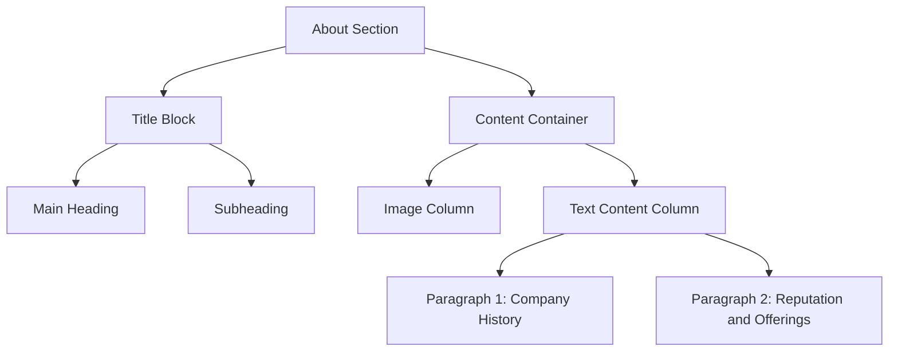
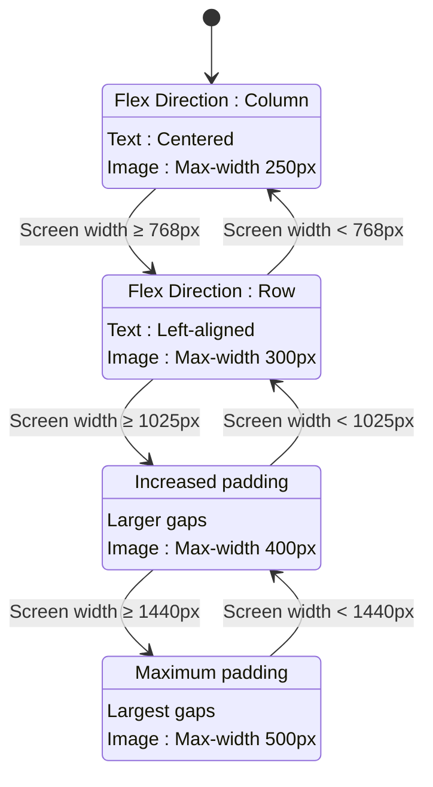
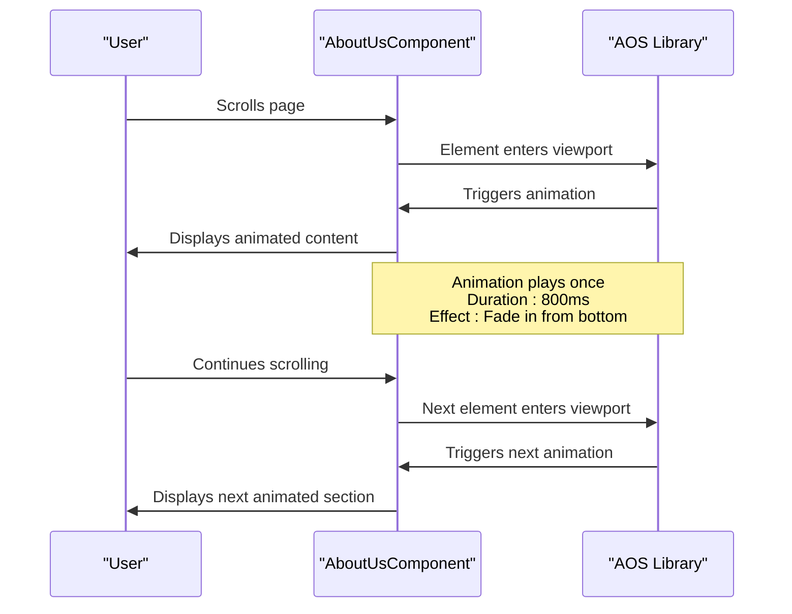
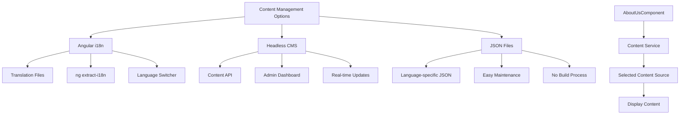
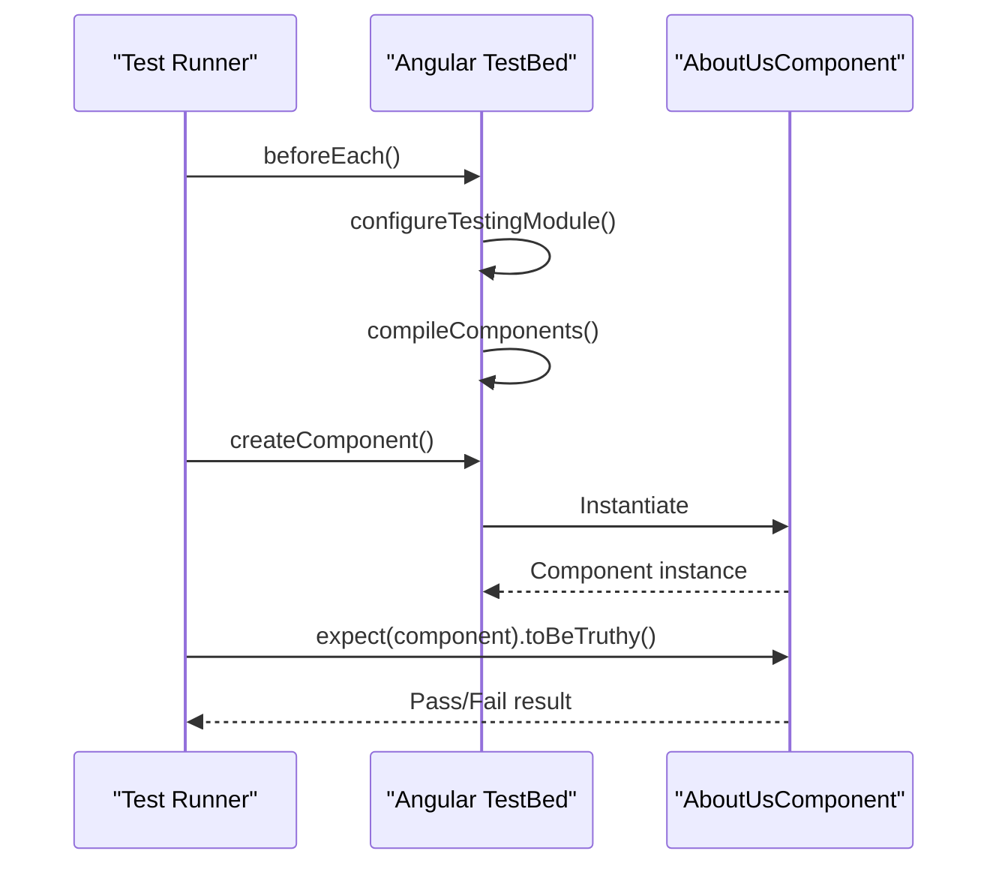

# About Us Component

<cite>
**Referenced Files in This Document**   
- [about-us.component.ts](file://src/app/about-us/about-us.component.ts)
- [about-us.component.html](file://src/app/about-us/about-us.component.html)
- [about-us.component.scss](file://src/app/about-us/about-us.component.scss)
- [about-us.component.spec.ts](file://src/app/about-us/about-us.component.spec.ts)
- [styles.scss](file://src/styles.scss)
- [app.routes.ts](file://src/app/app.routes.ts)
- [home.component.ts](file://src/app/home/home.component.ts)
- [package.json](file://package.json)
</cite>

## Table of Contents
1. [Introduction](#introduction)
2. [Component Architecture](#component-architecture)
3. [Content Structure and Brand Communication](#content-structure-and-brand-communication)
4. [Styling and Visual Design](#styling-and-visual-design)
5. [Responsive Design Implementation](#responsive-design-implementation)
6. [Animation and User Experience](#animation-and-user-experience)
7. [Content Management and Localization Strategy](#content-management-and-localization-strategy)
8. [Integration and Routing](#integration-and-routing)
9. [Testing and Quality Assurance](#testing-and-quality-assurance)
10. [Future Enhancement Opportunities](#future-enhancement-opportunities)

## Introduction

The AboutUsComponent serves as a dedicated informational section that communicates the company's brand identity, history, and values to website visitors. As a static content container, it presents key information about KVS Furniture, a reputable furniture company established in 1991 that specializes in high-quality teak furniture. The component is designed to be simple, stateless, and self-contained, focusing exclusively on delivering brand narrative without complex interactions or data dependencies.

**Section sources**
- [about-us.component.html](file://src/app/about-us/about-us.component.html#L1-L30)
- [about-us.component.ts](file://src/app/about-us/about-us.component.ts#L1-L12)

## Component Architecture

The AboutUsComponent follows a minimalist architectural approach as a standalone Angular component with no inputs, outputs, or service dependencies. It is implemented as a stateless container that renders static content, making it highly performant and easy to maintain. The component is defined with a simple decorator configuration that specifies its selector, template, and stylesheet, without requiring any additional imports or dependencies.

The component class itself is empty, containing no properties or methods, which emphasizes its role as a pure presentation component. This architectural decision aligns with the principle of separation of concerns, where the component's sole responsibility is to display information rather than manage state or handle complex logic.

```mermaid
classDiagram
class AboutUsComponent {
+selector : string
+templateUrl : string
+styleUrl : string
}
note right of AboutUsComponent
Stateless component with no inputs,
outputs, or service dependencies.
Pure presentation component for
brand information display.
end note
```

**Diagram sources**
- [about-us.component.ts](file://src/app/about-us/about-us.component.ts#L3-L8)

**Section sources**
- [about-us.component.ts](file://src/app/about-us/about-us.component.ts#L1-L12)

## Content Structure and Brand Communication

The component's HTML template is structured to effectively communicate the company's brand identity through a clear hierarchy of semantic elements. The content is organized into two main sections: a title block and a content container. The title block features a prominent heading "We are Makers of Comfort" accompanied by a descriptive subheading that emphasizes the company's passion for timeless design and lasting quality.

The main content section uses a two-column layout (on larger screens) to present information in a balanced way, with an image on the left and descriptive text on the right. The text content establishes the company's credibility by highlighting its long history since 1991 and its specialization in teak furniture craftsmanship. The use of semantic HTML elements such as sections, headings, and paragraphs ensures proper content hierarchy and accessibility compliance.



**Diagram sources**
- [about-us.component.html](file://src/app/about-us/about-us.component.html#L1-L30)

**Section sources**
- [about-us.component.html](file://src/app/about-us/about-us.component.html#L1-L30)

## Styling and Visual Design

The component's styling is implemented through SCSS to create a visually engaging experience that aligns with the brand's aesthetic. The design incorporates several key visual elements:

- **Background Pattern**: The section features a wood-pattern background image that reinforces the furniture theme and creates visual interest
- **Typography Hierarchy**: Uses the L2-heading and L2-text classes from the global style system to establish clear typographic hierarchy
- **Color Scheme**: Leverages the global color variables (--primary-color, --gray, --black) for consistent branding
- **Spacing System**: Implements a responsive spacing system using CSS custom properties (--spacing-sm, --spacing-md, etc.)

The styling approach emphasizes readability and visual balance, with careful attention to font sizes, line heights, and margins. The use of clamp() functions for font sizes ensures optimal readability across different screen sizes, while the flexible layout adapts to various viewport dimensions.

```mermaid
graph TD
A[Visual Design Elements] --> B[Background]
A --> C[Typography]
A --> D[Color System]
A --> E[Layout & Spacing]
B --> F[Wood Pattern Image]
B --> G[Background Size: cover]
C --> H[Clamp() for Responsive Fonts]
C --> I[Line Height: 1.6]
D --> J[Primary Color: #A76F3A]
D --> K[Gray Text: #A2A2A2]
E --> L[Flexbox Layout]
E --> M[Responsive Gap System]
```

**Diagram sources**
- [about-us.component.scss](file://src/app/about-us/about-us.component.scss#L1-L212)
- [styles.scss](file://src/styles.scss#L1-L146)

**Section sources**
- [about-us.component.scss](file://src/app/about-us/about-us.component.scss#L1-L212)
- [styles.scss](file://src/styles.scss#L1-L146)

## Responsive Design Implementation

The component implements a comprehensive responsive design strategy that ensures optimal presentation across all device sizes. The layout follows a mobile-first approach, starting with a stacked vertical arrangement on smaller screens and transitioning to a side-by-side layout on larger devices.

The responsive behavior is controlled through multiple media queries that target specific breakpoints:
- Mobile (up to 767px): Vertical layout with adjusted padding and font sizes
- Tablet (768px-1024px): Horizontal layout with optimized spacing
- Desktop (1025px+): Enhanced layout with increased padding and spacing
- Large displays (1440px+): Further optimized spacing for larger screens

The implementation uses a combination of flexbox properties, responsive units, and conditional styling to create a seamless experience across devices. The image dimensions and text alignment are also adjusted based on screen size to maintain visual harmony.



**Diagram sources**
- [about-us.component.scss](file://src/app/about-us/about-us.component.scss#L7-L212)

**Section sources**
- [about-us.component.scss](file://src/app/about-us/about-us.component.scss#L7-L212)

## Animation and User Experience

While the AboutUsComponent itself does not currently implement animations, the codebase uses the AOS (Animate On Scroll) library for other components, suggesting a consistent approach to user experience across the application. The home and contact components initialize AOS with specific configurations, indicating that animations could be easily added to the AboutUsComponent to enhance narrative flow.

The AOS library is configured with a duration of 800-1000ms and the "once: true" option, meaning animations play only once when elements come into view. This approach creates a subtle, professional animation effect that enhances engagement without being distracting. The animations could be applied to the AboutUsComponent to reveal content sections sequentially as users scroll, creating a more dynamic storytelling experience.



**Diagram sources**
- [home.component.ts](file://src/app/home/home.component.ts#L98-L102)
- [contact.component.ts](file://src/app/contact/contact.component.ts#L19)
- [package.json](file://package.json#L22)

**Section sources**
- [home.component.ts](file://src/app/home/home.component.ts#L98-L102)
- [contact.component.ts](file://src/app/contact/contact.component.ts#L19)
- [package.json](file://package.json#L22)

## Content Management and Localization Strategy

The current implementation uses hardcoded text content within the HTML template, which presents opportunities for improvement in content management and localization. For future enhancement, the text content could be externalized to support multiple languages and easier content updates.

A recommended approach would be to implement Angular's i18n framework or integrate with a headless CMS. This would allow content editors to update the about us information without requiring code changes or developer intervention. The text could be moved to JSON files or a content management system, with the component retrieving the appropriate content based on the user's language preference.

The styling system already supports this approach through the use of CSS custom properties and a consistent class naming convention (L2-heading, L2-text, etc.), which would remain unchanged regardless of the content language.



**Diagram sources**
- [about-us.component.html](file://src/app/about-us/about-us.component.html#L1-L30)
- [about-us.component.ts](file://src/app/about-us/about-us.component.ts#L1-L12)

**Section sources**
- [about-us.component.html](file://src/app/about-us/about-us.component.html#L1-L30)
- [about-us.component.ts](file://src/app/about-us/about-us.component.ts#L1-L12)

## Integration and Routing

The AboutUsComponent is integrated into the application's routing system through lazy loading, which optimizes performance by loading the component only when needed. The route configuration in app.routes.ts defines a dedicated path '/about-us' that loads the component asynchronously using the import() function.

This approach follows Angular's best practices for modular application architecture, keeping the component isolated and only loading its code when the user navigates to the about us page. The routing setup ensures clean URL structure and enables direct linking to the about us section.

```mermaid
graph TD
A[App Routing] --> B[Route Configuration]
B --> C[Path: /about-us]
C --> D[Lazy Loading]
D --> E[import('./about-us/about-us.component')]
E --> F[then(m => m.AboutUsComponent)]
F --> G[AboutUsComponent]
G --> H[Template Rendering]
H --> I[Style Application]
```

**Diagram sources**
- [app.routes.ts](file://src/app/app.routes.ts#L18-L21)

**Section sources**
- [app.routes.ts](file://src/app/app.routes.ts#L18-L21)

## Testing and Quality Assurance

The component is supported by a comprehensive unit test suite that verifies its basic functionality and instantiation. The test file about-us.component.spec.ts uses Angular's testing utilities to create a test bed, compile the component, and verify that the component instance is successfully created.

The testing approach follows Angular's standard testing patterns, with beforeEach() setup that configures the test module and creates the component fixture. The primary test case checks that the component is truthy after creation, ensuring that there are no errors in the component's initialization process.

While the current test coverage is minimal, focusing only on component creation, it provides a foundation that could be expanded to include tests for DOM elements, styling classes, and responsive behavior.



**Diagram sources**
- [about-us.component.spec.ts](file://src/app/about-us/about-us.component.spec.ts#L1-L24)

**Section sources**
- [about-us.component.spec.ts](file://src/app/about-us/about-us.component.spec.ts#L1-L24)

## Future Enhancement Opportunities

The AboutUsComponent presents several opportunities for future enhancement to improve functionality, user engagement, and content management:

1. **Dynamic Content Loading**: Implement a service to fetch content from an API or CMS, allowing for easier updates without code deployment
2. **Team Member Profiles**: Expand the component to include team member profiles with photos, roles, and bios
3. **Company Timeline**: Add a visual timeline of the company's history and milestones
4. **Customer Testimonials**: Incorporate a section for customer reviews and testimonials
5. **Enhanced Animations**: Implement AOS animations to create a more engaging narrative flow
6. **Localization Support**: Add multi-language support through Angular i18n or a translation service
7. **Accessibility Improvements**: Enhance ARIA attributes and keyboard navigation support
8. **Performance Optimization**: Implement image lazy loading and optimization for faster page loads

These enhancements would transform the component from a simple static page into a more dynamic and engaging brand experience while maintaining its core purpose of communicating the company's identity and values.

**Section sources**
- [about-us.component.html](file://src/app/about-us/about-us.component.html#L1-L30)
- [about-us.component.ts](file://src/app/about-us/about-us.component.ts#L1-L12)
- [about-us.component.scss](file://src/app/about-us/about-us.component.scss#L1-L212)