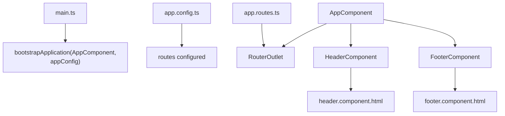
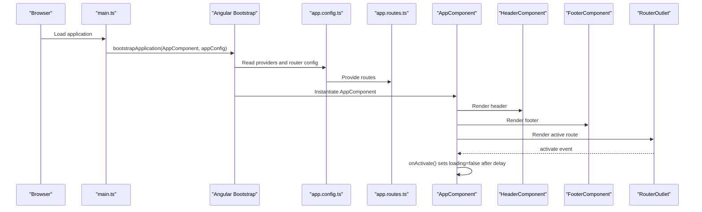
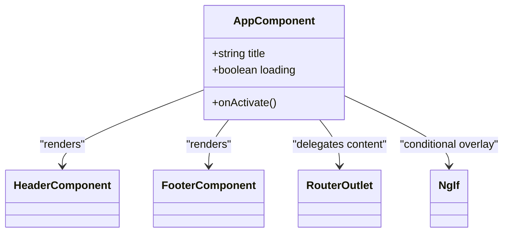
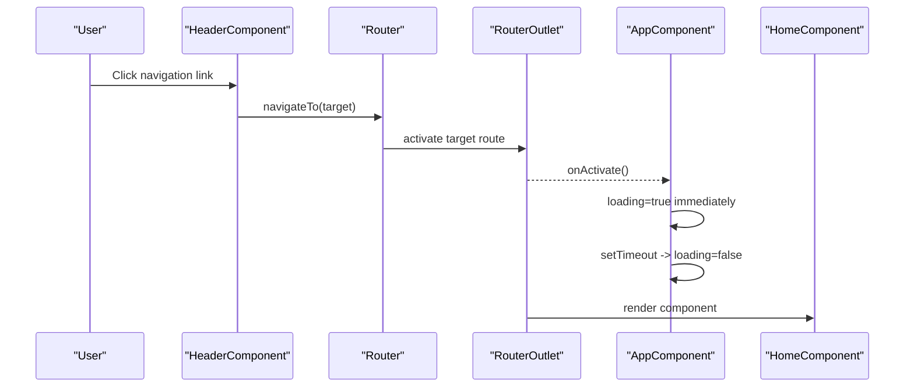
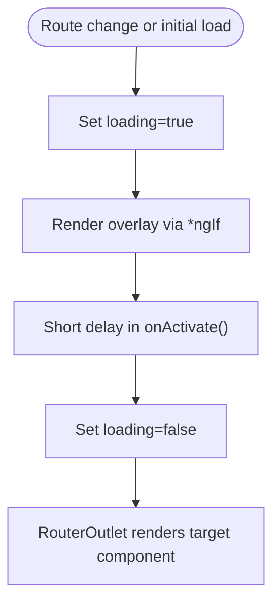
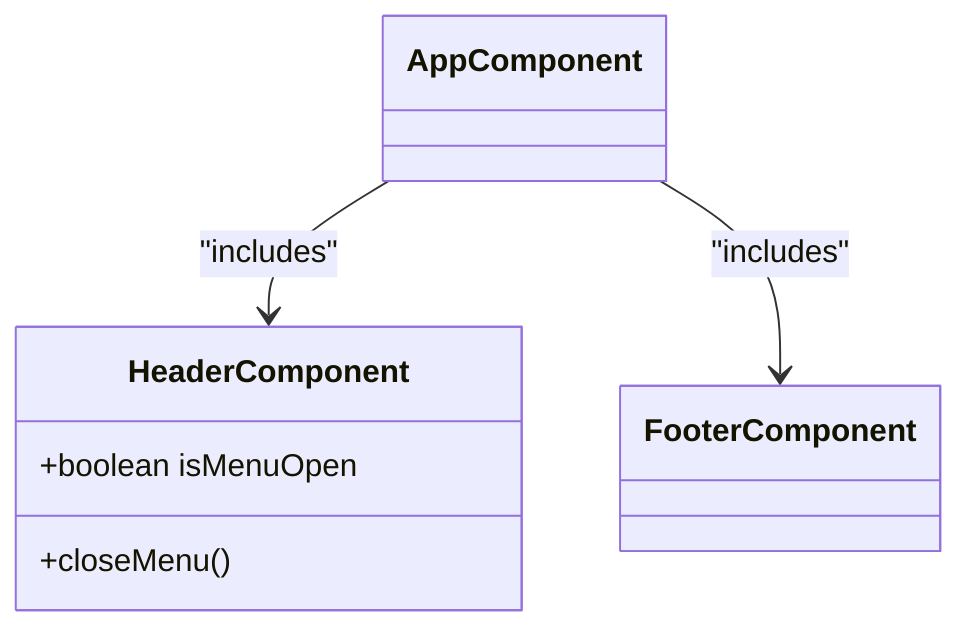
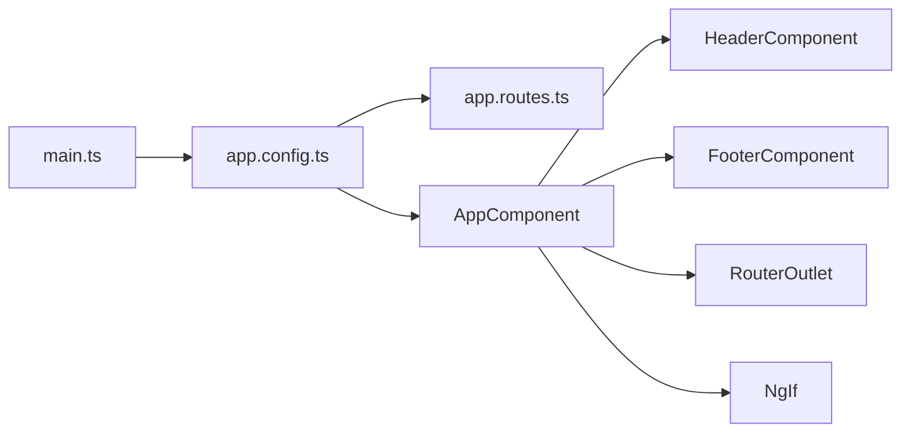

# App Component

<cite>
**Referenced Files in This Document**
- [app.component.ts](file://src/app/app.component.ts)
- [app.component.html](file://src/app/app.component.html)
- [app.component.scss](file://src/app/app.component.scss)
- [header.component.ts](file://src/app/header/header.component.ts)
- [header.component.html](file://src/app/header/header.component.html)
- [footer.component.ts](file://src/app/footer/footer.component.ts)
- [footer.component.html](file://src/app/footer/footer.component.html)
- [app.routes.ts](file://src/app/app.routes.ts)
- [app.config.ts](file://src/app/app.config.ts)
- [main.ts](file://src/main.ts)
- [home.component.ts](file://src/app/home/home.component.ts)
</cite>

## Table of Contents
1. [Introduction](#introduction)
2. [Project Structure](#project-structure)
3. [Core Components](#core-components)
4. [Architecture Overview](#architecture-overview)
5. [Detailed Component Analysis](#detailed-component-analysis)
6. [Dependency Analysis](#dependency-analysis)
7. [Performance Considerations](#performance-considerations)
8. [Troubleshooting Guide](#troubleshooting-guide)
9. [Conclusion](#conclusion)

## Introduction
This document explains the AppComponent, the root component of the kvs_website application. It covers how AppComponent bootstraps the Angular application, composes the main UI shell by including the header, footer, and router outlet, and manages the initial loading state. It also documents the use of standalone component imports in the @Component decorator, the conditional rendering of a loading overlay using structural directives, and how the onActivate lifecycle hook coordinates smooth transitions between routed components. Finally, it provides guidance on common issues, performance considerations, and UX optimization strategies.

## Project Structure
AppComponent resides in the application root and orchestrates the top-level layout. It imports and renders:
- Header component for navigation and branding
- Footer component for site-wide links and legal notices
- RouterOutlet for dynamic route rendering
- Structural directive NgIf for conditional overlay rendering

The application is bootstrapped via main.ts, which initializes the Angular application with app.config.ts that configures routing and preloading.

**Diagram sources**
- [main.ts](file://src/main.ts#L1-L7)
- [app.config.ts](file://src/app/app.config.ts#L1-L9)
- [app.routes.ts](file://src/app/app.routes.ts#L1-L27)
- [app.component.ts](file://src/app/app.component.ts#L1-L21)
- [header.component.html](file://src/app/header/header.component.html#L1-L29)
- [footer.component.html](file://src/app/footer/footer.component.html#L1-L28)

**Section sources**
- [main.ts](file://src/main.ts#L1-L7)
- [app.config.ts](file://src/app/app.config.ts#L1-L9)
- [app.routes.ts](file://src/app/app.routes.ts#L1-L27)
- [app.component.ts](file://src/app/app.component.ts#L1-L21)

## Core Components
- AppComponent: Root shell that includes the header, footer, and router outlet; manages the initial loading overlay and routes activation.
- HeaderComponent: Provides navigation links and mobile menu toggle.
- FooterComponent: Displays branding, social links, and legal information.
- RouterOutlet: Renders the active route’s component dynamically.
- NgIf: Conditionally renders the loading overlay during initial load.

Key responsibilities:
- Bootstrapping: main.ts invokes bootstrapApplication with AppComponent and appConfig.
- Routing: app.config.ts configures routes and enables preloading.
- Layout: AppComponent composes the shell and delegates page content to routed components.
- Loading UX: AppComponent controls a short delay before hiding the overlay to ensure smooth transitions.

**Section sources**
- [app.component.ts](file://src/app/app.component.ts#L1-L21)
- [app.component.html](file://src/app/app.component.html#L1-L10)
- [app.component.scss](file://src/app/app.component.scss#L1-L9)
- [header.component.ts](file://src/app/header/header.component.ts#L1-L17)
- [footer.component.ts](file://src/app/footer/footer.component.ts#L1-L12)
- [main.ts](file://src/main.ts#L1-L7)
- [app.config.ts](file://src/app/app.config.ts#L1-L9)

## Architecture Overview
AppComponent acts as the application shell. It:
- Declares standalone imports for RouterOutlet, HeaderComponent, FooterComponent, and NgIf in the @Component decorator.
- Renders the header and footer once, regardless of route.
- Delegates page content to the active route via RouterOutlet.
- Uses onActivate on RouterOutlet to trigger a short delay before setting loading=false, preventing flicker and enabling smooth transitions.

**Diagram sources**
- [main.ts](file://src/main.ts#L1-L7)
- [app.config.ts](file://src/app/app.config.ts#L1-L9)
- [app.routes.ts](file://src/app/app.routes.ts#L1-L27)
- [app.component.ts](file://src/app/app.component.ts#L1-L21)
- [app.component.html](file://src/app/app.component.html#L1-L10)

## Detailed Component Analysis

### AppComponent Shell Container
- Standalone imports: RouterOutlet, HeaderComponent, FooterComponent, NgIf are declared in the @Component decorator, enabling a compact, self-contained root component.
- Template composition: The template renders the header, a conditional loading overlay, the router outlet, and the footer.
- Global state: The component maintains a loading flag to coordinate the overlay visibility.
- Lifecycle coordination: onActivate() triggers a short timeout before setting loading=false, smoothing transitions between routed components.

**Diagram sources**
- [app.component.ts](file://src/app/app.component.ts#L1-L21)
- [app.component.html](file://src/app/app.component.html#L1-L10)

**Section sources**
- [app.component.ts](file://src/app/app.component.ts#L1-L21)
- [app.component.html](file://src/app/app.component.html#L1-L10)
- [app.component.scss](file://src/app/app.component.scss#L1-L9)

### Routing and Activation Flow
- Routes: app.routes.ts defines the application routes, including lazy-loaded components for home, collections, about-us, and contact.
- Preloading: app.config.ts enables preloading of all modules to improve perceived performance.
- Activation: RouterOutlet emits an activate event when a new route becomes active. AppComponent listens to this event and calls onActivate() to manage the loading overlay.

**Diagram sources**
- [app.routes.ts](file://src/app/app.routes.ts#L1-L27)
- [app.config.ts](file://src/app/app.config.ts#L1-L9)
- [app.component.html](file://src/app/app.component.html#L1-L10)
- [app.component.ts](file://src/app/app.component.ts#L1-L21)
- [home.component.ts](file://src/app/home/home.component.ts#L1-L180)

**Section sources**
- [app.routes.ts](file://src/app/app.routes.ts#L1-L27)
- [app.config.ts](file://src/app/app.config.ts#L1-L9)
- [app.component.html](file://src/app/app.component.html#L1-L10)
- [app.component.ts](file://src/app/app.component.ts#L1-L21)
- [home.component.ts](file://src/app/home/home.component.ts#L1-L180)

### Conditional Rendering with NgIf
- Overlay visibility: The template conditionally renders a loader element when loading is true.
- Styling: The loader is styled to occupy a significant portion of the viewport for clear feedback.
- UX benefit: Ensures users see a consistent loading indicator during initial load and route transitions.

**Diagram sources**
- [app.component.html](file://src/app/app.component.html#L1-L10)
- [app.component.scss](file://src/app/app.component.scss#L1-L9)
- [app.component.ts](file://src/app/app.component.ts#L1-L21)

**Section sources**
- [app.component.html](file://src/app/app.component.html#L1-L10)
- [app.component.scss](file://src/app/app.component.scss#L1-L9)
- [app.component.ts](file://src/app/app.component.ts#L1-L21)

### Child Components: Header and Footer
- HeaderComponent: Provides navigation links and a mobile menu toggle. It uses RouterLink for navigation and exposes a method to close the menu on navigation.
- FooterComponent: Displays branding, social icons, and legal links. It is a simple presentational component.

**Diagram sources**
- [header.component.ts](file://src/app/header/header.component.ts#L1-L17)
- [footer.component.ts](file://src/app/footer/footer.component.ts#L1-L12)

**Section sources**
- [header.component.ts](file://src/app/header/header.component.ts#L1-L17)
- [header.component.html](file://src/app/header/header.component.html#L1-L29)
- [footer.component.ts](file://src/app/footer/footer.component.ts#L1-L12)
- [footer.component.html](file://src/app/footer/footer.component.html#L1-L28)

## Dependency Analysis
- Bootstrap dependency: main.ts depends on app.config.ts and AppComponent to initialize the application.
- Routing dependency: app.config.ts depends on app.routes.ts to define routes and enable preloading.
- Shell dependencies: AppComponent depends on HeaderComponent, FooterComponent, and RouterOutlet to compose the shell and delegate content rendering.
- Conditional rendering: AppComponent depends on NgIf to control overlay visibility.

**Diagram sources**
- [main.ts](file://src/main.ts#L1-L7)
- [app.config.ts](file://src/app/app.config.ts#L1-L9)
- [app.routes.ts](file://src/app/app.routes.ts#L1-L27)
- [app.component.ts](file://src/app/app.component.ts#L1-L21)

**Section sources**
- [main.ts](file://src/main.ts#L1-L7)
- [app.config.ts](file://src/app/app.config.ts#L1-L9)
- [app.routes.ts](file://src/app/app.routes.ts#L1-L27)
- [app.component.ts](file://src/app/app.component.ts#L1-L21)

## Performance Considerations
- Preloading: Enabling preloading reduces perceived latency for subsequent navigations by prefetching module bundles.
- Route lazy loading: Lazy-loading route components keeps the initial bundle small, improving startup time.
- Initialization timing: The short delay in onActivate() prevents premature overlay removal, avoiding flicker and ensuring smooth transitions.
- UX optimization: The loader occupies a significant viewport area to provide clear feedback during load and route changes.

Practical tips:
- Keep the overlay minimal and fast to avoid masking legitimate slow content.
- Consider adjusting the delay based on device performance and network conditions.
- Monitor bundle sizes and route chunking to balance initial load vs. navigation responsiveness.

**Section sources**
- [app.config.ts](file://src/app/app.config.ts#L1-L9)
- [app.routes.ts](file://src/app/app.routes.ts#L1-L27)
- [app.component.ts](file://src/app/app.component.ts#L1-L21)
- [app.component.scss](file://src/app/app.component.scss#L1-L9)

## Troubleshooting Guide
Common issues and resolutions:
- Delayed rendering or blank screen on first load
  - Cause: Initial render may appear before the overlay is hidden.
  - Resolution: Ensure onActivate() runs and sets loading=false after a short delay. Verify the RouterOutlet is present and that the activate event fires.
  - Related code paths:
    - [app.component.html](file://src/app/app.component.html#L1-L10)
    - [app.component.ts](file://src/app/app.component.ts#L1-L21)

- Routing conflicts or unexpected navigation
  - Cause: Incorrect routerLink targets or missing route definitions.
  - Resolution: Confirm routes exist and match the intended destinations. Ensure RouterLinks in the header match route paths.
  - Related code paths:
    - [header.component.html](file://src/app/header/header.component.html#L1-L29)
    - [app.routes.ts](file://src/app/app.routes.ts#L1-L27)

- Overlay not hiding after navigation
  - Cause: onActivate() not triggered or loading state not updated.
  - Resolution: Verify the activate binding on RouterOutlet and confirm the timeout executes. Check for errors in the console.
  - Related code paths:
    - [app.component.html](file://src/app/app.component.html#L1-L10)
    - [app.component.ts](file://src/app/app.component.ts#L1-L21)

- Footer or header not displaying
  - Cause: Missing standalone imports or incorrect selectors.
  - Resolution: Ensure HeaderComponent, FooterComponent, and NgIf are imported in the root component decorator and selectors are used in the template.
  - Related code paths:
    - [app.component.ts](file://src/app/app.component.ts#L1-L21)
    - [header.component.ts](file://src/app/header/header.component.ts#L1-L17)
    - [footer.component.ts](file://src/app/footer/footer.component.ts#L1-L12)

- Preloading not taking effect
  - Cause: Preloading configuration missing or disabled.
  - Resolution: Confirm withPreloading(PreloadAllModules) is set in app.config.ts.
  - Related code paths:
    - [app.config.ts](file://src/app/app.config.ts#L1-L9)

**Section sources**
- [app.component.html](file://src/app/app.component.html#L1-L10)
- [app.component.ts](file://src/app/app.component.ts#L1-L21)
- [header.component.html](file://src/app/header/header.component.html#L1-L29)
- [app.routes.ts](file://src/app/app.routes.ts#L1-L27)
- [app.config.ts](file://src/app/app.config.ts#L1-L9)
- [header.component.ts](file://src/app/header/header.component.ts#L1-L17)
- [footer.component.ts](file://src/app/footer/footer.component.ts#L1-L12)

## Conclusion
AppComponent serves as the foundational shell of the kvs_website application. It bootstraps the app, composes the global layout with header and footer, and delegates page content to routed components via RouterOutlet. Its onActivate lifecycle hook and loading state, combined with a conditional overlay rendered by NgIf, deliver a smooth, responsive user experience. By leveraging standalone component imports and preloading, the application achieves a clean, modular structure with optimized performance and predictable UX behavior.