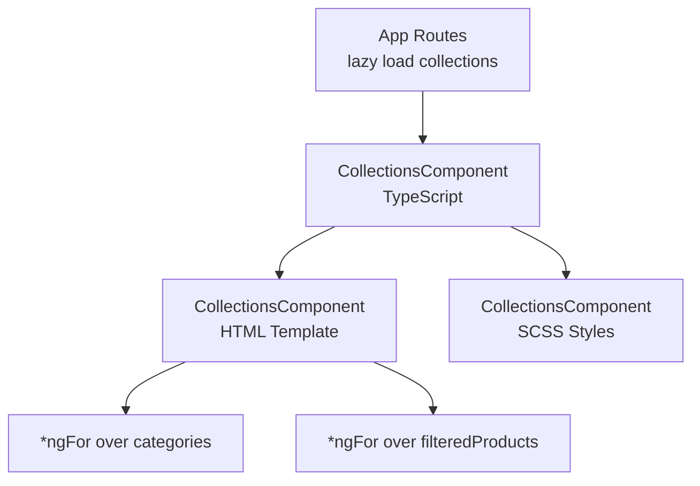
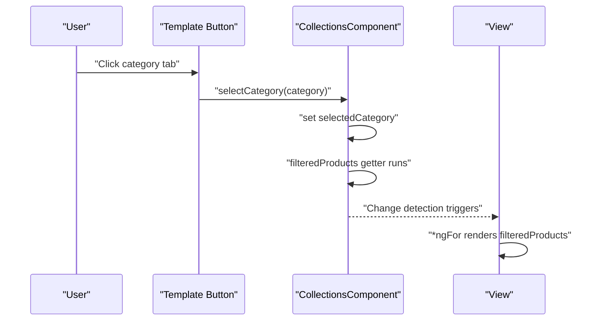
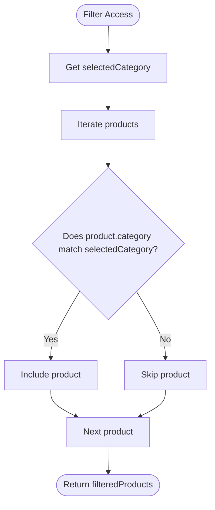
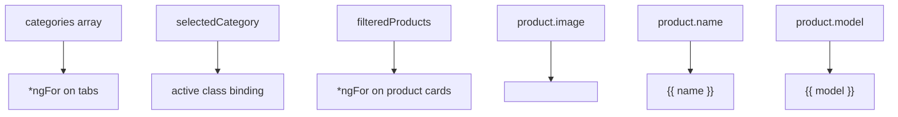
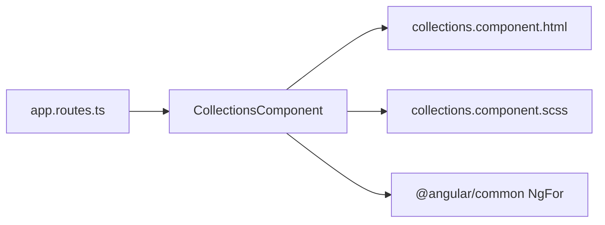

# Collections Component

<cite>
**Referenced Files in This Document**
- [collections.component.ts](file://src/app/collections/collections.component.ts)
- [collections.component.html](file://src/app/collections/collections.component.html)
- [collections.component.scss](file://src/app/collections/collections.component.scss)
- [collections.component.spec.ts](file://src/app/collections/collections.component.spec.ts)
- [app.routes.ts](file://src/app/app.routes.ts)
</cite>

## Table of Contents
1. [Introduction](#introduction)
2. [Project Structure](#project-structure)
3. [Core Components](#core-components)
4. [Architecture Overview](#architecture-overview)
5. [Detailed Component Analysis](#detailed-component-analysis)
6. [Dependency Analysis](#dependency-analysis)
7. [Performance Considerations](#performance-considerations)
8. [Troubleshooting Guide](#troubleshooting-guide)
9. [Conclusion](#conclusion)

## Introduction
This document explains the CollectionsComponent, which renders a filterable grid of furniture products organized by category. It focuses on the category-based filtering mechanism driven by the selectedCategory property and the filteredProducts getter, the structure of the mock product data, the selectCategory method’s role in updating filters and triggering change detection, and the use of NgFor for iterative rendering of categories and products. It also covers responsive grid layout techniques in the SCSS file, potential enhancements, common issues, and performance considerations for large datasets.

## Project Structure
The CollectionsComponent is a standalone Angular component located under the collections feature folder. It is lazily loaded via the application routes and rendered inside the main application shell.

**Diagram sources**
- [app.routes.ts](file://src/app/app.routes.ts#L1-L27)
- [collections.component.ts](file://src/app/collections/collections.component.ts#L1-L32)
- [collections.component.html](file://src/app/collections/collections.component.html#L1-L29)

**Section sources**
- [app.routes.ts](file://src/app/app.routes.ts#L1-L27)

## Core Components
- Categories array defines the selectable tabs for filtering.
- selectedCategory holds the currently active filter.
- products array is the mock dataset containing product entries with fields: name, model, image, category.
- filteredProducts getter returns only the products whose category equals selectedCategory.
- selectCategory updates the selectedCategory and relies on Angular’s change detection to re-render the view.

Key implementation references:
- Categories and selectedCategory initialization: [collections.component.ts](file://src/app/collections/collections.component.ts#L12-L13)
- Mock product data structure: [collections.component.ts](file://src/app/collections/collections.component.ts#L15-L21)
- filteredProducts getter: [collections.component.ts](file://src/app/collections/collections.component.ts#L23-L25)
- selectCategory method: [collections.component.ts](file://src/app/collections/collections.component.ts#L27-L29)

**Section sources**
- [collections.component.ts](file://src/app/collections/collections.component.ts#L12-L29)

## Architecture Overview
The component follows a simple reactive pattern:
- User clicks a category tab.
- The click handler invokes selectCategory, which updates selectedCategory.
- Angular detects the state change and recomputes filteredProducts.
- The template re-renders the product grid using *ngFor over filteredProducts.

**Diagram sources**
- [collections.component.html](file://src/app/collections/collections.component.html#L10-L18)
- [collections.component.ts](file://src/app/collections/collections.component.ts#L23-L29)

## Detailed Component Analysis

### Filtering Mechanism: selectedCategory and filteredProducts
- selectedCategory is initialized to a default category to pre-filter the grid.
- filteredProducts uses Array.prototype.filter to return only items matching selectedCategory.
- The getter ensures the filtered set is computed fresh on each access, reflecting the latest selectedCategory.

**Diagram sources**
- [collections.component.ts](file://src/app/collections/collections.component.ts#L23-L25)

**Section sources**
- [collections.component.ts](file://src/app/collections/collections.component.ts#L12-L29)

### Product Data Model
Each product entry includes:
- name: Human-readable product title.
- model: Descriptor or variant label.
- image: Path to the product image asset.
- category: String used for filtering.

The mock dataset is defined inline and includes multiple entries sharing the same category for demonstration.

**Section sources**
- [collections.component.ts](file://src/app/collections/collections.component.ts#L15-L21)

### Rendering Strategy: NgFor for Categories and Products
- Categories are iterated using *ngFor to render clickable tabs.
- The active tab is highlighted via a class binding that compares selectedCategory with the current category.
- Products are iterated using *ngFor over filteredProducts to display cards with image, name, and model.

**Diagram sources**
- [collections.component.html](file://src/app/collections/collections.component.html#L10-L27)
- [collections.component.ts](file://src/app/collections/collections.component.ts#L12-L21)

**Section sources**
- [collections.component.html](file://src/app/collections/collections.component.html#L10-L27)

### Responsive Grid Layout (SCSS)
The component uses a CSS Grid-based product grid with mobile-first breakpoints:
- Mobile: single column.
- Small phones: two columns.
- Tablets: three columns.
- Large tablets: four columns.
- Desktops: five columns.
- Additional media queries fine-tune spacing, typography, and hover effects across device ranges.

Responsive techniques include:
- grid-template-columns with repeat and 1fr units.
- clamp() for fluid typography.
- object-fit and height for consistent image sizing.
- hover transforms and shadows for interactive feedback.

**Section sources**
- [collections.component.scss](file://src/app/collections/collections.component.scss#L76-L98)
- [collections.component.scss](file://src/app/collections/collections.component.scss#L135-L180)
- [collections.component.scss](file://src/app/collections/collections.component.scss#L205-L276)
- [collections.component.scss](file://src/app/collections/collections.component.scss#L278-L350)
- [collections.component.scss](file://src/app/collections/collections.component.scss#L351-L423)
- [collections.component.scss](file://src/app/collections/collections.component.scss#L424-L495)
- [collections.component.scss](file://src/app/collections/collections.component.scss#L497-L569)

### Enhancements and Extensions
Potential improvements to the current implementation:
- Multi-category filtering: Allow selecting multiple categories and combine filters (e.g., OR logic).
- Search bar: Add a text input that filters products by name or model while preserving category filters.
- URL state persistence: Sync selectedCategory to the route params so users can bookmark or share links.
- Debounced search: For larger datasets, debounce input to reduce frequent recomputation.
- Virtual scrolling: For very large product lists, implement virtualized rendering to improve performance.
- Precomputed indices: Maintain category-to-product indices to speed up filtering.

[No sources needed since this section proposes enhancements conceptually]

## Dependency Analysis
- CollectionsComponent depends on:
  - Angular’s built-in NgFor directive for iteration.
  - Internal arrays (categories, products) and a getter (filteredProducts).
  - Template bindings for click handlers and class toggles.
- Routing integrates the component via lazy loading, ensuring it is only loaded when navigating to the collections route.

**Diagram sources**
- [app.routes.ts](file://src/app/app.routes.ts#L1-L27)
- [collections.component.ts](file://src/app/collections/collections.component.ts#L1-L10)
- [collections.component.html](file://src/app/collections/collections.component.html#L1-L29)

**Section sources**
- [app.routes.ts](file://src/app/app.routes.ts#L1-L27)
- [collections.component.ts](file://src/app/collections/collections.component.ts#L1-L10)

## Performance Considerations
- Change detection:
  - filteredProducts is a getter; Angular will recompute it on each change detection cycle. For small to medium datasets, this is acceptable.
  - If performance becomes a concern, consider memoizing filtered results or switching to OnPush change detection with explicit input updates.
- Rendering:
  - NgFor iterates over filteredProducts; keep the dataset reasonably sized or implement virtualization for large lists.
- Filtering cost:
  - Current filter is linear in product count. For large datasets, consider indexing by category or debouncing user input.
- Image assets:
  - Ensure images are appropriately sized and compressed to minimize load times.

[No sources needed since this section provides general guidance]

## Troubleshooting Guide
Common issues and resolutions:
- Stale data display:
  - Ensure selectedCategory is updated via selectCategory and that the component participates in change detection. Verify the click handler is bound to the buttons.
  - Confirm filteredProducts is accessed via the getter and not cached in a local variable.
- Filter state not persisting:
  - The component maintains state locally. To persist across navigation, synchronize selectedCategory with route params or a shared service.
- No products shown:
  - Verify that category strings in products match the categories array exactly (case and whitespace).
  - Confirm the image paths exist and are resolvable at runtime.
- Excessive reflows:
  - For large grids, consider virtualization or pagination to reduce DOM nodes.

**Section sources**
- [collections.component.html](file://src/app/collections/collections.component.html#L10-L27)
- [collections.component.ts](file://src/app/collections/collections.component.ts#L12-L29)

## Conclusion
CollectionsComponent provides a clean, minimal implementation of category-based filtering with a responsive product grid. Its design leverages Angular’s change detection and getters to keep the UI synchronized with the selected category. With straightforward enhancements—such as multi-category filtering, search, and URL persistence—the component can scale to richer product catalogs while maintaining good performance and user experience.