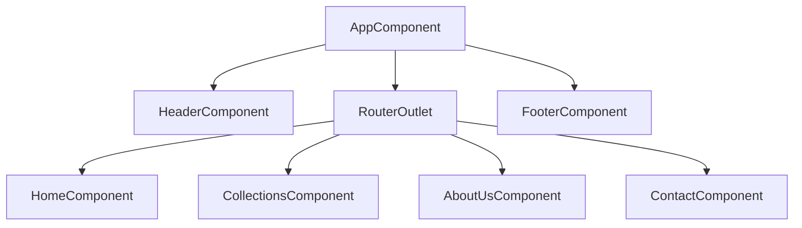
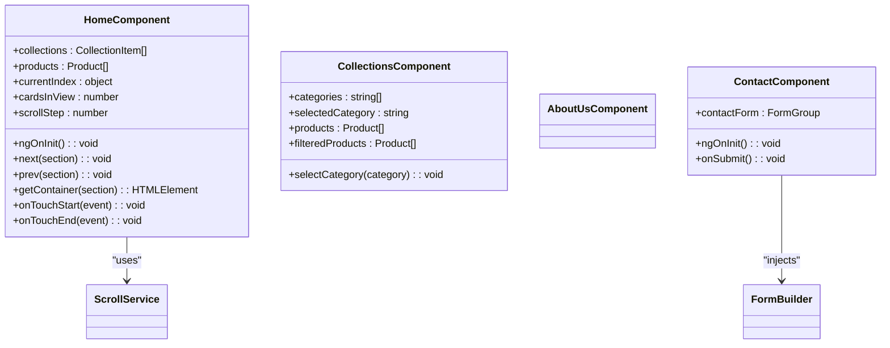
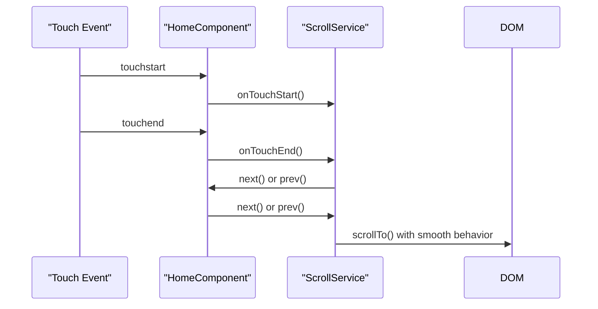

# Component Architecture

<cite>
**Referenced Files in This Document**   
- [app.component.ts](file://src/app/app.component.ts)
- [app.component.html](file://src/app/app.component.html)
- [header.component.ts](file://src/app/header/header.component.ts)
- [footer.component.ts](file://src/app/footer/footer.component.ts)
- [home.component.ts](file://src/app/home/home.component.ts)
- [collections.component.ts](file://src/app/collections/collections.component.ts)
- [about-us.component.ts](file://src/app/about-us/about-us.component.ts)
- [contact.component.ts](file://src/app/contact/contact.component.ts)
- [scroll.service.ts](file://src/app/home/service/scroll.service.ts)
- [app.routes.ts](file://src/app/app.routes.ts)
</cite>

## Table of Contents
1. [Root Component Structure](#root-component-structure)
2. [Page-Level Components](#page-level-components)
3. [Standalone Component Structure](#standalone-component-structure)
4. [Component Communication Patterns](#component-communication-patterns)
5. [Angular Decorator Usage](#angular-decorator-usage)
6. [Lifecycle Hooks Implementation](#lifecycle-hooks-implementation)
7. [Form Handling Approaches](#form-handling-approaches)

## Root Component Structure

The AppComponent serves as the root component of the kvs_website application, orchestrating the overall layout and routing structure. It imports and composes three key structural components: HeaderComponent, FooterComponent, and RouterOutlet, establishing the foundational UI architecture.

The component template follows a sequential layout pattern with the header at the top, a loading indicator, the router outlet for dynamic content, and the footer at the bottom. The loading state is managed internally with a small delay to ensure smooth user experience during navigation transitions.

**Diagram sources**
- [app.component.ts](file://src/app/app.component.ts#L7-L20)
- [app.component.html](file://src/app/app.component.html#L1-L10)

**Section sources**
- [app.component.ts](file://src/app/app.component.ts#L1-L21)
- [app.component.html](file://src/app/app.component.html#L1-L10)

## Page-Level Components

The application features four primary page-level components that handle specific content sections: Home, Collections, About Us, and Contact. Each component is lazy-loaded through the routing configuration, optimizing initial load performance.

The HomeComponent serves as the landing page with rich interactive features including scrollable collections and product displays. The CollectionsComponent provides category-based filtering of furniture products with a responsive grid layout. The AboutUsComponent presents company information with a clean, minimal structure. The ContactComponent implements a reactive form for user inquiries with validation and submission handling.

**Diagram sources**
- [home.component.ts](file://src/app/home/home.component.ts#L17-L179)
- [collections.component.ts](file://src/app/collections/collections.component.ts#L10-L31)
- [about-us.component.ts](file://src/app/about-us/about-us.component.ts#L9-L11)
- [contact.component.ts](file://src/app/contact/contact.component.ts#L11-L39)

**Section sources**
- [home.component.ts](file://src/app/home/home.component.ts#L1-L180)
- [collections.component.ts](file://src/app/collections/collections.component.ts#L1-L32)
- [about-us.component.ts](file://src/app/about-us/about-us.component.ts#L1-L12)
- [contact.component.ts](file://src/app/contact/contact.component.ts#L1-L40)
- [app.routes.ts](file://src/app/app.routes.ts#L3-L26)

## Standalone Component Structure

All components in the kvs_website application follow Angular's standalone component pattern, self-declaring their dependencies through the imports array in the @Component decorator. Each component maintains a consistent three-file structure: HTML template, SCSS styling, and TypeScript logic.

The HTML templates leverage Angular's template syntax for data binding, structural directives, and event handling. The SCSS files implement responsive design with mobile-first principles, utilizing media queries and CSS variables for consistent theming across different screen sizes. The TypeScript classes encapsulate component logic with proper typing and follow Angular's best practices for class organization.

The component architecture emphasizes separation of concerns, with each component responsible for a specific UI segment and its associated behavior. The styling system uses a combination of global variables and component-specific styles to maintain visual consistency while allowing for contextual variations.

**Section sources**
- [home.component.ts](file://src/app/home/home.component.ts#L11-L16)
- [home.component.html](file://src/app/home/home.component.html)
- [home.component.scss](file://src/app/home/home.component.scss)
- [header.component.scss](file://src/app/header/header.component.scss)
- [footer.component.scss](file://src/app/footer/footer.component.scss)

## Component Communication Patterns

The application implements several Angular component communication patterns to facilitate interaction between different parts of the UI. Template references and the @ViewChild decorator are used extensively in the HomeComponent to access DOM elements and manage scroll behavior.

The HomeComponent uses @ViewChild to obtain references to the collectionsContainer and productsContainer elements, enabling programmatic scrolling and swipe gesture handling. This pattern allows the component to interact directly with its template elements while maintaining encapsulation.

Service injection is employed through the ScrollService, which is providedIn: 'root' and injected into the HomeComponent via the constructor. This service provides shared functionality for scroll calculations and swipe gesture detection, promoting code reuse across components that require similar interaction patterns.

The @HostListener decorator enables the HomeComponent to respond to touch events at the component level, implementing a swipe gesture system that triggers navigation between items in the collections and products sections.

**Diagram sources**
- [home.component.ts](file://src/app/home/home.component.ts#L19-L179)
- [scroll.service.ts](file://src/app/home/service/scroll.service.ts#L6-L52)

**Section sources**
- [home.component.ts](file://src/app/home/home.component.ts#L19-L179)
- [scroll.service.ts](file://src/app/home/service/scroll.service.ts#L1-L53)

## Angular Decorator Usage

The application extensively uses Angular's decorator-based syntax to define component metadata and behavior. The @Component decorator is applied to all components, specifying essential configuration such as selector, template, and style URLs.

The @ViewChild decorator is used in the HomeComponent to create references to template elements, enabling direct manipulation of the DOM in a type-safe manner. This decorator accepts configuration options like { static: false } to control when the query is resolved during the change detection cycle.

The @HostListener decorator is employed to bind DOM events to component methods, specifically for handling touch events that drive the swipe navigation functionality. This pattern allows components to respond to user interactions without explicit event binding in the template.

The @Injectable decorator marks the ScrollService as an injectable service with providedIn: 'root', making it available throughout the application via Angular's dependency injection system.

**Section sources**
- [home.component.ts](file://src/app/home/home.component.ts#L19-L179)
- [scroll.service.ts](file://src/app/home/service/scroll.service.ts#L3-L6)

## Lifecycle Hooks Implementation

The application implements Angular lifecycle hooks to manage component initialization and state. The ngOnInit hook is used in both the HomeComponent and ContactComponent to perform setup tasks when the component is initialized.

In the HomeComponent, ngOnInit initializes the AOS (Animate On Scroll) library with specific duration and animation settings, and calls a private method to log screen size information. This hook ensures that animations are properly configured before the component becomes visible to the user.

The ContactComponent uses ngOnInit to initialize the reactive form with validation rules for all form fields, ensuring the form is ready for user interaction immediately after component creation.

These lifecycle hook implementations follow Angular best practices by performing initialization tasks in ngOnInit rather than in the constructor, allowing for proper dependency injection and change detection timing.

**Section sources**
- [home.component.ts](file://src/app/home/home.component.ts#L98-L135)
- [contact.component.ts](file://src/app/contact/contact.component.ts#L17-L29)

## Form Handling Approaches

The application demonstrates both template-driven and reactive approaches to form handling, with the ContactComponent implementing a reactive form pattern. This approach provides greater control over form validation and state management compared to template-driven forms.

The ContactComponent uses Angular's ReactiveFormsModule and FormBuilder to create a FormGroup with validation rules for each form control. Required fields are marked with Validators.required, while the email field includes additional email format validation.

Form submission is handled through the onSubmit method, which checks the form validity before processing the submission. Upon successful validation, the form data is logged, a success message is displayed, and the form is reset to its initial state.

This reactive approach allows for more complex validation scenarios, easier unit testing, and better type safety compared to template-driven forms, making it well-suited for the contact form's requirements.

**Section sources**
- [contact.component.ts](file://src/app/contact/contact.component.ts#L2-L39)
- [contact.component.html](file://src/app/contact/contact.component.html)