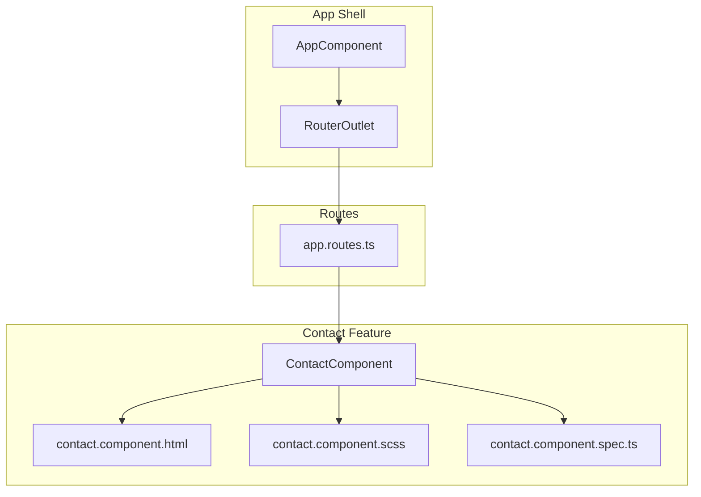
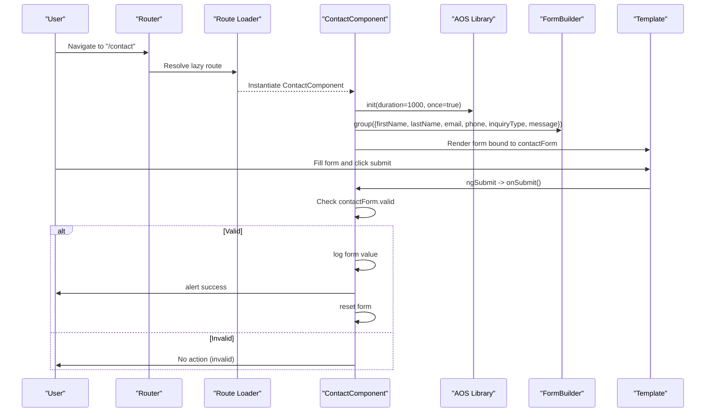
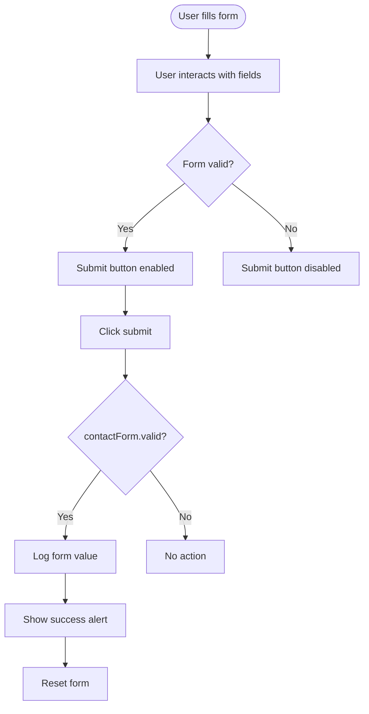
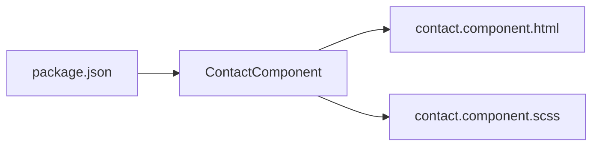

# Contact Component

<cite>
**Referenced Files in This Document**
- [contact.component.ts](file://src/app/contact/contact.component.ts)
- [contact.component.html](file://src/app/contact/contact.component.html)
- [contact.component.scss](file://src/app/contact/contact.component.scss)
- [contact.component.spec.ts](file://src/app/contact/contact.component.spec.ts)
- [app.routes.ts](file://src/app/app.routes.ts)
- [app.config.ts](file://src/app/app.config.ts)
- [app.component.ts](file://src/app/app.component.ts)
- [package.json](file://package.json)
</cite>

## Table of Contents
1. [Introduction](#introduction)
2. [Project Structure](#project-structure)
3. [Core Components](#core-components)
4. [Architecture Overview](#architecture-overview)
5. [Detailed Component Analysis](#detailed-component-analysis)
6. [Dependency Analysis](#dependency-analysis)
7. [Performance Considerations](#performance-considerations)
8. [Troubleshooting Guide](#troubleshooting-guide)
9. [Conclusion](#conclusion)
10. [Appendices](#appendices)

## Introduction
This document explains the ContactComponent, which implements a user inquiry form using Angular’s Reactive Forms module. It covers the construction of the contactForm FormGroup via FormBuilder, client-side validation with Validators.required and Validators.email, form control state management (pristine, dirty, valid), submission handling, and AOS animations integration. It also compares reactive and template-driven approaches, highlights accessibility considerations, and outlines production-ready recommendations for backend integration.

## Project Structure
The ContactComponent resides under the contact feature module and is lazily loaded via the application router. The component integrates with AOS for scroll-triggered animations and uses a dedicated stylesheet for responsive layout and form styling.

**Diagram sources**
- [app.component.ts](file://src/app/app.component.ts#L1-L21)
- [app.routes.ts](file://src/app/app.routes.ts#L1-L27)
- [contact.component.ts](file://src/app/contact/contact.component.ts#L1-L40)
- [contact.component.html](file://src/app/contact/contact.component.html#L1-L77)
- [contact.component.scss](file://src/app/contact/contact.component.scss#L1-L390)
- [contact.component.spec.ts](file://src/app/contact/contact.component.spec.ts#L1-L24)

**Section sources**
- [app.routes.ts](file://src/app/app.routes.ts#L1-L27)
- [contact.component.ts](file://src/app/contact/contact.component.ts#L1-L40)
- [contact.component.html](file://src/app/contact/contact.component.html#L1-L77)
- [contact.component.scss](file://src/app/contact/contact.component.scss#L1-L390)
- [contact.component.spec.ts](file://src/app/contact/contact.component.spec.ts#L1-L24)

## Core Components
- ContactComponent: Implements the reactive form, validation, submission handling, and AOS integration.
- Template: Binds the form controls to the contactForm and disables the submit button when invalid.
- Stylesheet: Provides responsive layout and form field styling.
- Routing: Lazily loads the ContactComponent via the route definition.

Key responsibilities:
- Build a reactive form with required fields and email validation.
- Manage form state and submission lifecycle.
- Initialize AOS animations on component initialization.
- Provide basic visual feedback on successful submission.

**Section sources**
- [contact.component.ts](file://src/app/contact/contact.component.ts#L1-L40)
- [contact.component.html](file://src/app/contact/contact.component.html#L1-L77)
- [contact.component.scss](file://src/app/contact/contact.component.scss#L1-L390)
- [app.routes.ts](file://src/app/app.routes.ts#L1-L27)

## Architecture Overview
The ContactComponent participates in the Angular application’s routing and form ecosystem. On navigation to the contact route, the ContactComponent is instantiated, initializes AOS, constructs the reactive form, and renders the form UI. Submission triggers validation and a success flow.

**Diagram sources**
- [app.routes.ts](file://src/app/app.routes.ts#L1-L27)
- [contact.component.ts](file://src/app/contact/contact.component.ts#L1-L40)
- [contact.component.html](file://src/app/contact/contact.component.html#L1-L77)

## Detailed Component Analysis

### Reactive Form Construction with FormBuilder
- The component declares a FormGroup named contactForm.
- The form is built in ngOnInit using FormBuilder.group with the following fields:
  - firstName: required
  - lastName: required
  - email: required and email pattern validated
  - phone: optional
  - inquiryType: required
  - message: required
- The template binds to this form via [formGroup] and formControlName attributes.

Validation applied:
- Validators.required ensures mandatory fields are present.
- Validators.email enforces a valid email format.

Form state management:
- Angular automatically tracks control states (pristine, dirty, valid) based on user interaction and validation outcomes.
- The submit button is disabled when the form is invalid, preventing submission until validation passes.

Submission handling:
- onSubmit checks contactForm.valid before proceeding.
- On success, it logs the form value to the console, shows a success alert, and resets the form.

AOS integration:
- AOS is initialized in ngOnInit with duration and once options to animate elements on scroll.

**Section sources**
- [contact.component.ts](file://src/app/contact/contact.component.ts#L1-L40)
- [contact.component.html](file://src/app/contact/contact.component.html#L1-L77)

### Template Binding and Accessibility
- The template binds the form to contactForm and uses formControlName for each input.
- The submit button is disabled when the form is invalid.
- Required attributes on inputs complement reactive validation.
- Consider adding aria-describedby and aria-invalid for improved accessibility.

**Diagram sources**
- [contact.component.html](file://src/app/contact/contact.component.html#L1-L77)
- [contact.component.ts](file://src/app/contact/contact.component.ts#L1-L40)

**Section sources**
- [contact.component.html](file://src/app/contact/contact.component.html#L1-L77)
- [contact.component.ts](file://src/app/contact/contact.component.ts#L1-L40)

### Comparison: Reactive Forms vs Template-Driven Forms
- Reactive Forms (used here):
  - Centralized form model in the component class.
  - Strongly typed, testable, and suitable for complex validation scenarios.
  - Easier to dynamically add/remove controls and manage async validation.
- Template-Driven Forms:
  - Declarative binding in templates with directives like ngModel.
  - Simpler for straightforward forms but harder to scale for complex validation.

Justification for reactive forms in this component:
- The form requires multiple validators and a structured submission flow.
- Reactive forms enable centralized validation logic and easier integration with backend services.

[No sources needed since this section provides conceptual comparison]

### Styling and Responsiveness
- The stylesheet defines a two-column layout on larger screens and a stacked layout on mobile.
- Form inputs, selects, and textarea are styled consistently with focus states and transitions.
- Button states reflect disabled/enabled conditions.

**Section sources**
- [contact.component.scss](file://src/app/contact/contact.component.scss#L1-L390)

## Dependency Analysis
External dependencies and integrations:
- Angular Forms: FormBuilder, FormGroup, Validators, ReactiveFormsModule.
- AOS: Scroll-triggered animations initialized in ngOnInit.
- Font Awesome icons are used in the template for social links.

**Diagram sources**
- [package.json](file://package.json#L1-L42)
- [contact.component.ts](file://src/app/contact/contact.component.ts#L1-L40)
- [contact.component.html](file://src/app/contact/contact.component.html#L1-L77)
- [contact.component.scss](file://src/app/contact/contact.component.scss#L1-L390)

**Section sources**
- [package.json](file://package.json#L1-L42)
- [contact.component.ts](file://src/app/contact/contact.component.ts#L1-L40)

## Performance Considerations
- Reactive forms are efficient for moderate complexity; keep validation logic synchronous to avoid blocking UI updates.
- Debounce asynchronous validations if integrating with external services.
- Minimize heavy computations in onSubmit; delegate network calls to services.

[No sources needed since this section provides general guidance]

## Troubleshooting Guide
Common issues and resolutions:
- Unhandled submission errors:
  - Add error handling around submission logic and surface user-friendly messages.
  - Consider moving submission to a service and handling errors centrally.
- Accessibility concerns:
  - Ensure labels are associated with inputs.
  - Provide aria-invalid and aria-describedby for dynamic feedback.
  - Announce validation messages to assistive technologies.
- Validation feedback:
  - Display inline validation messages tied to each control.
  - Use control status classes to visually indicate validity states.
- AOS not animating:
  - Verify AOS initialization occurs after DOM rendering and that AOS CSS is included.

**Section sources**
- [contact.component.ts](file://src/app/contact/contact.component.ts#L1-L40)
- [contact.component.html](file://src/app/contact/contact.component.html#L1-L77)

## Conclusion
The ContactComponent demonstrates a clean implementation of a reactive form with essential validation and a polished user experience through AOS animations. Its structure supports scalability, testability, and future enhancements such as backend integration and improved accessibility.

[No sources needed since this section summarizes without analyzing specific files]

## Appendices

### Backend Integration Recommendations
- Use a service to encapsulate submission logic and handle HTTP requests.
- Integrate with Firebase Functions or another backend endpoint.
- Implement retry logic, timeouts, and error surfaces for robustness.
- Consider adding loading indicators and progress feedback during submission.

[No sources needed since this section provides general guidance]