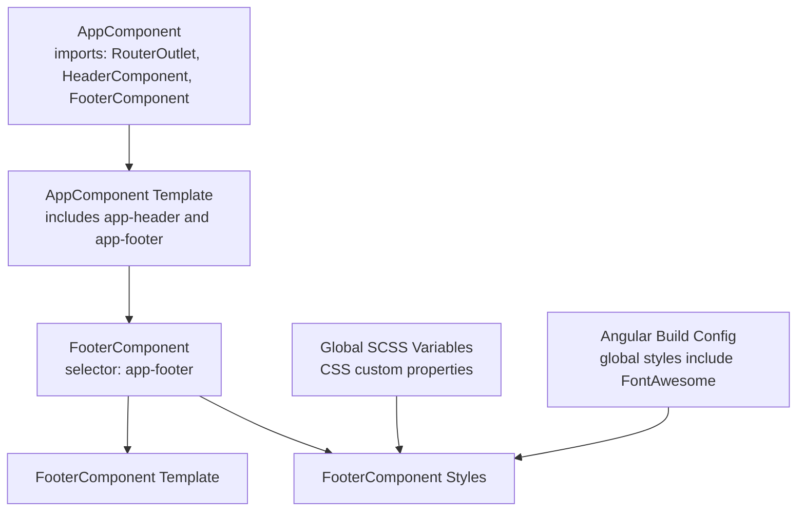
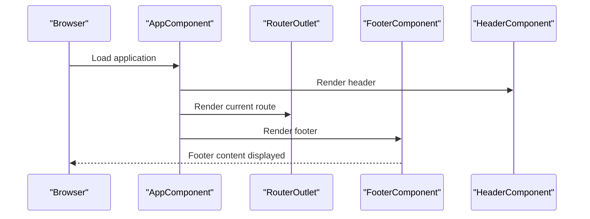
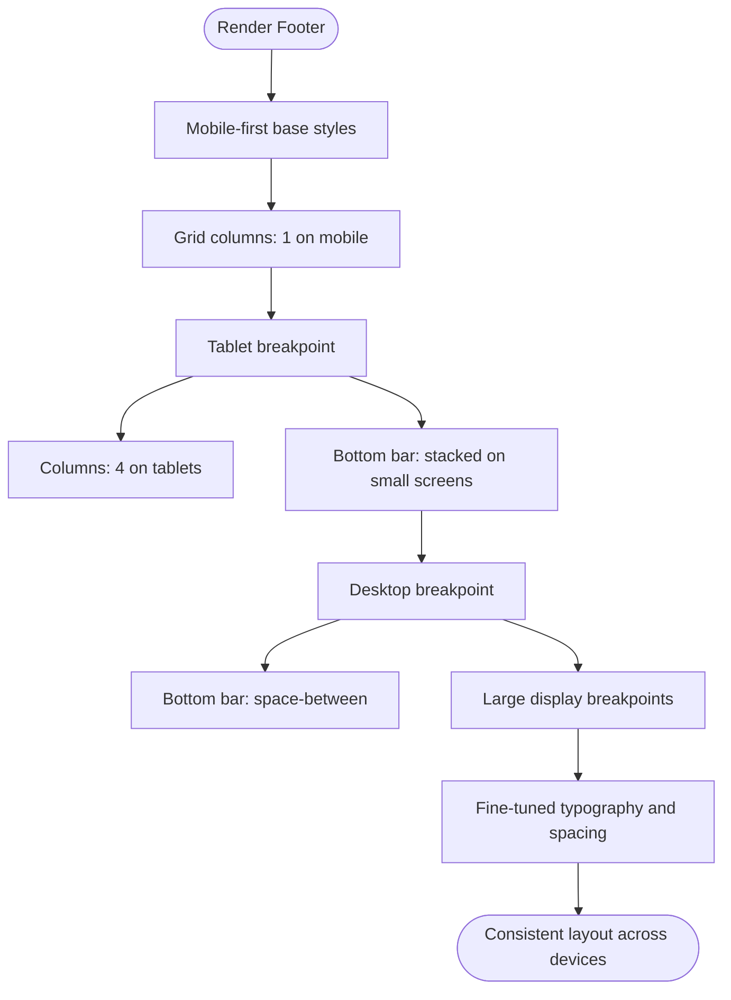
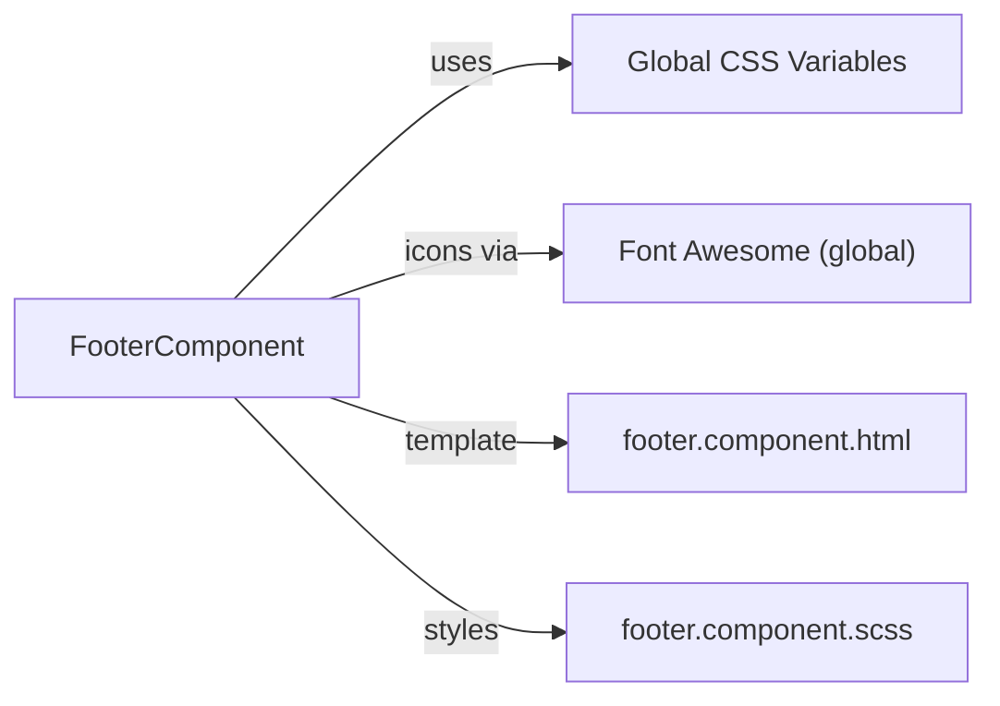

# Footer Component

<cite>
**Referenced Files in This Document**
- [footer.component.ts](file://src/app/footer/footer.component.ts)
- [footer.component.html](file://src/app/footer/footer.component.html)
- [footer.component.scss](file://src/app/footer/footer.component.scss)
- [app.component.ts](file://src/app/app.component.ts)
- [app.component.html](file://src/app/app.component.html)
- [styles.scss](file://src/styles.scss)
- [angular.json](file://angular.json)
- [header.component.html](file://src/app/header/header.component.html)
- [footer.component.spec.ts](file://src/app/footer/footer.component.spec.ts)
</cite>

## Table of Contents
1. [Introduction](#introduction)
2. [Project Structure](#project-structure)
3. [Core Components](#core-components)
4. [Architecture Overview](#architecture-overview)
5. [Detailed Component Analysis](#detailed-component-analysis)
6. [Dependency Analysis](#dependency-analysis)
7. [Performance Considerations](#performance-considerations)
8. [Troubleshooting Guide](#troubleshooting-guide)
9. [Conclusion](#conclusion)
10. [Appendices](#appendices)

## Introduction
This document describes the FooterComponent, a standalone Angular component responsible for rendering consistent site-wide footer content. It covers how the component integrates into the application shell, its static content model, responsive layout techniques, accessibility considerations, and customization/theming approaches. The FooterComponent is placed at the bottom of the AppComponent template and remains consistent across all routes, ensuring brand continuity and navigation anchors for users.

## Project Structure
The FooterComponent resides under the app module and is integrated into the application shell via the AppComponent. The component’s template and styles are self-contained, and the application’s global SCSS variables define the theming system used by the footer.

**Diagram sources**
- [app.component.ts](file://src/app/app.component.ts#L1-L21)
- [app.component.html](file://src/app/app.component.html#L1-L10)
- [footer.component.ts](file://src/app/footer/footer.component.ts#L1-L12)
- [footer.component.html](file://src/app/footer/footer.component.html#L1-L28)
- [footer.component.scss](file://src/app/footer/footer.component.scss#L1-L402)
- [styles.scss](file://src/styles.scss#L1-L146)
- [angular.json](file://angular.json#L35-L40)

**Section sources**
- [app.component.ts](file://src/app/app.component.ts#L1-L21)
- [app.component.html](file://src/app/app.component.html#L1-L10)
- [footer.component.ts](file://src/app/footer/footer.component.ts#L1-L12)
- [footer.component.html](file://src/app/footer/footer.component.html#L1-L28)
- [footer.component.scss](file://src/app/footer/footer.component.scss#L1-L402)
- [styles.scss](file://src/styles.scss#L1-L146)
- [angular.json](file://angular.json#L35-L40)

## Core Components
- FooterComponent: A minimal standalone component with no external dependencies beyond Angular core. It defines a selector and relies on its own template and SCSS for presentation.
- Integration: AppComponent includes app-footer in its template, ensuring the footer appears consistently across routes managed by RouterOutlet.

Key characteristics:
- Standalone component with no imports declared in the decorator (no external dependencies).
- Uses semantic HTML with a footer element and accessible link anchors.
- Responsive layout built with CSS Grid and Flexbox, plus media queries for multiple breakpoints.
- Theming via CSS custom properties defined globally.

**Section sources**
- [footer.component.ts](file://src/app/footer/footer.component.ts#L1-L12)
- [app.component.html](file://src/app/app.component.html#L1-L10)

## Architecture Overview
The FooterComponent participates in the application’s layout architecture by being rendered inside the AppComponent template alongside the header and routed content. This ensures a consistent footer across all pages.

**Diagram sources**
- [app.component.html](file://src/app/app.component.html#L1-L10)
- [app.component.ts](file://src/app/app.component.ts#L1-L21)
- [header.component.html](file://src/app/header/header.component.html#L1-L29)

## Detailed Component Analysis

### Component Structure and Responsibilities
- Selector: app-footer
- Template: Contains branding, tagline, social icons, and legal links in a structured layout.
- Styles: Uses CSS Grid for the footer column layout and Flexbox for the bottom bar, with extensive media queries for responsiveness.

Responsibilities:
- Provide consistent branding and navigation anchors across routes.
- Offer a static set of links suitable for legal and informational purposes.
- Maintain visual consistency with the rest of the site via shared CSS custom properties.

**Section sources**
- [footer.component.ts](file://src/app/footer/footer.component.ts#L1-L12)
- [footer.component.html](file://src/app/footer/footer.component.html#L1-L28)
- [footer.component.scss](file://src/app/footer/footer.component.scss#L1-L402)

### Template Composition
The template organizes content into two main areas:
- Top section: Brand identity and social media links.
- Bottom section: Copyright notice and legal navigation links.

Structure highlights:
- Semantic footer container.
- Column-based layout for top content.
- Bottom bar with centered text on small screens and split layout on larger screens.

**Section sources**
- [footer.component.html](file://src/app/footer/footer.component.html#L1-L28)

### Styling and Responsive Layout
Responsive strategy:
- Mobile-first approach using clamp() for fluid typography.
- CSS Grid for the top content columns with increasing column counts at larger breakpoints.
- Flexbox for the bottom bar, switching from stacked to space-between layout at tablet breakpoint.
- Extensive media queries covering extra-small to ultra-large displays.

Key techniques:
- CSS custom properties for spacing and typography.
- Media queries for tablet, desktop, and large display ranges.
- Utility of clamp() for readable scaling across viewport widths.

**Diagram sources**
- [footer.component.scss](file://src/app/footer/footer.component.scss#L1-L402)

**Section sources**
- [footer.component.scss](file://src/app/footer/footer.component.scss#L1-L402)

### Theming and Customization
Theming system:
- Global CSS custom properties defined in the global SCSS file.
- Footer SCSS consumes these variables for colors, fonts, and spacing.
- Angular build configuration includes Font Awesome for social icons.

Customization guidance:
- Modify global variables to change primary colors, fonts, and spacing.
- Override footer-specific variables if a distinct footer palette is desired.
- Keep iconography consistent with Font Awesome by updating the icon classes.

**Section sources**
- [styles.scss](file://src/styles.scss#L1-L146)
- [angular.json](file://angular.json#L35-L40)
- [footer.component.scss](file://src/app/footer/footer.component.scss#L1-L402)

### Accessibility Best Practices
Current state:
- Uses semantic footer element.
- Links are present for navigation and legal information.
- Social icons are anchor tags with icon fonts.

Recommended enhancements:
- Add aria-label attributes to social media links for screen reader clarity.
- Ensure keyboard navigable links with focus-visible indicators.
- Consider adding skip links or landmark roles if integrating into a larger page framework.
- Verify sufficient color contrast for text and hover states.

Note: These recommendations are derived from the existing HTML structure and do not introduce new code.

**Section sources**
- [footer.component.html](file://src/app/footer/footer.component.html#L1-L28)

### Static Content Model and Extension Opportunities
Current content:
- Brand identity and tagline.
- Social media placeholders.
- Legal links (privacy policy, terms, sitemap).
- Copyright notice.

Static nature:
- No component inputs or state; content is hard-coded in the template.

Extension opportunities:
- Dynamic copyright year: Replace fixed year with a runtime value bound to the current year.
- Dynamic social links: Introduce inputs for platform URLs and toggle visibility.
- Multi-column layout: Expand top section into multiple columns for navigation links.
- Contact information: Add address, phone, and email placeholders with inputs.

These suggestions are conceptual and would require component inputs and data binding.

**Section sources**
- [footer.component.html](file://src/app/footer/footer.component.html#L1-L28)

### Integration Within AppComponent
Integration details:
- AppComponent imports FooterComponent and includes it in its template.
- Footer is rendered after RouterOutlet, ensuring it appears below page content.

Benefits:
- Consistent footer across all routes.
- Minimal coupling; footer is independent of route logic.

**Section sources**
- [app.component.ts](file://src/app/app.component.ts#L1-L21)
- [app.component.html](file://src/app/app.component.html#L1-L10)

### Test Coverage
Basic test scaffolding exists for the component, confirming creation and basic instantiation.

**Section sources**
- [footer.component.spec.ts](file://src/app/footer/footer.component.spec.ts#L1-L24)

## Dependency Analysis
Component dependencies:
- Angular core only (no external libraries).
- Template and styles are self-contained.
- Global SCSS variables and build-time assets (Font Awesome) influence appearance.

External influences:
- Global CSS custom properties drive colors and spacing.
- Font Awesome is included globally for iconography.

**Diagram sources**
- [footer.component.ts](file://src/app/footer/footer.component.ts#L1-L12)
- [footer.component.html](file://src/app/footer/footer.component.html#L1-L28)
- [footer.component.scss](file://src/app/footer/footer.component.scss#L1-L402)
- [styles.scss](file://src/styles.scss#L1-L146)
- [angular.json](file://angular.json#L35-L40)

**Section sources**
- [footer.component.ts](file://src/app/footer/footer.component.ts#L1-L12)
- [styles.scss](file://src/styles.scss#L1-L146)
- [angular.json](file://angular.json#L35-L40)

## Performance Considerations
- Minimal component footprint: No external dependencies reduce bundle size.
- CSS Grid and Flexbox layouts are efficient; avoid heavy JavaScript for layout.
- Font Awesome is included globally; ensure only used icons are loaded if optimizing further.
- Keep media queries focused and avoid excessive reflows by using CSS custom properties.

[No sources needed since this section provides general guidance]

## Troubleshooting Guide
Common issues and resolutions:
- Icons not displaying: Confirm Font Awesome is included in the build configuration and network allows loading the CDN.
- Colors look incorrect: Verify global CSS custom properties are defined and not overridden elsewhere.
- Layout shifts on load: Ensure clamp() usage is appropriate and media queries are ordered correctly.
- Social icons misaligned: Check icon classes and ensure Font Awesome CSS is loaded.

**Section sources**
- [angular.json](file://angular.json#L35-L40)
- [styles.scss](file://src/styles.scss#L1-L146)
- [footer.component.scss](file://src/app/footer/footer.component.scss#L1-L402)

## Conclusion
The FooterComponent delivers a consistent, responsive footer with a clean, static content model. Its integration into AppComponent ensures it appears across all routes, while its SCSS leverages global variables and modern layout techniques for cross-device compatibility. Future enhancements can introduce dynamic content and expanded sections without altering the component’s standalone architecture.

[No sources needed since this section summarizes without analyzing specific files]

## Appendices

### Appendix A: Responsive Breakpoints and Layout Notes
- Mobile-first base with clamp() for scalable typography.
- Grid columns increase progressively: 1 → 2 → 4 across breakpoints.
- Bottom bar switches from stacked to split layout at tablet breakpoint.
- Fine-grained media queries for tablet, desktop, and large displays.

**Section sources**
- [footer.component.scss](file://src/app/footer/footer.component.scss#L1-L402)

### Appendix B: Accessibility Recommendations
- Add aria-labels to social links.
- Ensure keyboard focus visibility.
- Maintain color contrast for text and interactive elements.

**Section sources**
- [footer.component.html](file://src/app/footer/footer.component.html#L1-L28)