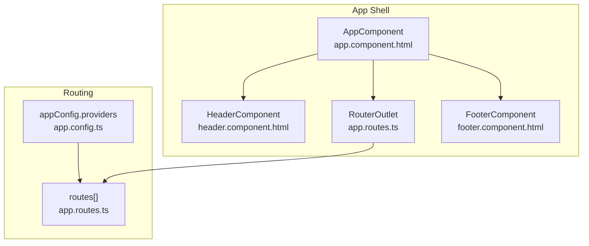
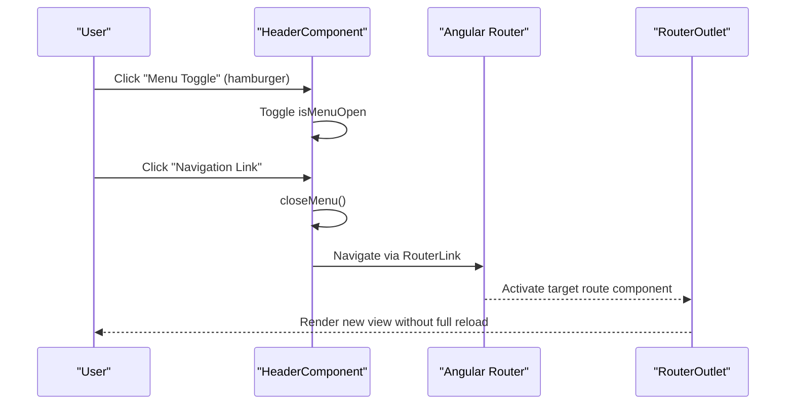
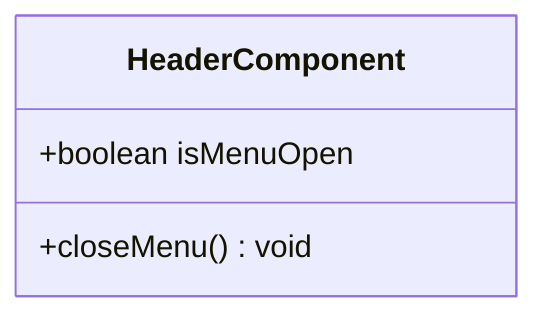
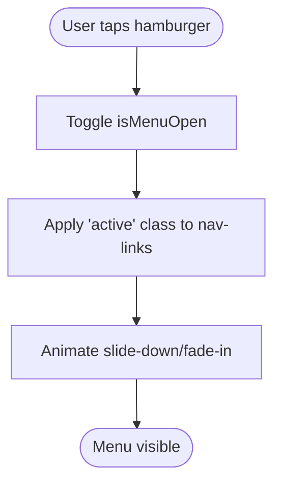
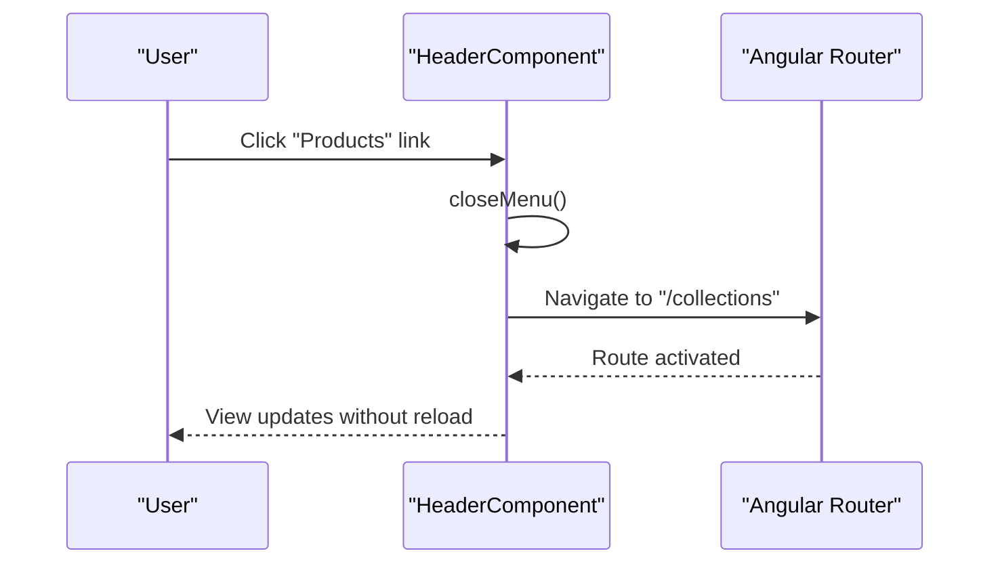
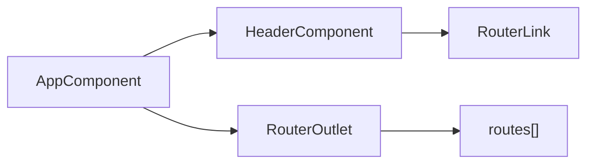
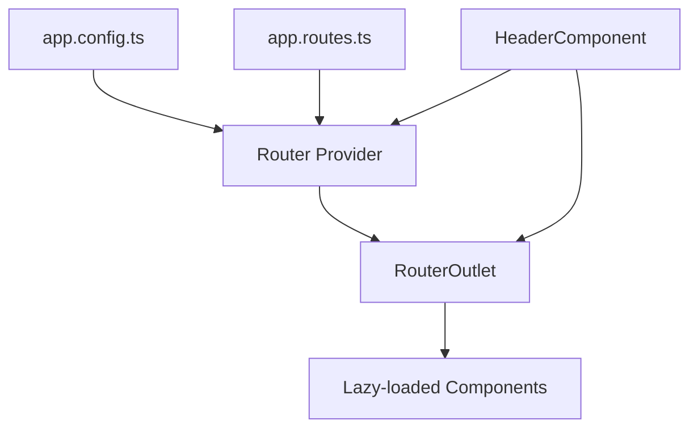

# Header Component

<cite>
**Referenced Files in This Document**
- [header.component.ts](file://src/app/header/header.component.ts)
- [header.component.html](file://src/app/header/header.component.html)
- [header.component.scss](file://src/app/header/header.component.scss)
- [app.routes.ts](file://src/app/app.routes.ts)
- [app.config.ts](file://src/app/app.config.ts)
- [app.component.ts](file://src/app/app.component.ts)
- [app.component.html](file://src/app/app.component.html)
- [styles.scss](file://src/styles.scss)
</cite>

## Table of Contents
1. [Introduction](#introduction)
2. [Project Structure](#project-structure)
3. [Core Components](#core-components)
4. [Architecture Overview](#architecture-overview)
5. [Detailed Component Analysis](#detailed-component-analysis)
6. [Dependency Analysis](#dependency-analysis)
7. [Performance Considerations](#performance-considerations)
8. [Troubleshooting Guide](#troubleshooting-guide)
9. [Conclusion](#conclusion)

## Introduction
This document explains the HeaderComponent implementation for navigation and mobile menu state management in the kvs_website application. It covers the toggleable mobile menu driven by the isMenuOpen boolean flag and the closeMenu method, how RouterLink directives enable client-side navigation without page reloads, and how the component integrates with Angular’s router for active route highlighting. It also documents the standalone component architecture with direct imports of RouterLink, provides practical interaction patterns, accessibility considerations, responsive design techniques, and solutions for common issues such as menu persistence after navigation.

## Project Structure
The header is a standalone component integrated into the application shell. The app module composes the header, router outlet, and footer, while routing is configured via app.routes.ts and app.config.ts.

**Diagram sources**
- [app.component.html](file://src/app/app.component.html#L1-L10)
- [app.routes.ts](file://src/app/app.routes.ts#L1-L27)
- [app.config.ts](file://src/app/app.config.ts#L1-L9)

**Section sources**
- [app.component.ts](file://src/app/app.component.ts#L1-L21)
- [app.component.html](file://src/app/app.component.html#L1-L10)
- [app.routes.ts](file://src/app/app.routes.ts#L1-L27)
- [app.config.ts](file://src/app/app.config.ts#L1-L9)

## Core Components
- HeaderComponent: Provides the navigation bar, logo, menu items, and mobile hamburger toggle. It manages the isMenuOpen state and exposes closeMenu to programmatically close the mobile menu.
- Router integration: Uses RouterLink and routerLinkActive to enable client-side navigation and highlight active links without full page reloads.
- Standalone component: Declares RouterLink as an import, aligning with Angular’s standalone component pattern.

Key responsibilities:
- Toggle mobile menu visibility via isMenuOpen and click handler on the hamburger element.
- Close menu on navigation item clicks to ensure consistent UI behavior across devices.
- Highlight active route using routerLinkActive.
- Provide responsive design via SCSS media queries and utility classes.

**Section sources**
- [header.component.ts](file://src/app/header/header.component.ts#L1-L17)
- [header.component.html](file://src/app/header/header.component.html#L1-L29)
- [header.component.scss](file://src/app/header/header.component.scss#L1-L120)

## Architecture Overview
The header participates in the application’s routing lifecycle. When users click a navigation link, Angular updates the router outlet without reloading the page. The header’s closeMenu ensures the mobile menu collapses after selection, preventing persistent open menus on smaller screens.

**Diagram sources**
- [header.component.html](file://src/app/header/header.component.html#L1-L29)
- [header.component.ts](file://src/app/header/header.component.ts#L1-L17)
- [app.routes.ts](file://src/app/app.routes.ts#L1-L27)

## Detailed Component Analysis

### Component Class and Template
- State management: A single boolean flag controls the mobile menu state.
- Behavior: A method toggles the menu open/closed and another method closes the menu on navigation.
- Router integration: RouterLink directives enable client-side navigation; routerLinkActive applies an active class to the currently active link.

**Diagram sources**
- [header.component.ts](file://src/app/header/header.component.ts#L1-L17)

**Section sources**
- [header.component.ts](file://src/app/header/header.component.ts#L1-L17)
- [header.component.html](file://src/app/header/header.component.html#L1-L29)

### Mobile Menu Toggle Logic
The mobile menu is controlled by a click handler bound to the hamburger element. The template toggles the isMenuOpen flag, and the SCSS uses this flag to apply an active class that reveals the menu on small screens.

**Diagram sources**
- [header.component.html](file://src/app/header/header.component.html#L1-L29)
- [header.component.scss](file://src/app/header/header.component.scss#L66-L80)

**Section sources**
- [header.component.html](file://src/app/header/header.component.html#L1-L29)
- [header.component.scss](file://src/app/header/header.component.scss#L66-L80)

### Navigation and Active Route Highlighting
- Client-side navigation: RouterLink directives on anchor and button elements trigger navigation without a full page reload.
- Active highlighting: routerLinkActive adds a class to the active link, enabling visual indication of the current route.
- Closing on navigate: Each navigation link invokes closeMenu to collapse the mobile menu immediately after navigation.

**Diagram sources**
- [header.component.html](file://src/app/header/header.component.html#L1-L29)
- [app.routes.ts](file://src/app/app.routes.ts#L1-L27)

**Section sources**
- [header.component.html](file://src/app/header/header.component.html#L1-L29)
- [app.routes.ts](file://src/app/app.routes.ts#L1-L27)

### Standalone Component Architecture
- Imports: RouterLink is imported directly in the component decorator, reflecting Angular’s standalone component pattern.
- Composition: The header is included in the app shell via the app component’s template.

**Diagram sources**
- [header.component.ts](file://src/app/header/header.component.ts#L1-L17)
- [app.component.html](file://src/app/app.component.html#L1-L10)
- [app.routes.ts](file://src/app/app.routes.ts#L1-L27)

**Section sources**
- [header.component.ts](file://src/app/header/header.component.ts#L1-L17)
- [app.component.ts](file://src/app/app.component.ts#L1-L21)

### Responsive Design and Accessibility
- Responsive breakpoints: The SCSS defines extensive media queries for mobile, tablet, desktop, and large displays, adjusting spacing, typography, and layout.
- Mobile menu presentation: On small screens, the nav-links container becomes a full-viewport overlay with a slide-down animation when the active class is applied.
- Accessibility: While the header template does not include explicit aria-* attributes, the presence of a visible toggle and active link highlighting supports basic screen reader navigation cues. Consider adding aria-expanded and aria-controls for improved semantics.

Practical examples of interaction patterns:
- Tap hamburger to reveal menu, tap a link to navigate and close the menu.
- On desktop, the menu remains hidden; the desktop contact button is visible.
- On tablets and large screens, the layout adapts with appropriate spacing and typography scaling.

**Section sources**
- [header.component.scss](file://src/app/header/header.component.scss#L1-L120)
- [header.component.scss](file://src/app/header/header.component.scss#L172-L207)
- [header.component.scss](file://src/app/header/header.component.scss#L258-L267)
- [styles.scss](file://src/styles.scss#L1-L23)

## Dependency Analysis
- Routing configuration: routes[] defines the available paths and lazy-loaded components.
- Router provider: app.config.ts configures the router with preloading enabled and zone change detection coalescing.
- Component composition: AppComponent includes the header, router outlet, and footer.

**Diagram sources**
- [app.config.ts](file://src/app/app.config.ts#L1-L9)
- [app.routes.ts](file://src/app/app.routes.ts#L1-L27)
- [app.component.html](file://src/app/app.component.html#L1-L10)

**Section sources**
- [app.config.ts](file://src/app/app.config.ts#L1-L9)
- [app.routes.ts](file://src/app/app.routes.ts#L1-L27)
- [app.component.ts](file://src/app/app.component.ts#L1-L21)

## Performance Considerations
- Minimizing re-renders:
  - Keep the header state minimal (single boolean flag) to reduce change detection overhead.
  - Avoid unnecessary subscriptions in the header; rely on template-driven interactions.
- Touch event handling:
  - The header’s mobile toggle is a simple click handler; ensure no heavy computations occur during click handlers.
  - For smoother animations, prefer hardware-accelerated CSS properties (already used for transitions).
- Router performance:
  - Preloading is enabled globally, reducing perceived latency for subsequent navigations.
  - Zone change detection coalescing reduces redundant change detection cycles.

[No sources needed since this section provides general guidance]

## Troubleshooting Guide
Common issues and solutions:
- Menu persists after navigation on mobile:
  - Ensure closeMenu is invoked on each navigation link click. Verify the (click)="closeMenu()" binding on anchor and button elements.
  - Confirm the active class is toggled by isMenuOpen and that the SCSS targets the active class correctly.
- Active link highlighting not updating:
  - Confirm routerLinkActive is present on the anchor elements and that the router outlet is rendering the intended component.
  - Verify the active class is styled appropriately in SCSS.
- Mobile menu not closing on desktop:
  - The template hides the hamburger on larger screens; ensure the closeMenu method is still called on navigation for consistency.
- Inconsistent UI across devices:
  - Review media queries for nav-links and menu-toggle visibility. Adjust breakpoints if needed to match design requirements.

**Section sources**
- [header.component.html](file://src/app/header/header.component.html#L1-L29)
- [header.component.scss](file://src/app/header/header.component.scss#L66-L80)
- [app.routes.ts](file://src/app/app.routes.ts#L1-L27)

## Conclusion
The HeaderComponent provides a clean, standalone implementation of navigation with robust mobile menu state management. Its integration with Angular’s router enables seamless client-side navigation and active route highlighting. The SCSS-driven responsive design ensures consistent behavior across devices, while the closeMenu method helps prevent menu persistence after navigation. By following the outlined patterns and troubleshooting steps, developers can maintain a reliable and accessible navigation experience.