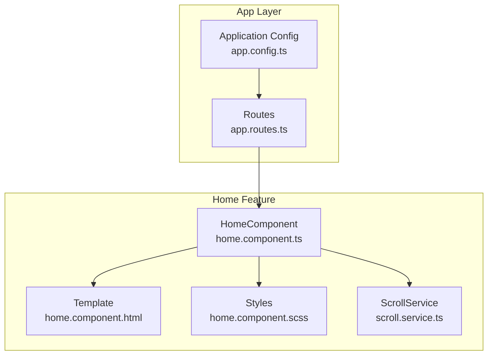
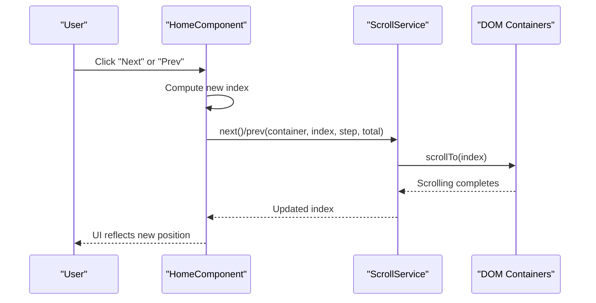
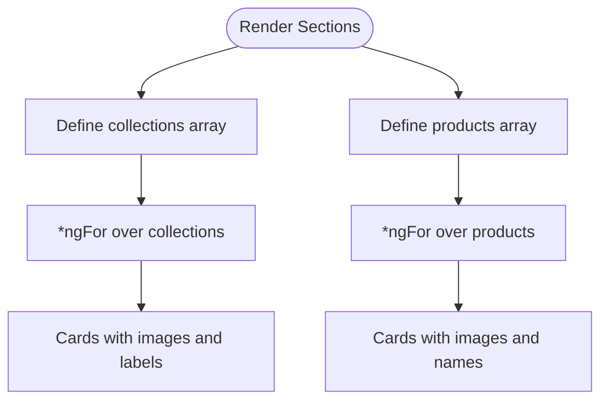
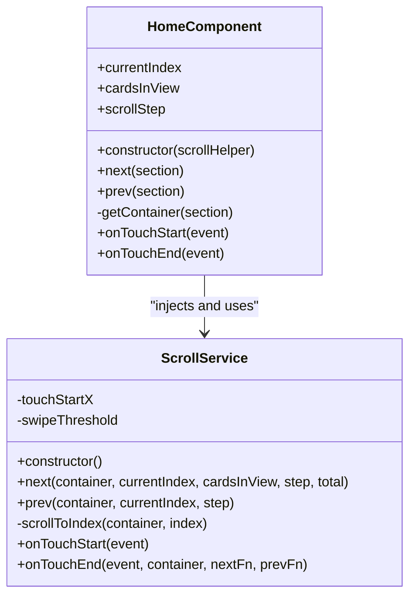
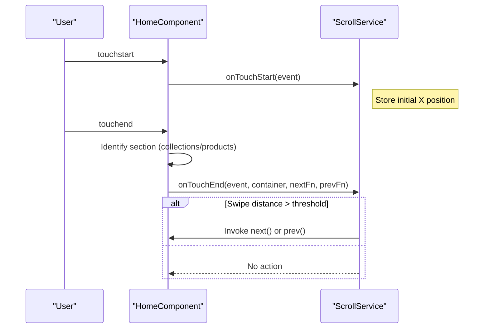
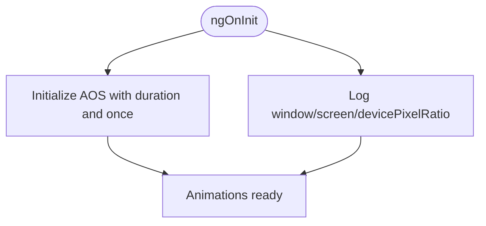
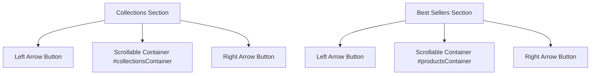
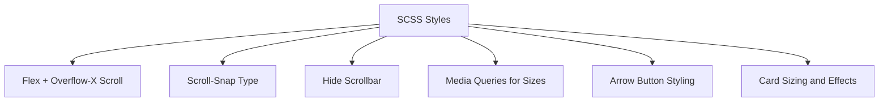
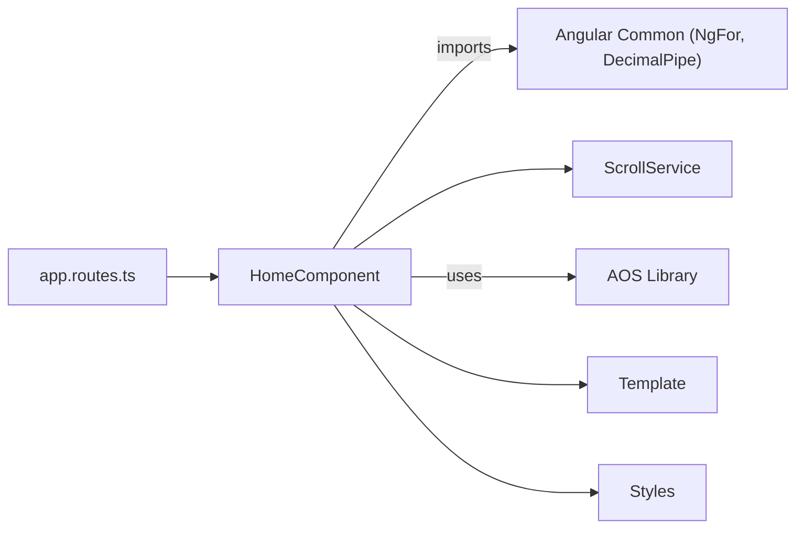

# Home Component

<cite>
**Referenced Files in This Document**
- [home.component.ts](file://src/app/home/home.component.ts)
- [home.component.html](file://src/app/home/home.component.html)
- [home.component.scss](file://src/app/home/home.component.scss)
- [scroll.service.ts](file://src/app/home/service/scroll.service.ts)
- [app.routes.ts](file://src/app/app.routes.ts)
- [app.config.ts](file://src/app/app.config.ts)
</cite>

## Table of Contents
1. [Introduction](#introduction)
2. [Project Structure](#project-structure)
3. [Core Components](#core-components)
4. [Architecture Overview](#architecture-overview)
5. [Detailed Component Analysis](#detailed-component-analysis)
6. [Dependency Analysis](#dependency-analysis)
7. [Performance Considerations](#performance-considerations)
8. [Troubleshooting Guide](#troubleshooting-guide)
9. [Conclusion](#conclusion)

## Introduction
This document explains the HomeComponent, the primary landing page of the kvs_website application. It focuses on how the component manages two horizontal scrollable sections: Collections and Best Sellers (Products). The component uses Angular’s @ViewChild to access DOM elements for scroll manipulation, delegates scroll logic to a shared ScrollService, and integrates touch gestures via @HostListener decorators for swipe navigation on mobile devices. It also documents the data structures for collections and products, the display logic, and the integration of the AOS (Animate On Scroll) library for entrance animations during initialization.

## Project Structure
The HomeComponent resides under src/app/home and is wired into the application via route configuration. The component template defines two horizontally scrollable sections with navigation controls and swipe support.

**Diagram sources**
- [app.routes.ts](file://src/app/app.routes.ts#L1-L27)
- [app.config.ts](file://src/app/app.config.ts#L1-L9)
- [home.component.ts](file://src/app/home/home.component.ts#L1-L180)
- [home.component.html](file://src/app/home/home.component.html#L1-L205)
- [home.component.scss](file://src/app/home/home.component.scss#L813-L950)
- [scroll.service.ts](file://src/app/home/service/scroll.service.ts#L1-L53)

**Section sources**
- [app.routes.ts](file://src/app/app.routes.ts#L1-L27)
- [app.config.ts](file://src/app/app.config.ts#L1-L9)
- [home.component.ts](file://src/app/home/home.component.ts#L1-L180)
- [home.component.html](file://src/app/home/home.component.html#L1-L205)
- [home.component.scss](file://src/app/home/home.component.scss#L813-L950)
- [scroll.service.ts](file://src/app/home/service/scroll.service.ts#L1-L53)

## Core Components
- HomeComponent: Orchestrates two horizontal carousels (Collections and Best Sellers), manages scroll positions, exposes navigation controls, and handles touch gestures.
- ScrollService: Centralizes scroll logic, including smooth scrolling to a target index and swipe detection.

Key responsibilities:
- Manage two independent currentIndex values (one per carousel).
- Expose next() and prev() methods bound to arrow buttons.
- Use @ViewChild to access DOM containers for both sections.
- Inject ScrollService to encapsulate scroll calculations and smooth scrolling.
- Integrate AOS for entrance animations on initialization.
- Implement touch gesture support via @HostListener for swipe navigation.

**Section sources**
- [home.component.ts](file://src/app/home/home.component.ts#L1-L180)
- [scroll.service.ts](file://src/app/home/service/scroll.service.ts#L1-L53)

## Architecture Overview
The HomeComponent delegates all scroll-related logic to ScrollService, keeping the component lean and testable. The template defines two carousel sections with navigation buttons and a container element for each. Styles define horizontal scrolling behavior and responsive card sizing.

**Diagram sources**
- [home.component.ts](file://src/app/home/home.component.ts#L139-L178)
- [scroll.service.ts](file://src/app/home/service/scroll.service.ts#L13-L38)

## Detailed Component Analysis

### Data Structures and Mock Data
- Collections: An array of objects representing categories. Each item includes an identifier, name, and image URL.
- Products: An array of product objects with name, description, image URL, and a favorite flag.

Display logic:
- Both sections render via *ngFor over their respective arrays.
- The Collections section shows numeric indices alongside images and names.
- The Best Sellers section shows product images and names.

**Diagram sources**
- [home.component.ts](file://src/app/home/home.component.ts#L32-L94)
- [home.component.html](file://src/app/home/home.component.html#L71-L113)
- [home.component.html](file://src/app/home/home.component.html#L159-L199)

**Section sources**
- [home.component.ts](file://src/app/home/home.component.ts#L32-L94)
- [home.component.html](file://src/app/home/home.component.html#L71-L113)
- [home.component.html](file://src/app/home/home.component.html#L159-L199)

### Scroll Management with @ViewChild and ScrollService
- @ViewChild targets:
  - collectionsContainer: A template reference to the Collections section’s scrollable container.
  - productsContainer: A template reference to the Best Sellers section’s scrollable container.
- currentIndex:
  - Tracks the current starting index for each carousel.
  - Separate counters enable independent navigation per section.
- next(section) and prev(section):
  - Resolve the appropriate container via getContainer(section).
  - Delegate to ScrollService for smooth scrolling and index updates.
- ScrollService:
  - next(container, currentIndex, cardsInView, step, total): Computes the new index respecting bounds and scrolls smoothly.
  - prev(container, currentIndex, step): Computes previous index and scrolls.
  - scrollToIndex(container, index): Calculates card width including margins and scrolls to the computed offset.
  - onTouchStart/onTouchEnd: Implements swipe detection with a threshold and invokes callbacks for next/previous.

**Diagram sources**
- [home.component.ts](file://src/app/home/home.component.ts#L1-L180)
- [scroll.service.ts](file://src/app/home/service/scroll.service.ts#L1-L53)

**Section sources**
- [home.component.ts](file://src/app/home/home.component.ts#L19-L178)
- [scroll.service.ts](file://src/app/home/service/scroll.service.ts#L13-L51)

### Touch Gesture Support and Swipe Navigation
- @HostListener('touchstart'): Captures initial touch position.
- @HostListener('touchend'): Determines whether the swipe moved far enough to trigger navigation.
- The touchend handler:
  - Identifies which section triggered the event by inspecting the closest container.
  - Invokes ScrollService’s onTouchEnd with callbacks to next(section) or prev(section).

**Diagram sources**
- [home.component.ts](file://src/app/home/home.component.ts#L163-L178)
- [scroll.service.ts](file://src/app/home/service/scroll.service.ts#L41-L51)

**Section sources**
- [home.component.ts](file://src/app/home/home.component.ts#L163-L178)
- [scroll.service.ts](file://src/app/home/service/scroll.service.ts#L41-L51)

### AOS Integration for Entrance Animations
- On initialization, AOS is initialized with duration and once flags.
- The component logs device screen size and categorization to assist responsive tuning.

**Diagram sources**
- [home.component.ts](file://src/app/home/home.component.ts#L98-L135)

**Section sources**
- [home.component.ts](file://src/app/home/home.component.ts#L98-L135)

### Template Layout and Navigation Controls
- Collections section:
  - Header with title and “View all” link.
  - Left/right arrow buttons bound to prev('collections') and next('collections').
  - A container with a template reference for horizontal scrolling.
- Best Sellers section:
  - Similar layout with “View all” link and arrow buttons bound to prev('products') and next('products').
- Cards:
  - Horizontal scrolling enabled via CSS flex and overflow-x.
  - Responsive card sizing and spacing handled in SCSS.

**Diagram sources**
- [home.component.html](file://src/app/home/home.component.html#L71-L113)
- [home.component.html](file://src/app/home/home.component.html#L159-L199)

**Section sources**
- [home.component.html](file://src/app/home/home.component.html#L71-L113)
- [home.component.html](file://src/app/home/home.component.html#L159-L199)

### Style and Responsive Behavior
- Horizontal scrolling:
  - cards container uses flex with overflow-x scroll and scroll-snap-type.
  - Hidden scrollbar for clean appearance.
- Arrow buttons:
  - Positioned inside carousel-container with shadows and hover effects.
  - Disabled when at boundaries.
- Cards:
  - Fixed width with margin-right for consistent gaps.
  - Hover and blur effects for visual feedback.
- Media queries:
  - Adjust card sizes, arrow sizes, and spacing across breakpoints.
  - Hide arrows on small screens to favor swipe navigation.

**Diagram sources**
- [home.component.scss](file://src/app/home/home.component.scss#L813-L950)
- [home.component.scss](file://src/app/home/home.component.scss#L950-L1054)

**Section sources**
- [home.component.scss](file://src/app/home/home.component.scss#L813-L950)
- [home.component.scss](file://src/app/home/home.component.scss#L950-L1054)

## Dependency Analysis
- Routing:
  - The HomeComponent is loaded lazily via the route configuration.
- Module imports:
  - HomeComponent imports NgFor and DecimalPipe for rendering and formatting.
- Component-to-service coupling:
  - Tight coupling with ScrollService for scroll logic, promoting reuse and testability.
- Template-to-component binding:
  - Two-way navigation via arrow buttons and touch gestures.
- External libraries:
  - AOS is used for entrance animations.
  - ScrollService uses native Element APIs for smooth scrolling.

**Diagram sources**
- [app.routes.ts](file://src/app/app.routes.ts#L1-L27)
- [home.component.ts](file://src/app/home/home.component.ts#L1-L180)
- [scroll.service.ts](file://src/app/home/service/scroll.service.ts#L1-L53)

**Section sources**
- [app.routes.ts](file://src/app/app.routes.ts#L1-L27)
- [home.component.ts](file://src/app/home/home.component.ts#L1-L180)
- [scroll.service.ts](file://src/app/home/service/scroll.service.ts#L1-L53)

## Performance Considerations
- Smooth scrolling:
  - Using native scrollTo with behavior smooth is efficient and avoids heavy animations.
- Index calculation:
  - Computing index based on card width plus margin ensures precise alignment.
- Debouncing and coalescing:
  - Application-level zone change detection coalescing reduces unnecessary change detections.
- Rendering:
  - Using *ngFor over arrays with fixed card widths minimizes layout thrashing.
- Touch handling:
  - Swipe threshold prevents accidental triggers and improves UX on mobile.
- Recommendations:
  - Consider virtualizing long lists if data grows significantly.
  - Use trackBy with *ngFor to optimize change detection for large datasets.
  - Avoid frequent reflows by batching DOM reads/writes.

[No sources needed since this section provides general guidance]

## Troubleshooting Guide
- Touch event conflicts:
  - Ensure the touchend handler identifies the correct container and section to avoid unintended navigation.
  - Verify that the swipe threshold is appropriate for the device and that the container reference is correct.
- Incorrect container references:
  - Confirm that the template references #collectionsContainer and #productsContainer match the ViewChild selectors.
  - Ensure containers are rendered before scroll operations; otherwise, access via nativeElement may be null.
- Pagination behavior:
  - Verify cardsInView and scrollStep values align with desired pagination granularity.
  - Confirm boundary conditions for disabling buttons are correct.
- AOS animations:
  - If animations do not appear, confirm AOS is initialized and the DOM elements are present when AOS runs.
- Scroll snapping:
  - If cards do not align perfectly, check card width calculations and margins; ensure consistent units across breakpoints.

**Section sources**
- [home.component.ts](file://src/app/home/home.component.ts#L139-L178)
- [scroll.service.ts](file://src/app/home/service/scroll.service.ts#L13-L38)
- [home.component.scss](file://src/app/home/home.component.scss#L813-L950)

## Conclusion
The HomeComponent provides a robust, modular solution for two horizontal carousels with smooth navigation, responsive design, and mobile-friendly swipe gestures. By delegating scroll logic to ScrollService, the component remains focused and maintainable. AOS integration enhances perceived performance and user engagement. Proper configuration of currentIndex, cardsInView, and scrollStep enables predictable pagination behavior across devices.

[No sources needed since this section summarizes without analyzing specific files]