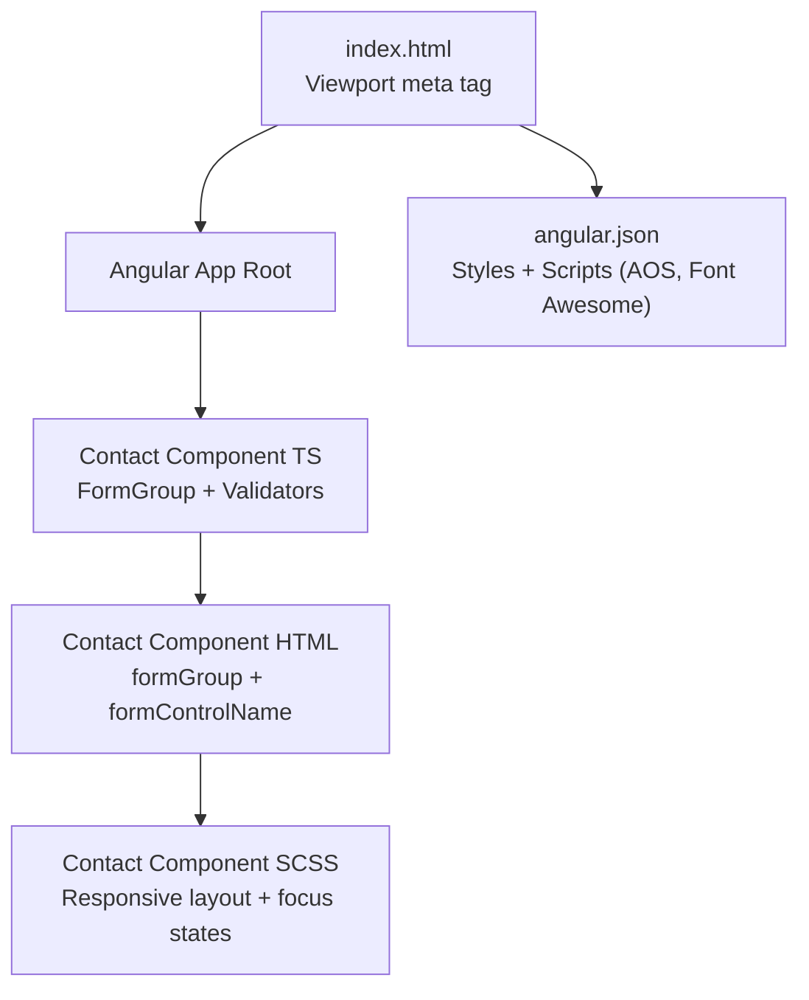
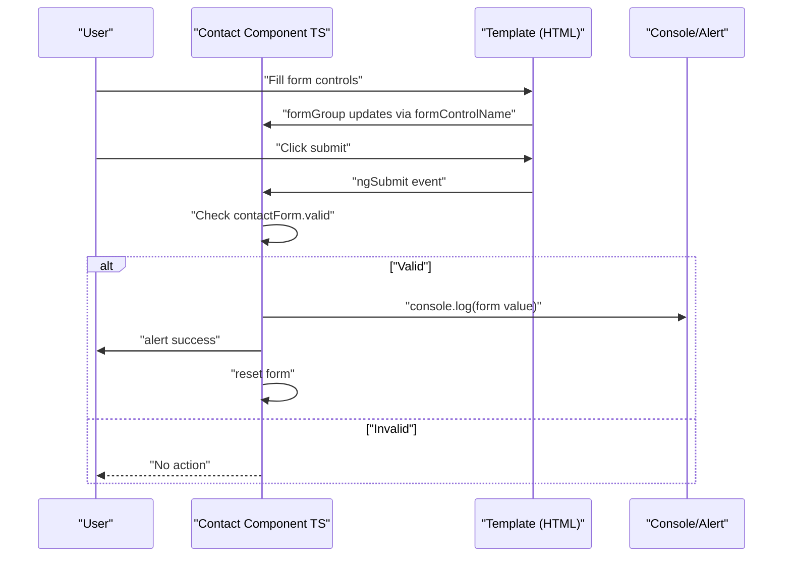
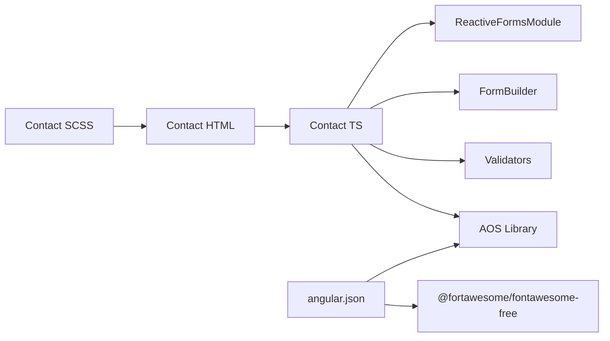

# Form Handling (Contact Form)

<cite>
**Referenced Files in This Document**
- [contact.component.ts](file://src/app/contact/contact.component.ts)
- [contact.component.html](file://src/app/contact/contact.component.html)
- [contact.component.scss](file://src/app/contact/contact.component.scss)
- [index.html](file://src/index.html)
- [angular.json](file://angular.json)
</cite>

## Table of Contents
1. [Introduction](#introduction)
2. [Project Structure](#project-structure)
3. [Core Components](#core-components)
4. [Architecture Overview](#architecture-overview)
5. [Detailed Component Analysis](#detailed-component-analysis)
6. [Dependency Analysis](#dependency-analysis)
7. [Performance Considerations](#performance-considerations)
8. [Troubleshooting Guide](#troubleshooting-guide)
9. [Conclusion](#conclusion)

## Introduction
This document explains the contact form implementation using Angular’s Reactive Forms approach. It covers the creation of the contactForm FormGroup with FormBuilder, the validation rules applied to each control, the template-driven rendering with two-way binding, and how the form status controls the submit button state. It also describes the current onSubmit handler behavior and outlines how it can be extended to integrate with backend services. Accessibility considerations and mobile input optimization are addressed to ensure a robust, user-friendly experience.

## Project Structure
The contact form resides in the contact feature module. The component integrates Angular’s reactive forms, uses SCSS for responsive styling, and relies on global styles and third-party libraries included via the build configuration.

**Diagram sources**
- [index.html](file://src/index.html#L1-L21)
- [contact.component.ts](file://src/app/contact/contact.component.ts#L1-L40)
- [contact.component.html](file://src/app/contact/contact.component.html#L1-L77)
- [contact.component.scss](file://src/app/contact/contact.component.scss#L1-L390)
- [angular.json](file://angular.json#L1-L149)

**Section sources**
- [contact.component.ts](file://src/app/contact/contact.component.ts#L1-L40)
- [contact.component.html](file://src/app/contact/contact.component.html#L1-L77)
- [contact.component.scss](file://src/app/contact/contact.component.scss#L1-L390)
- [index.html](file://src/index.html#L1-L21)
- [angular.json](file://angular.json#L1-L149)

## Core Components
- Reactive Form Setup: The component initializes a FormGroup using FormBuilder with controls for firstName, lastName, email, phone, inquiryType, and message. Validation rules include required fields and email pattern validation.
- Template Rendering: The template binds the form group to the form element and individual controls via formGroup and formControlName directives. The submit button is disabled when the form is invalid.
- Submit Handler: On submission, the component logs the form value to the console, shows a success alert, and resets the form.

Key implementation references:
- Reactive form initialization and validators: [contact.component.ts](file://src/app/contact/contact.component.ts#L17-L30)
- Template binding and submit button state: [contact.component.html](file://src/app/contact/contact.component.html#L51-L71)
- Submit handler behavior: [contact.component.ts](file://src/app/contact/contact.component.ts#L32-L38)

**Section sources**
- [contact.component.ts](file://src/app/contact/contact.component.ts#L17-L38)
- [contact.component.html](file://src/app/contact/contact.component.html#L51-L71)

## Architecture Overview
The contact form follows Angular’s reactive forms architecture. The component encapsulates the form model and validation logic, while the template binds to the model and exposes user interactions.

**Diagram sources**
- [contact.component.ts](file://src/app/contact/contact.component.ts#L32-L38)
- [contact.component.html](file://src/app/contact/contact.component.html#L51-L71)

## Detailed Component Analysis

### Reactive Form Model and Validation
- Controls and Validation:
  - firstName: required
  - lastName: required
  - email: required and email pattern
  - phone: optional (no validator)
  - inquiryType: required
  - message: required
- Initialization:
  - The component creates the FormGroup in ngOnInit using FormBuilder and assigns it to contactForm.
- Current Behavior:
  - The submit handler checks validity and logs the value to the console, shows an alert, and resets the form.

Implementation references:
- FormGroup creation and validators: [contact.component.ts](file://src/app/contact/contact.component.ts#L21-L29)
- Submit handler logic: [contact.component.ts](file://src/app/contact/contact.component.ts#L32-L38)

**Section sources**
- [contact.component.ts](file://src/app/contact/contact.component.ts#L21-L38)

### Template Binding and Submit Button State
- The form element binds to the FormGroup using formGroup.
- Individual controls bind to form controls using formControlName.
- The submit button is disabled when the form is invalid using [disabled]="contactForm.invalid".
- Required attributes are present on inputs/select/textarea to support native validation hints.

Implementation references:
- Form binding and controls: [contact.component.html](file://src/app/contact/contact.component.html#L51-L70)
- Submit button disabled state: [contact.component.html](file://src/app/contact/contact.component.html#L71-L71)

**Section sources**
- [contact.component.html](file://src/app/contact/contact.component.html#L51-L71)

### Accessibility Considerations
- Viewport Meta Tag: The application includes a viewport meta tag to ensure proper scaling on mobile devices.
- Focus Management: The SCSS defines focus styles for inputs, enhancing keyboard navigation visibility.
- Native Validation Hints: The presence of required attributes on inputs helps assistive technologies announce required fields.

References:
- Viewport meta tag: [index.html](file://src/index.html#L6-L12)
- Focus styles for inputs: [contact.component.scss](file://src/app/contact/contact.component.scss#L177-L181)

**Section sources**
- [index.html](file://src/index.html#L6-L12)
- [contact.component.scss](file://src/app/contact/contact.component.scss#L177-L181)

### Mobile Input Optimization
- Responsive Layout:
  - The form stacks inputs on small screens and arranges them side-by-side on tablets and larger screens.
  - Flexbox and media queries adapt spacing, font sizes, and input widths for readability and usability.
- Input Sizing and Spacing:
  - Inputs, selects, and textareas use percentage widths and padding to fit various screen sizes.
  - Focus states improve visibility and usability on touch devices.
- Reduced Motion:
  - The global styles include a reduced motion preference guard to respect user preferences.

References:
- Responsive grid and input stacking: [contact.component.scss](file://src/app/contact/contact.component.scss#L141-L183)
- Media queries for breakpoints: [contact.component.scss](file://src/app/contact/contact.component.scss#L154-L163)
- Global reduced motion guard: [contact.component.scss](file://src/app/contact/contact.component.scss#L1-L20)

**Section sources**
- [contact.component.scss](file://src/app/contact/contact.component.scss#L141-L183)
- [contact.component.scss](file://src/app/contact/contact.component.scss#L154-L163)
- [contact.component.scss](file://src/app/contact/contact.component.scss#L1-L20)

### Error Message Display (Current Implementation)
- The current template does not render explicit error messages. The submit button is disabled when the form is invalid, providing a basic user feedback mechanism.
- To add error messages, you can leverage control-level validation states (e.g., control.touched && control.invalid) and display messages conditionally in the template. This would involve:
  - Accessing control errors via the form control reference.
  - Showing messages based on specific validators (required, email).
  - Ensuring messages appear only when the control is touched and invalid.

Note: The current template does not include explicit error message blocks. Extending it would require adding conditional templates alongside each control.

**Section sources**
- [contact.component.html](file://src/app/contact/contact.component.html#L51-L71)

### Backend Integration Extension
- Current onSubmit behavior:
  - Logs the form value to the console.
  - Shows a success alert.
  - Resets the form.
- Extension points:
  - Replace console logging with an HTTP client call to a backend endpoint.
  - Add loading states and error handling around the request.
  - Consider adding a success/error toast notification or redirect after successful submission.

References:
- Submit handler: [contact.component.ts](file://src/app/contact/contact.component.ts#L32-L38)

**Section sources**
- [contact.component.ts](file://src/app/contact/contact.component.ts#L32-L38)

## Dependency Analysis
- Angular Forms:
  - The component imports ReactiveFormsModule and uses FormBuilder and Validators to construct the form model.
- Third-Party Libraries:
  - AOS animation library is initialized in the component.
  - Styles and scripts include AOS and Font Awesome via angular.json.
- Global Styles:
  - The project applies global styles and prefers reduced motion, contributing to accessibility and UX.

**Diagram sources**
- [contact.component.ts](file://src/app/contact/contact.component.ts#L1-L10)
- [contact.component.html](file://src/app/contact/contact.component.html#L51-L71)
- [contact.component.scss](file://src/app/contact/contact.component.scss#L1-L30)
- [angular.json](file://angular.json#L35-L44)

**Section sources**
- [contact.component.ts](file://src/app/contact/contact.component.ts#L1-L10)
- [angular.json](file://angular.json#L35-L44)

## Performance Considerations
- Reactive forms are efficient for dynamic forms and provide fine-grained control over validation and state.
- Keep validation logic lightweight; avoid heavy synchronous computations in validators.
- Debounce or throttle expensive operations if needed (e.g., server-side validation).
- Minimize DOM updates by relying on Angular’s change detection and avoiding unnecessary re-renders.

[No sources needed since this section provides general guidance]

## Troubleshooting Guide
- Form remains disabled:
  - Ensure all required controls are filled and the email control matches the email pattern.
  - Verify that the form is bound to the component via formGroup and that formControlName is set on each input.
- Submit button does nothing:
  - Confirm the ngSubmit event is wired to the component’s onSubmit method.
  - Check that the submit handler evaluates contactForm.valid and performs actions accordingly.
- Console logging not visible:
  - Open browser developer tools to inspect the console output.
- Alert appears unexpectedly:
  - The current implementation triggers an alert upon successful validation. If alerts are undesired, replace with a non-blocking success indicator.

References:
- Form binding and submit wiring: [contact.component.html](file://src/app/contact/contact.component.html#L51-L71)
- Submit handler logic: [contact.component.ts](file://src/app/contact/contact.component.ts#L32-L38)

**Section sources**
- [contact.component.html](file://src/app/contact/contact.component.html#L51-L71)
- [contact.component.ts](file://src/app/contact/contact.component.ts#L32-L38)

## Conclusion
The contact form is implemented with Angular’s reactive forms, providing a clean separation between the form model and the template. Validation rules are applied to required fields and email formatting, and the submit button state reflects the form’s validity. The template is responsive and accessible, with focus states and viewport configuration supporting mobile usage. The current onSubmit handler can be extended to integrate with backend services while maintaining the existing validation and UX patterns.