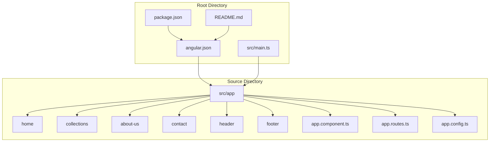
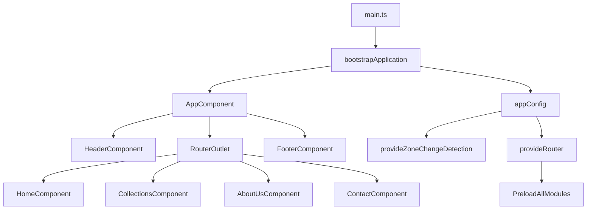
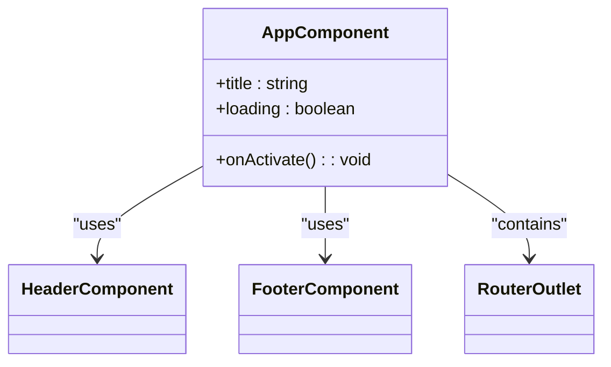
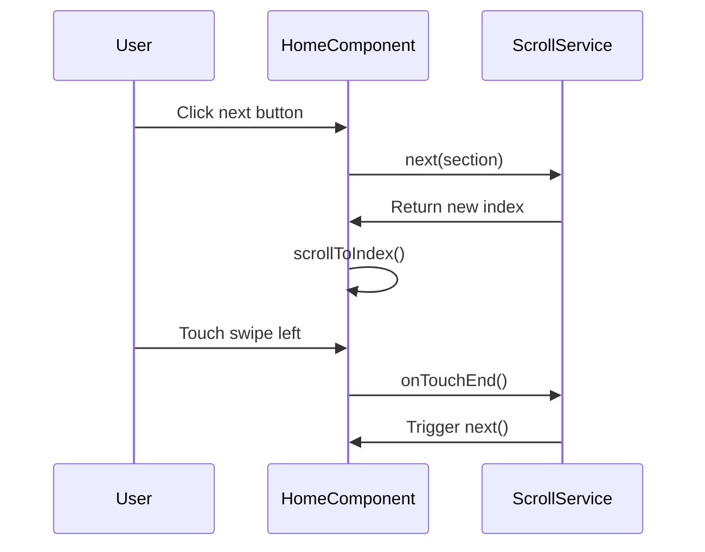
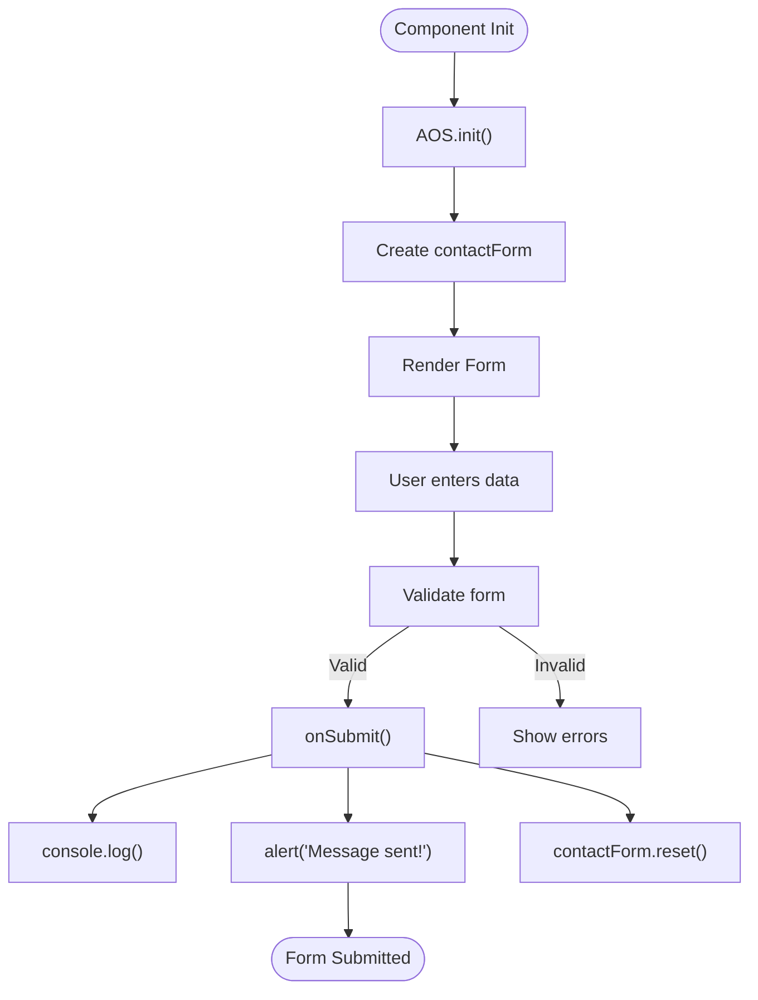

# Project Overview

<cite>
**Referenced Files in This Document**   
- [README.md](file://README.md)
- [package.json](file://package.json)
- [angular.json](file://angular.json)
- [src/main.ts](file://src/main.ts)
- [src/app/app.component.ts](file://src/app/app.component.ts)
- [src/app/app.routes.ts](file://src/app/app.routes.ts)
- [src/app/app.config.ts](file://src/app/app.config.ts)
- [src/app/header/header.component.ts](file://src/app/header/header.component.ts)
- [src/app/footer/footer.component.ts](file://src/app/footer/footer.component.ts)
- [src/app/home/home.component.ts](file://src/app/home/home.component.ts)
- [src/app/collections/collections.component.ts](file://src/app/collections/collections.component.ts)
- [src/app/about-us/about-us.component.ts](file://src/app/about-us/about-us.component.ts)
- [src/app/contact/contact.component.ts](file://src/app/contact/contact.component.ts)
- [src/app/home/service/scroll.service.ts](file://src/app/home/service/scroll.service.ts)
</cite>

## Table of Contents
1. [Introduction](#introduction)
2. [Project Structure](#project-structure)
3. [Core Components](#core-components)
4. [Architecture Overview](#architecture-overview)
5. [Detailed Component Analysis](#detailed-component-analysis)
6. [Dependency Analysis](#dependency-analysis)
7. [Performance Considerations](#performance-considerations)
8. [Troubleshooting Guide](#troubleshooting-guide)
9. [Conclusion](#conclusion)

## Introduction
The kvs_website project is a frontend Angular application designed for KVS Furniture, a furniture brand with a legacy dating back to 1991 in Nilambur. The application serves as a digital showcase for the brand's product collections, company heritage, and craftsmanship. Built as a component-based single-page application (SPA) using Angular 20 with standalone components, it provides a seamless user experience with client-side routing, responsive design, and interactive features. The website enables users to explore furniture collections, learn about the company's history, and submit inquiries through a contact form. This documentation provides a comprehensive overview of the application's architecture, components, features, and development workflows.

**Section sources**
- [README.md](file://README.md#L1-L60)
- [package.json](file://package.json#L1-L42)

## Project Structure
The kvs_website project follows a standard Angular CLI structure with a clear separation of concerns. The application is organized into feature modules under the `src/app/` directory, including `home`, `collections`, `about-us`, `contact`, `header`, and `footer`. Each component has its own directory containing HTML, SCSS, TypeScript, and spec files. The core application configuration is managed through `app.routes.ts` for routing and `app.config.ts` for application-level providers. Global styles are defined in `styles.scss`, and assets are stored in the `src/assets/` directory. The `public/` folder contains the `index.html` file, which serves as the entry point for the application.



**Diagram sources**
- [src/app](file://src/app)
- [angular.json](file://angular.json#L1-L149)

**Section sources**
- [src/app](file://src/app)
- [angular.json](file://angular.json#L1-L149)

## Core Components
The kvs_website application is built around several core components that define its structure and functionality. The `AppComponent` serves as the root component, orchestrating the layout by including the `HeaderComponent` and `FooterComponent` across all views. The `HomeComponent` acts as the landing page, featuring hero sections, collections, and best sellers with horizontal scrolling carousels. The `CollectionsComponent` allows users to browse products by category, while the `AboutUsComponent` and `ContactComponent` provide company information and inquiry functionality. These components work together to create a cohesive user experience that aligns with the brand's identity and business objectives.

**Section sources**
- [src/app/app.component.ts](file://src/app/app.component.ts#L1-L21)
- [src/app/header/header.component.ts](file://src/app/header/header.component.ts#L1-L17)
- [src/app/footer/footer.component.ts](file://src/app/footer/footer.component.ts#L1-L12)
- [src/app/home/home.component.ts](file://src/app/home/home.component.ts#L1-L180)
- [src/app/collections/collections.component.ts](file://src/app/collections/collections.component.ts#L1-L32)
- [src/app/about-us/about-us.component.ts](file://src/app/about-us/about-us.component.ts#L1-L12)
- [src/app/contact/contact.component.ts](file://src/app/contact/contact.component.ts#L1-L40)

## Architecture Overview
The kvs_website application follows a modern Angular architecture with standalone components and lazy loading. The application bootstraps through `main.ts`, which calls `bootstrapApplication` with `AppComponent` and `appConfig`. The routing system is configured in `app.routes.ts` using dynamic imports for lazy loading, improving initial load performance. The `appConfig` provides essential services like zone change detection and router configuration with preloading of all modules. The component tree is structured with `AppComponent` at the root, containing `HeaderComponent`, `FooterComponent`, and `RouterOutlet` for dynamic content. This architecture enables efficient code splitting, improved performance, and maintainable code organization.



**Diagram sources**
- [src/main.ts](file://src/main.ts#L1-L7)
- [src/app/app.component.ts](file://src/app/app.component.ts#L1-L21)
- [src/app/app.config.ts](file://src/app/app.config.ts#L1-L9)
- [src/app/app.routes.ts](file://src/app/app.routes.ts#L1-L27)

**Section sources**
- [src/main.ts](file://src/main.ts#L1-L7)
- [src/app/app.component.ts](file://src/app/app.component.ts#L1-L21)
- [src/app/app.config.ts](file://src/app/app.config.ts#L1-L9)
- [src/app/app.routes.ts](file://src/app/app.routes.ts#L1-L27)

## Detailed Component Analysis

### AppComponent Analysis
The `AppComponent` serves as the root component of the kvs_website application, providing the overall structure and layout. It imports and uses `HeaderComponent`, `FooterComponent`, and `RouterOutlet` to create a consistent user interface across all views. The component implements a simple loading state that hides content briefly during navigation to improve user experience. This approach ensures that users see a complete page rather than partial content during route transitions.



**Diagram sources**
- [src/app/app.component.ts](file://src/app/app.component.ts#L1-L21)

**Section sources**
- [src/app/app.component.ts](file://src/app/app.component.ts#L1-L21)

### HomeComponent Analysis
The `HomeComponent` is the primary landing page of the kvs_website application, featuring multiple interactive sections including collections and best sellers. It implements horizontal scrolling carousels with both button navigation and touch gesture support. The component uses the `ScrollService` to manage carousel state and scrolling behavior, allowing users to navigate through product collections smoothly. AOS (Animate On Scroll) animations are initialized in `ngOnInit` to enhance visual appeal as users scroll through the page. The component also includes screen size logging for debugging and responsive design purposes.



**Diagram sources**
- [src/app/home/home.component.ts](file://src/app/home/home.component.ts#L1-L180)
- [src/app/home/service/scroll.service.ts](file://src/app/home/service/scroll.service.ts#L1-L53)

**Section sources**
- [src/app/home/home.component.ts](file://src/app/home/home.component.ts#L1-L180)
- [src/app/home/service/scroll.service.ts](file://src/app/home/service/scroll.service.ts#L1-L53)

### ContactComponent Analysis
The `ContactComponent` provides a form-based interface for users to submit inquiries to KVS Furniture. It uses Angular's Reactive Forms for robust form validation, requiring fields such as first name, last name, email, inquiry type, and message. The form includes client-side validation with appropriate error states, and upon successful submission, displays a confirmation message and resets the form. AOS animations are applied to enhance the visual experience when the component loads. The component demonstrates proper separation of concerns by handling form logic in TypeScript while maintaining a clean HTML template.



**Diagram sources**
- [src/app/contact/contact.component.ts](file://src/app/contact/contact.component.ts#L1-L40)

**Section sources**
- [src/app/contact/contact.component.ts](file://src/app/contact/contact.component.ts#L1-L40)

## Dependency Analysis
The kvs_website application has a well-defined dependency structure that supports its functionality and user experience. The `package.json` file lists Angular 20 as the core framework, with additional dependencies for animations, forms, and routing. Third-party libraries include Bootstrap 5 for responsive design, Font Awesome for icons, and AOS for scroll animations. The application also uses RxJS for reactive programming patterns. Development dependencies include Jasmine and Karma for testing. The `angular.json` configuration file specifies additional dependencies loaded directly in the build process, including Bootstrap CSS/JS, Font Awesome, and AOS libraries, ensuring they are available globally across the application.

```mermaid
graph TD
A[kvs_website] --> B[@angular/core]
A --> C[bootstrap]
A --> D[@fortawesome/fontawesome-free]
A --> E[aos]
A --> F[rxjs]
B --> G[@angular/common]
B --> H[@angular/forms]
B --> I[@angular/router]
C --> J[bootstrap.min.css]
C --> K[bootstrap.min.js]
D --> L[all.min.css]
E --> M[aos.css]
E --> N[aos.js]
```

**Diagram sources**
- [package.json](file://package.json#L1-L42)
- [angular.json](file://angular.json#L1-L149)

**Section sources**
- [package.json](file://package.json#L1-L42)
- [angular.json](file://angular.json#L1-L149)

## Performance Considerations
The kvs_website application incorporates several performance optimizations to ensure a smooth user experience. The routing configuration uses lazy loading with `PreloadAllModules`, which improves initial load time by loading critical routes first and preloading others in the background. The application leverages Angular's standalone components, reducing bundle size by eliminating NgModule overhead. Carousel functionality is optimized through the `ScrollService`, which efficiently manages scroll positions and animations. AOS animations are configured with `once: true` to prevent re-animation on scroll back, improving performance. The build configuration in `angular.json` includes budget constraints to prevent bundle size bloat, with maximum warnings and errors defined for initial load, component styles, and bundles.

**Section sources**
- [src/app/app.config.ts](file://src/app/app.config.ts#L1-L9)
- [angular.json](file://angular.json#L1-L149)
- [src/app/home/home.component.ts](file://src/app/home/home.component.ts#L98-L103)

## Troubleshooting Guide
When developing or maintaining the kvs_website application, several common issues may arise. For routing problems, verify that routes in `app.routes.ts` use correct dynamic import syntax and that component paths are accurate. If AOS animations are not working, ensure that `AOS.init()` is called in the appropriate lifecycle hook and that the `data-aos` attributes are correctly applied in templates. For form validation issues in the contact form, check that all required validators are properly configured and that the form group structure matches the template controls. Carousel navigation problems may indicate issues with the `ScrollService` or incorrect references to DOM elements via `@ViewChild`. Build errors should be checked against the budget constraints in `angular.json`, as exceeding size limits can cause production builds to fail.

**Section sources**
- [src/app/app.routes.ts](file://src/app/app.routes.ts#L1-L27)
- [src/app/contact/contact.component.ts](file://src/app/contact/contact.component.ts#L1-L40)
- [src/app/home/service/scroll.service.ts](file://src/app/home/service/scroll.service.ts#L1-L53)
- [angular.json](file://angular.json#L1-L149)

## Conclusion
The kvs_website application is a well-structured Angular frontend that effectively showcases KVS Furniture's product offerings and brand identity. Its component-based architecture with standalone components and lazy loading provides a solid foundation for maintainability and performance. The application successfully implements key features such as responsive design, interactive carousels with touch support, AOS animations, and form validation, creating an engaging user experience. The development workflow is supported by standard Angular CLI commands for serving, building, and testing the application. As a real-world business solution, the website enables potential customers to explore furniture collections, learn about the company's craftsmanship heritage, and initiate contact for inquiries or custom orders, fulfilling its role as a digital storefront for the furniture brand.