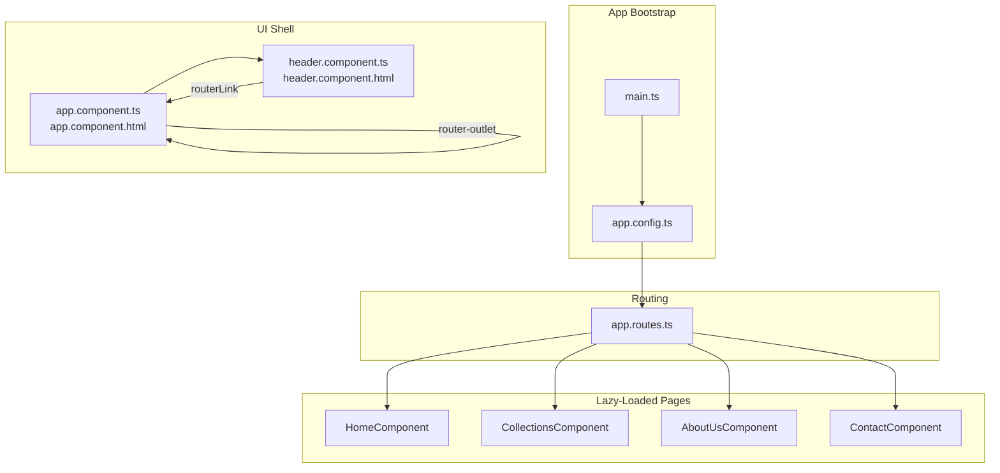
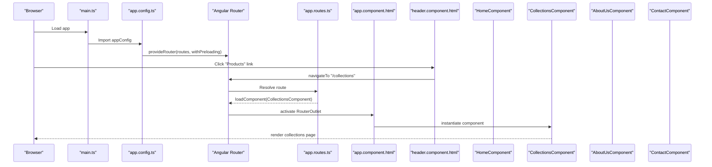
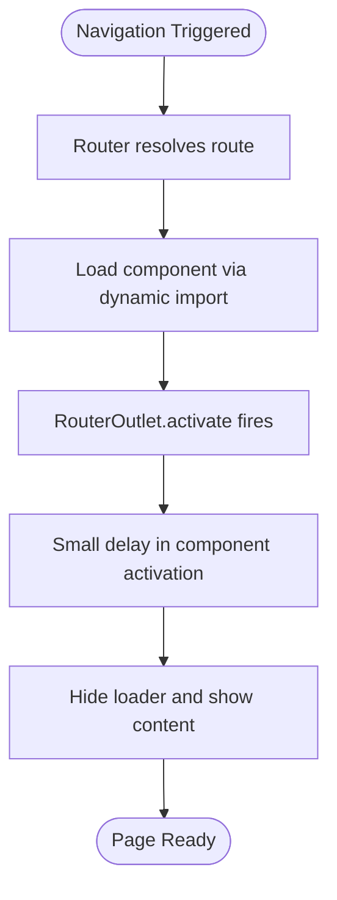
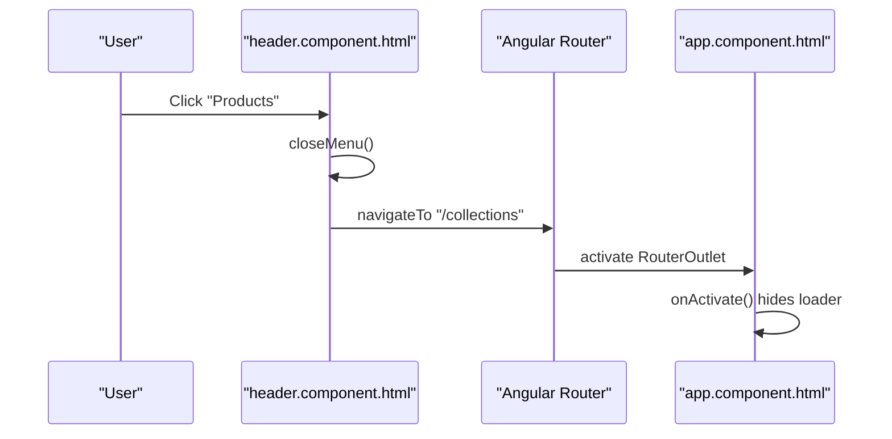
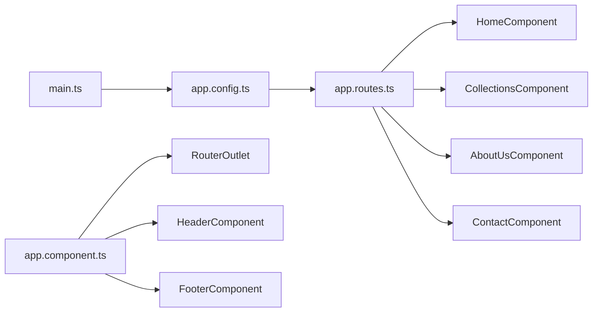

# Routing & Navigation

<cite>
**Referenced Files in This Document**
- [app.routes.ts](file://src/app/app.routes.ts)
- [app.config.ts](file://src/app/app.config.ts)
- [main.ts](file://src/main.ts)
- [app.component.ts](file://src/app/app.component.ts)
- [app.component.html](file://src/app/app.component.html)
- [header.component.ts](file://src/app/header/header.component.ts)
- [header.component.html](file://src/app/header/header.component.html)
- [HomeComponent](file://src/app/home/home.component.ts)
- [CollectionsComponent](file://src/app/collections/collections.component.ts)
- [AboutUsComponent](file://src/app/about-us/about-us.component.ts)
- [ContactComponent](file://src/app/contact/contact.component.ts)
</cite>

## Table of Contents
1. [Introduction](#introduction)
2. [Project Structure](#project-structure)
3. [Core Components](#core-components)
4. [Architecture Overview](#architecture-overview)
5. [Detailed Component Analysis](#detailed-component-analysis)
6. [Dependency Analysis](#dependency-analysis)
7. [Performance Considerations](#performance-considerations)
8. [Troubleshooting Guide](#troubleshooting-guide)
9. [Conclusion](#conclusion)

## Introduction
This document explains the client-side routing and navigation implementation for the website. It focuses on how Angular’s Router module is configured in app.routes.ts, how lazy-loaded components are wired to routes, how navigation is implemented in the header, and how RouterOutlet dynamically renders routed components. It also covers best practices for organizing routes, common issues such as route loading errors, and the relationship between URL changes and component instantiation during the Angular router lifecycle.

## Project Structure
The routing system is centered around a single routes configuration file and the application bootstrap process. The header component provides navigation links, and the root component hosts the RouterOutlet to render the active route.

**Diagram sources**
- [main.ts](file://src/main.ts#L1-L7)
- [app.config.ts](file://src/app/app.config.ts#L1-L9)
- [app.routes.ts](file://src/app/app.routes.ts#L1-L27)
- [app.component.ts](file://src/app/app.component.ts#L1-L21)
- [app.component.html](file://src/app/app.component.html#L1-L10)
- [header.component.ts](file://src/app/header/header.component.ts#L1-L17)
- [header.component.html](file://src/app/header/header.component.html#L1-L29)
- [HomeComponent](file://src/app/home/home.component.ts#L1-L180)
- [CollectionsComponent](file://src/app/collections/collections.component.ts#L1-L32)
- [AboutUsComponent](file://src/app/about-us/about-us.component.ts#L1-L12)
- [ContactComponent](file://src/app/contact/contact.component.ts#L1-L40)

**Section sources**
- [main.ts](file://src/main.ts#L1-L7)
- [app.config.ts](file://src/app/app.config.ts#L1-L9)
- [app.routes.ts](file://src/app/app.routes.ts#L1-L27)
- [app.component.html](file://src/app/app.component.html#L1-L10)
- [header.component.html](file://src/app/header/header.component.html#L1-L29)

## Core Components
- Route definitions: The routes array defines the root redirect and four named routes with lazy loading via dynamic imports.
- Application configuration: The application is configured to provide the router with preloading enabled.
- Root component: Hosts the header, RouterOutlet, and footer; includes a small loading UX hook on activation.
- Header navigation: Uses RouterLink and routerLinkActive to bind navigation and highlight the active link.
- Lazy-loaded components: Each page component is loaded on demand when its route is activated.

Key responsibilities:
- app.routes.ts: Declares routes, root redirect, and lazy loading.
- app.config.ts: Provides the router with preloading strategy.
- app.component.ts/html: Hosts the shell and RouterOutlet; manages a minimal loading UX.
- header.component.ts/html: Implements navigation links with RouterLink and active state binding.
- Page components: Standalone components representing each route.

**Section sources**
- [app.routes.ts](file://src/app/app.routes.ts#L1-L27)
- [app.config.ts](file://src/app/app.config.ts#L1-L9)
- [app.component.ts](file://src/app/app.component.ts#L1-L21)
- [app.component.html](file://src/app/app.component.html#L1-L10)
- [header.component.ts](file://src/app/header/header.component.ts#L1-L17)
- [header.component.html](file://src/app/header/header.component.html#L1-L29)
- [HomeComponent](file://src/app/home/home.component.ts#L1-L180)
- [CollectionsComponent](file://src/app/collections/collections.component.ts#L1-L32)
- [AboutUsComponent](file://src/app/about-us/about-us.component.ts#L1-L12)
- [ContactComponent](file://src/app/contact/contact.component.ts#L1-L40)

## Architecture Overview
The routing architecture follows Angular’s standard pattern:
- The application bootstraps via main.ts with appConfig.ts providing the router.
- app.routes.ts defines the route table with lazy loading.
- app.component.html contains the RouterOutlet where the active route’s component is rendered.
- The header provides navigation via RouterLink directives.

**Diagram sources**
- [main.ts](file://src/main.ts#L1-L7)
- [app.config.ts](file://src/app/app.config.ts#L1-L9)
- [app.routes.ts](file://src/app/app.routes.ts#L1-L27)
- [app.component.html](file://src/app/app.component.html#L1-L10)
- [header.component.html](file://src/app/header/header.component.html#L1-L29)
- [CollectionsComponent](file://src/app/collections/collections.component.ts#L1-L32)

## Detailed Component Analysis

### Route Definitions and Lazy Loading
- Root redirect: An empty path route redirects to “/home” with full path match.
- Named routes: “/home”, “/collections”, “/about-us”, and “/contact” each use loadComponent with dynamic imports to lazy-load their respective components.
- Lazy loading benefits: Smaller initial bundle size, improved first-load performance, and on-demand code splitting.

Route configuration highlights:
- Redirect from root to “/home”
- Dynamic imports per route for on-demand loading
- No additional guards or data resolvers in the current configuration

Best practices reflected:
- Using loadComponent for lazy loading
- Keeping routes flat and explicit for readability
- Enabling preloading to improve perceived performance

**Section sources**
- [app.routes.ts](file://src/app/app.routes.ts#L1-L27)

### Application Configuration and Preloading
- The application provides the router with a preloading strategy that eagerly loads all lazy routes after initial navigation.
- This reduces subsequent navigation latency while still deferring initial bundle size.

**Section sources**
- [app.config.ts](file://src/app/app.config.ts#L1-L9)

### Root Component and RouterOutlet Lifecycle
- The root component hosts the header, RouterOutlet, and footer.
- The RouterOutlet is bound to an activate event handler that toggles a small loading indicator after a short delay, improving UX during navigation.
- The header remains static across routes, while the outlet swaps the content.

**Diagram sources**
- [app.component.ts](file://src/app/app.component.ts#L1-L21)
- [app.component.html](file://src/app/app.component.html#L1-L10)

**Section sources**
- [app.component.ts](file://src/app/app.component.ts#L1-L21)
- [app.component.html](file://src/app/app.component.html#L1-L10)

### Header Navigation with RouterLink
- The header template uses routerLink to bind navigation targets.
- routerLinkActive applies an active class to the currently active link.
- A click handler closes the mobile menu when a link is clicked.

**Diagram sources**
- [header.component.html](file://src/app/header/header.component.html#L1-L29)
- [header.component.ts](file://src/app/header/header.component.ts#L1-L17)
- [app.component.html](file://src/app/app.component.html#L1-L10)

**Section sources**
- [header.component.html](file://src/app/header/header.component.html#L1-L29)
- [header.component.ts](file://src/app/header/header.component.ts#L1-L17)
- [app.component.html](file://src/app/app.component.html#L1-L10)

### Lazy-Loaded Components
- HomeComponent: Standalone component with imports and initialization logic.
- CollectionsComponent: Standalone component with category filtering and product rendering.
- AboutUsComponent: Minimal standalone component.
- ContactComponent: Standalone component with reactive form and submission logic.

Each component is lazy-loaded when its route is activated, as declared in app.routes.ts.

**Section sources**
- [HomeComponent](file://src/app/home/home.component.ts#L1-L180)
- [CollectionsComponent](file://src/app/collections/collections.component.ts#L1-L32)
- [AboutUsComponent](file://src/app/about-us/about-us.component.ts#L1-L12)
- [ContactComponent](file://src/app/contact/contact.component.ts#L1-L40)

## Dependency Analysis
The routing system exhibits low coupling and clear separation of concerns:
- app.routes.ts depends on page components via dynamic imports.
- app.config.ts depends on app.routes.ts for route definitions.
- app.component.ts/html depends on RouterOutlet and header/footer components.
- header.component.ts/html depends on RouterLink and active state binding.

**Diagram sources**
- [app.routes.ts](file://src/app/app.routes.ts#L1-L27)
- [app.config.ts](file://src/app/app.config.ts#L1-L9)
- [main.ts](file://src/main.ts#L1-L7)
- [app.component.ts](file://src/app/app.component.ts#L1-L21)

**Section sources**
- [app.routes.ts](file://src/app/app.routes.ts#L1-L27)
- [app.config.ts](file://src/app/app.config.ts#L1-L9)
- [app.component.ts](file://src/app/app.component.ts#L1-L21)

## Performance Considerations
- Lazy loading: Each route uses loadComponent with dynamic imports, reducing initial bundle size.
- Preloading: PreloadAllModules is enabled to improve subsequent navigations.
- Activation delay: A short delay in onActivate helps smooth transitions and avoids flicker during navigation.

Recommendations:
- Keep route definitions flat and explicit for clarity.
- Consider route-level preloading strategies for heavy pages.
- Monitor chunk sizes and split additional features if needed.

**Section sources**
- [app.config.ts](file://src/app/app.config.ts#L1-L9)
- [app.component.ts](file://src/app/app.component.ts#L1-L21)

## Troubleshooting Guide
Common issues and resolutions:
- Route not found or blank page:
  - Verify the route path and component name match the dynamic import.
  - Ensure the component selector and template path are correct.
- Navigation not highlighting active link:
  - Confirm routerLinkActive is applied to the same element as routerLink.
  - Ensure the active class is styled appropriately in global styles.
- Navigation triggers but component does not render:
  - Check that RouterOutlet exists in the root component template.
  - Confirm the component is exported and the selector matches usage.
- Route loading errors:
  - Review the browser console for dynamic import failures.
  - Validate the component path and file existence.
- Preloading impact:
  - If initial load feels slow, consider disabling preloading temporarily to isolate the cause.

**Section sources**
- [app.routes.ts](file://src/app/app.routes.ts#L1-L27)
- [app.component.html](file://src/app/app.component.html#L1-L10)
- [header.component.html](file://src/app/header/header.component.html#L1-L29)

## Conclusion
The routing and navigation system is cleanly implemented with Angular’s modern router features. Routes are defined with lazy loading, navigation is declarative via RouterLink, and RouterOutlet dynamically renders components. The configuration enables preloading for smoother UX, and the header provides intuitive navigation with active-state feedback. Following the outlined best practices and troubleshooting steps will help maintain a robust, scalable routing architecture.