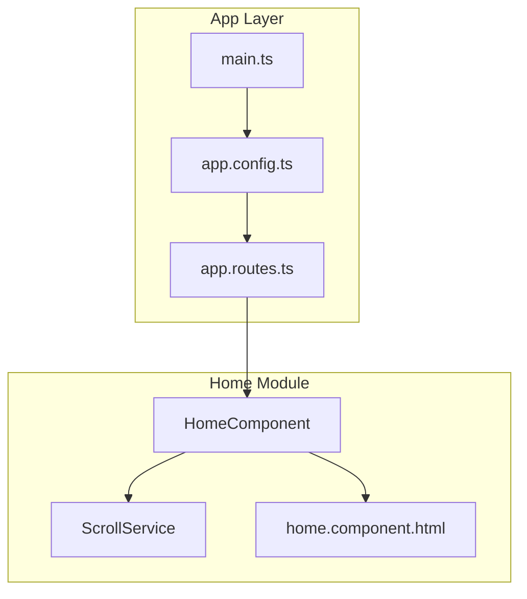
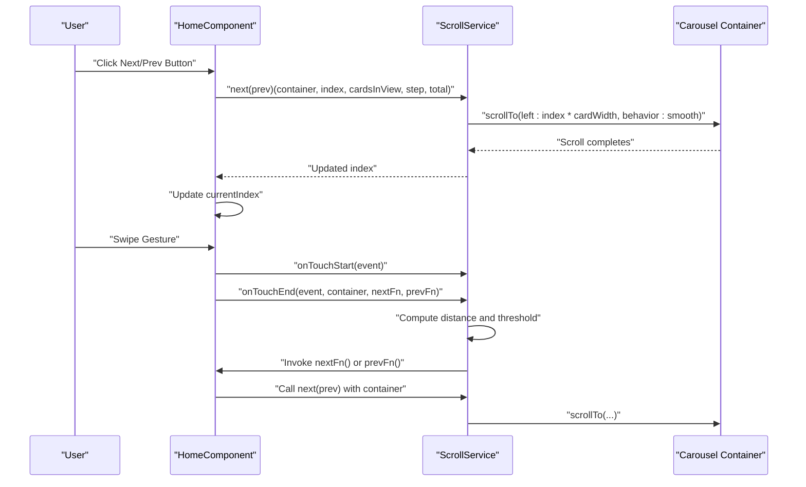
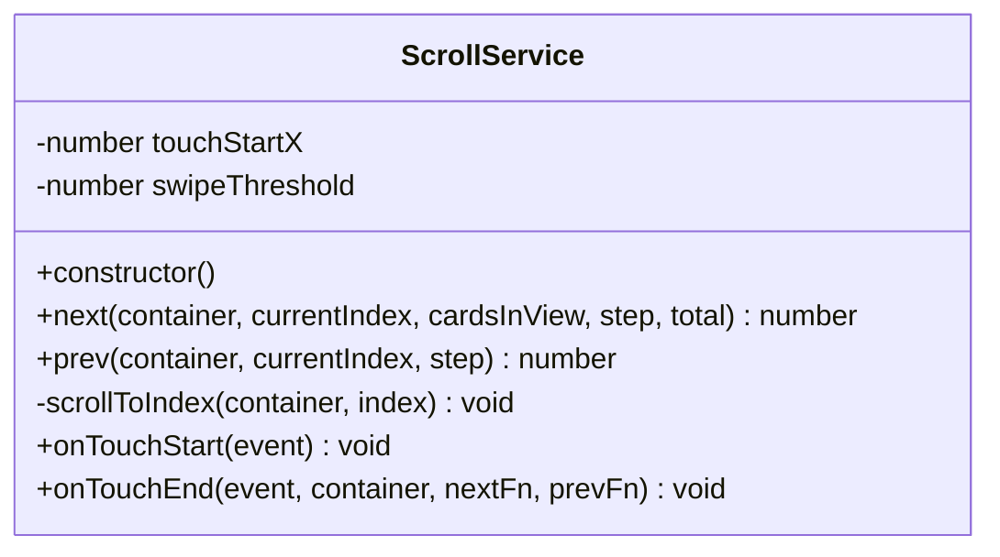
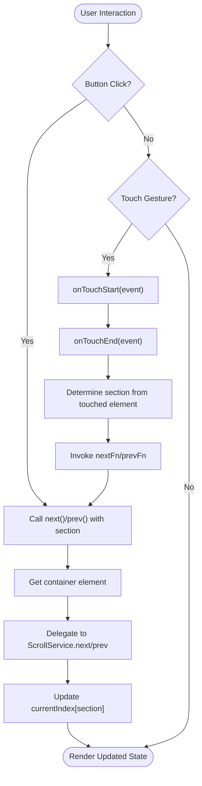
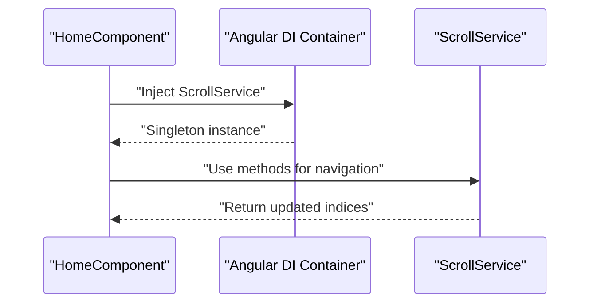
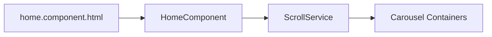

# State & Service Management

<cite>
**Referenced Files in This Document**
- [scroll.service.ts](file://src/app/home/service/scroll.service.ts)
- [scroll.service.spec.ts](file://src/app/home/service/scroll.service.spec.ts)
- [home.component.ts](file://src/app/home/home.component.ts)
- [home.component.html](file://src/app/home/home.component.html)
- [app.routes.ts](file://src/app/app.routes.ts)
- [app.config.ts](file://src/app/app.config.ts)
- [main.ts](file://src/main.ts)
</cite>

## Table of Contents
1. [Introduction](#introduction)
2. [Project Structure](#project-structure)
3. [Core Components](#core-components)
4. [Architecture Overview](#architecture-overview)
5. [Detailed Component Analysis](#detailed-component-analysis)
6. [Dependency Analysis](#dependency-analysis)
7. [Performance Considerations](#performance-considerations)
8. [Troubleshooting Guide](#troubleshooting-guide)
9. [Conclusion](#conclusion)

## Introduction
This document explains the ScrollService architecture and state management pattern used in the kvs_website application’s home page. ScrollService is an injectable service that centralizes horizontal scrolling logic for carousel navigation. It is configured as a singleton via providedIn: 'root', enabling consistent state and behavior across button clicks and touch interactions. The service exposes methods to move left/right and jump to specific items, while translating touch gestures into scroll commands. The HomeComponent injects ScrollService and delegates DOM manipulation to the service, keeping UI logic minimal and testable.

## Project Structure
The carousel feature resides under the Home module. The key files involved are:
- ScrollService: Injectable service that encapsulates scroll logic and gesture handling.
- HomeComponent: Consumes ScrollService, manages local state (current index and visibility thresholds), and binds UI events.
- Home template: Provides two carousels (Collections and Best Sellers) with arrow buttons and touch support.
- Routing and bootstrapping: The application loads the Home route lazily and bootstraps the root component.

**Diagram sources**
- [home.component.ts](file://src/app/home/home.component.ts#L1-L180)
- [scroll.service.ts](file://src/app/home/service/scroll.service.ts#L1-L53)
- [home.component.html](file://src/app/home/home.component.html#L1-L205)
- [app.routes.ts](file://src/app/app.routes.ts#L1-L27)
- [app.config.ts](file://src/app/app.config.ts#L1-L9)
- [main.ts](file://src/main.ts#L1-L7)

**Section sources**
- [home.component.ts](file://src/app/home/home.component.ts#L1-L180)
- [scroll.service.ts](file://src/app/home/service/scroll.service.ts#L1-L53)
- [home.component.html](file://src/app/home/home.component.html#L1-L205)
- [app.routes.ts](file://src/app/app.routes.ts#L1-L27)
- [app.config.ts](file://src/app/app.config.ts#L1-L9)
- [main.ts](file://src/main.ts#L1-L7)

## Core Components
- ScrollService
  - Singleton service instantiated at root level.
  - Manages internal gesture state (touchStartX) and a configurable threshold for swipe detection.
  - Exposes:
    - next(container, currentIndex, cardsInView, step, total): Computes new index and scrolls to the target card.
    - prev(container, currentIndex, step): Computes previous index and scrolls to the target card.
    - onTouchStart(event): Captures initial touch position.
    - onTouchEnd(event, container, nextFn, prevFn): Calculates swipe distance and invokes appropriate callback.
  - Internal helper:
    - scrollToIndex(container, index): Computes card width including margins and smoothly scrolls to the index position.

- HomeComponent
  - Injects ScrollService via constructor.
  - Holds local state:
    - currentIndex: Tracks current visible index for each carousel ('collections' and 'products').
    - cardsInView: Number of cards visible at once.
    - scrollStep: Step increment/decrement for navigation.
  - Provides:
    - next(section) and prev(section): Delegates to ScrollService and updates local index.
    - getContainer(section): Resolves the correct HTMLElement from ElementRef references.
    - Host listeners for touchstart/touchend to delegate gesture handling to ScrollService.
  - Template bindings:
    - Two carousels with arrow buttons bound to prev/next.
    - Each carousel has a template reference (#collectionsContainer, #productsContainer) passed to ScrollService.

Benefits of separation:
- Reusability: The same service powers both carousels and can be extended to other horizontal lists.
- Testability: ScrollService can be unit-tested independently of UI.
- Consistency: Centralized logic ensures uniform scroll behavior across interactions.

**Section sources**
- [scroll.service.ts](file://src/app/home/service/scroll.service.ts#L1-L53)
- [home.component.ts](file://src/app/home/home.component.ts#L1-L180)
- [home.component.html](file://src/app/home/home.component.html#L70-L205)

## Architecture Overview
The architecture follows a clean separation of concerns:
- UI layer (HomeComponent) handles state and user interactions.
- Service layer (ScrollService) encapsulates DOM manipulation and gesture logic.
- Template layer (home.component.html) defines the carousel UI and binds events.

**Diagram sources**
- [home.component.ts](file://src/app/home/home.component.ts#L139-L178)
- [scroll.service.ts](file://src/app/home/service/scroll.service.ts#L13-L51)
- [home.component.html](file://src/app/home/home.component.html#L80-L113)

## Detailed Component Analysis

### ScrollService
Purpose:
- Centralizes horizontal scrolling logic for carousels.
- Encapsulates gesture handling to translate touch interactions into navigation actions.
- Provides deterministic index computation and smooth scrolling behavior.

Key methods and behavior:
- next(container, currentIndex, cardsInView, step, total):
  - Computes the maximum allowable index based on total items and cardsInView.
  - Calls scrollToIndex to perform the scroll.
  - Returns the computed new index.
- prev(container, currentIndex, step):
  - Ensures index does not go below zero.
  - Calls scrollToIndex to perform the scroll.
  - Returns the computed new index.
- scrollToIndex(container, index):
  - Validates container existence.
  - Locates the target child element and computes its width plus trailing margin.
  - Smoothly scrolls the container to the computed offset.
- onTouchStart(event):
  - Stores the initial X coordinate of the touch.
- onTouchEnd(event, container, nextFn, prevFn):
  - Computes swipe distance and compares against a threshold.
  - Invokes nextFn or prevFn depending on direction.

State and configuration:
- Internal state: touchStartX, swipeThreshold.
- Singleton instantiation via providedIn: 'root'.

**Diagram sources**
- [scroll.service.ts](file://src/app/home/service/scroll.service.ts#L1-L53)

**Section sources**
- [scroll.service.ts](file://src/app/home/service/scroll.service.ts#L1-L53)

### HomeComponent
Purpose:
- Owns the carousel state and delegates scroll operations to ScrollService.
- Binds UI events (buttons and touch) to navigation actions.
- Resolves DOM containers via template references.

State management:
- currentIndex: An object keyed by section ('collections' and 'products'), tracking the first visible card index.
- cardsInView: Number of cards visible at once.
- scrollStep: Step size for navigation.

Methods and interactions:
- next(section) and prev(section):
  - Resolve the correct container element.
  - Call ScrollService methods and update local currentIndex.
- getContainer(section):
  - Returns the native element for the selected carousel.
- Host listeners:
  - onTouchStart: Delegates to ScrollService.
  - onTouchEnd: Determines which carousel was touched and invokes ScrollService with callbacks to next/prev.

Template bindings:
- Arrow buttons trigger prev/next with disabled states based on currentIndex boundaries.
- Template references #collectionsContainer and #productsContainer are passed to ScrollService.

**Diagram sources**
- [home.component.ts](file://src/app/home/home.component.ts#L139-L178)
- [home.component.html](file://src/app/home/home.component.html#L80-L113)

**Section sources**
- [home.component.ts](file://src/app/home/home.component.ts#L1-L180)
- [home.component.html](file://src/app/home/home.component.html#L70-L205)

### Dependency Injection and Singleton Behavior
- ScrollService is provided in root, making it a singleton across the application.
- HomeComponent injects ScrollService via its constructor, enabling shared state and behavior across the app lifecycle.
- Benefits:
  - Single source of truth for gesture state and thresholds.
  - Easier testing by mocking the service.
  - Reduced memory footprint and consistent behavior.

**Diagram sources**
- [home.component.ts](file://src/app/home/home.component.ts#L30-L31)
- [scroll.service.ts](file://src/app/home/service/scroll.service.ts#L3-L6)

**Section sources**
- [home.component.ts](file://src/app/home/home.component.ts#L30-L31)
- [scroll.service.ts](file://src/app/home/service/scroll.service.ts#L3-L6)

## Dependency Analysis
- HomeComponent depends on ScrollService for all carousel navigation logic.
- ScrollService depends on DOM APIs (HTMLElement, Element.children, getComputedStyle, scrollTo) and Angular’s ElementRef indirectly via passed HTMLElement references.
- Template references (collectionsContainer, productsContainer) are passed from the template to the service, decoupling DOM access from the component.

**Diagram sources**
- [home.component.ts](file://src/app/home/home.component.ts#L139-L178)
- [scroll.service.ts](file://src/app/home/service/scroll.service.ts#L13-L51)
- [home.component.html](file://src/app/home/home.component.html#L80-L113)

**Section sources**
- [home.component.ts](file://src/app/home/home.component.ts#L139-L178)
- [scroll.service.ts](file://src/app/home/service/scroll.service.ts#L13-L51)
- [home.component.html](file://src/app/home/home.component.html#L80-L113)

## Performance Considerations
- Smooth scrolling: The service uses smooth behavior for scroll animations, improving perceived performance and UX.
- Computed layout: Uses computed styles and offsets to calculate precise scroll positions, avoiding manual sizing assumptions.
- Gesture threshold: A fixed threshold prevents accidental triggers from minor touches.
- Minimal DOM access: The service receives pre-resolved HTMLElement instances, reducing repeated DOM queries.
- Index bounds: Enforces min/max indices to prevent unnecessary DOM operations.

[No sources needed since this section provides general guidance]

## Troubleshooting Guide
Common issues and resolutions:
- Carousel not scrolling:
  - Verify template references exist and are passed to ScrollService methods.
  - Ensure container children are present and measurable (width and margins computed).
- Buttons disabled unexpectedly:
  - Confirm cardsInView and total counts match the actual number of items.
  - Check that currentIndex updates correctly after navigation.
- Touch gestures ignored:
  - Ensure host listeners are attached and the touched element belongs to the correct carousel wrapper.
  - Verify the swipe threshold is not too large for the device screen size.
- Unit testing:
  - Use the existing spec to confirm the service is injectable and functional.

**Section sources**
- [scroll.service.spec.ts](file://src/app/home/service/scroll.service.spec.ts#L1-L17)
- [home.component.ts](file://src/app/home/home.component.ts#L139-L178)
- [home.component.html](file://src/app/home/home.component.html#L80-L113)

## Conclusion
ScrollService provides a robust, reusable foundation for horizontal carousel navigation in the kvs_website application. By centralizing scroll logic and gesture handling, it enables consistent behavior across button clicks and touch interactions. The separation of concerns—state in HomeComponent and DOM manipulation in ScrollService—improves maintainability, testability, and scalability. The singleton configuration ensures predictable behavior and efficient resource usage.