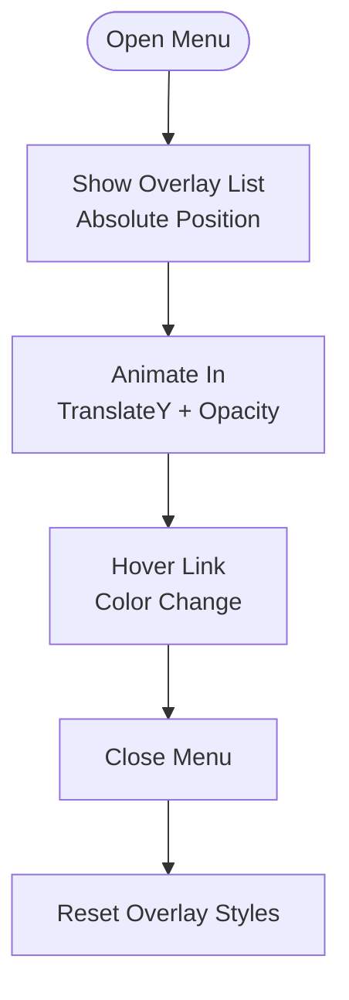

# Styling Strategy

<cite>
**Referenced Files in This Document**
- [styles.scss](file://src/styles.scss)
- [angular.json](file://angular.json)
- [package.json](file://package.json)
- [app.component.scss](file://src/app/app.component.scss)
- [header.component.scss](file://src/app/header/header.component.scss)
- [footer.component.scss](file://src/app/footer/footer.component.scss)
- [home.component.scss](file://src/app/home/home.component.scss)
- [collections.component.scss](file://src/app/collections/collections.component.scss)
- [about-us.component.scss](file://src/app/about-us/about-us.component.scss)
</cite>

## Table of Contents
1. [Introduction](#introduction)
2. [Project Structure](#project-structure)
3. [Core Components](#core-components)
4. [Architecture Overview](#architecture-overview)
5. [Detailed Component Analysis](#detailed-component-analysis)
6. [Dependency Analysis](#dependency-analysis)
7. [Performance Considerations](#performance-considerations)
8. [Troubleshooting Guide](#troubleshooting-guide)
9. [Conclusion](#conclusion)

## Introduction
This document explains the styling architecture of the kvs_website application. It describes the hybrid approach combining global styles in styles.scss with component-specific SCSS files. It details how Bootstrap 5 provides the foundational CSS framework for layout, typography, and responsive utilities, and how custom SCSS is used for horizontal scrolling containers, carousel positioning, and mobile menu behavior. It also covers the use of CSS custom properties, flexbox layouts, and overflow handling for horizontal scroll carousels, along with the responsive design strategy across breakpoints. Finally, it documents the integration of AOS animation classes and Font Awesome icons within the styling system, and provides guidance on extending the styling system for new components or theme variations.

## Project Structure
The styling system is organized around a hybrid model:
- Global styles are centralized in a single SCSS file for shared variables, mixins, and base styles.
- Component-specific SCSS files encapsulate styles scoped to individual Angular components.
- Third-party libraries (Bootstrap 5, Font Awesome, AOS) are integrated globally via the build configuration.

**Diagram sources**
- [styles.scss](file://src/styles.scss#L1-L146)
- [angular.json](file://angular.json#L35-L44)

**Section sources**
- [styles.scss](file://src/styles.scss#L1-L146)
- [angular.json](file://angular.json#L35-L44)

## Core Components
- Global SCSS variables and utilities:
  - CSS custom properties define theme colors, typography family, and spacing tokens.
  - Base typography classes leverage clamp for fluid sizing and transition effects.
- Component SCSS:
  - Header: responsive navigation bar with mobile hamburger menu, hover states, and breakpoint-specific enhancements.
  - Footer: grid-based layout with responsive columns and typography scaling.
  - Home: hero animations, manufacturing process steps, and horizontal scrolling product cards with blur/focus transitions.
  - Collections: tabbed product grid with responsive columns and hover effects.
  - About Us: flexible two-column layout with responsive adjustments.
  - App shell: loader container using flexbox for centering.

**Section sources**
- [styles.scss](file://src/styles.scss#L1-L146)
- [header.component.scss](file://src/app/header/header.component.scss#L1-L483)
- [footer.component.scss](file://src/app/footer/footer.component.scss#L1-L402)
- [home.component.scss](file://src/app/home/home.component.scss#L1-L1054)
- [collections.component.scss](file://src/app/collections/collections.component.scss#L1-L569)
- [about-us.component.scss](file://src/app/about-us/about-us.component.scss#L1-L212)
- [app.component.scss](file://src/app/app.component.scss#L1-L9)

## Architecture Overview
The styling architecture follows a layered approach:
- Foundation: Bootstrap 5 classes and utilities for layout, spacing, and responsive grids.
- Theme: Global SCSS variables and CSS custom properties for consistent colors, fonts, and spacing.
- Components: Component-specific SCSS for layout, interactions, and responsive variants.
- Effects: AOS for scroll-triggered animations and Font Awesome for iconography.

**Diagram sources**
- [angular.json](file://angular.json#L35-L44)
- [styles.scss](file://src/styles.scss#L1-L146)
- [header.component.scss](file://src/app/header/header.component.scss#L1-L483)
- [footer.component.scss](file://src/app/footer/footer.component.scss#L1-L402)
- [home.component.scss](file://src/app/home/home.component.scss#L1-L1054)
- [collections.component.scss](file://src/app/collections/collections.component.scss#L1-L569)
- [about-us.component.scss](file://src/app/about-us/about-us.component.scss#L1-L212)

## Detailed Component Analysis

### Global Styles and Variables
- CSS custom properties define primary brand colors, neutral grays, white/black, and the Poppins font family.
- Spacing tokens are defined for xs, sm, md, lg, xl to ensure consistent gutters and paddings across components.
- Base body typography sets font family, margins, and line-height.
- Typography classes use clamp for fluid headings and text, with transitions for smooth resizing.

**Section sources**
- [styles.scss](file://src/styles.scss#L1-L146)

### Header Navigation
- Mobile-first navbar with flex layout, shadow, and z-index stacking.
- Desktop links are hidden by default and revealed at tablet width with a horizontal flex layout and gap spacing.
- Mobile menu toggles via a hamburger icon, showing a vertical overlay list with absolute positioning and subtle animations.
- Contact button is hidden on mobile and shown on desktop with hover effects and transitions.
- Responsive breakpoints include tablet, desktop, large desktop, and 4K screen enhancements with increased font sizes and padding.

**Diagram sources**
- [header.component.scss](file://src/app/header/header.component.scss#L1-L483)

**Section sources**
- [header.component.scss](file://src/app/header/header.component.scss#L1-L483)

### Footer Layout
- Grid-based footer container with responsive column counts from 1 to 4 based on viewport width.
- Typography scales fluidly using clamp, with hover effects on links and social icons.
- Bottom bar uses flex layout with centered text on small screens and split alignment on larger screens.
- Extensive media queries tailor padding, font sizes, and spacing for tablet, desktop, large desktop, and 4K displays.

**Section sources**
- [footer.component.scss](file://src/app/footer/footer.component.scss#L1-L402)

### Home Page: Hero and Animations
- Hero section uses AOS animations for staggered entrance of subtitle, headline, description, and buttons.
- Flex layout stacks content on small screens and switches to a two-column grid on larger screens.
- Buttons use clamp for fluid sizing and hover transitions.

**Section sources**
- [home.component.scss](file://src/app/home/home.component.scss#L1-L187)

### Home Page: Horizontal Scrolling Collections
- Carousel container uses flexbox for alignment and spacing.
- Arrow buttons are fixed-positioned with hover and disabled states.
- Cards wrapper uses overflow hidden and relative positioning to constrain scroll.
- Cards use flex with horizontal scrolling, scroll snap, and hidden scrollbar.
- SCSS variables define card width and margins for consistent sizing.
- Blur/focus classes apply filter and opacity for inactive cards, with transitions for smooth state changes.
- Responsive adjustments reduce card widths on small screens and scale up for larger displays.

**Diagram sources**
- [home.component.scss](file://src/app/home/home.component.scss#L813-L954)

**Section sources**
- [home.component.scss](file://src/app/home/home.component.scss#L813-L954)

### Collections: Tabbed Product Grid
- Tabs use flex layout with wrap and hover/active states.
- Product grid uses CSS Grid with responsive column counts from 1 to 5 based on viewport width.
- Hover effects elevate cards and increase shadows for depth.
- Media queries adjust padding, font sizes, and spacing across tablet, desktop, large desktop, and 4K displays.
- Mobile-specific adjustments stack columns and reduce font sizes and gaps.

**Section sources**
- [collections.component.scss](file://src/app/collections/collections.component.scss#L1-L569)

### About Us: Two-Column Layout
- Flex layout stacks content on small screens and switches to a two-column arrangement on larger screens.
- Content areas use flex ratios to allocate space proportionally.
- Media queries adjust padding, font sizes, and image max-widths for various breakpoints.

**Section sources**
- [about-us.component.scss](file://src/app/about-us/about-us.component.scss#L1-L212)

### App Shell Loader
- Centered loader uses flexbox to vertically and horizontally center content within a minimum viewport height.

**Section sources**
- [app.component.scss](file://src/app/app.component.scss#L1-L9)

## Dependency Analysis
- Global styles are included via the Angular build configuration, ensuring they load before component styles.
- Bootstrap 5 is included globally to provide utility classes, grid system, and responsive helpers.
- Font Awesome is included globally for icon usage across components.
- AOS is included globally for scroll-triggered animations.

**Diagram sources**
- [angular.json](file://angular.json#L35-L44)
- [styles.scss](file://src/styles.scss#L1-L146)

**Section sources**
- [angular.json](file://angular.json#L35-L44)
- [package.json](file://package.json#L1-L42)

## Performance Considerations
- Fluid typography with clamp reduces the need for numerous media queries while maintaining readability.
- CSS custom properties centralize theme tokens, minimizing duplication and enabling efficient updates.
- Flexbox and grid layouts are performant and reduce heavy DOM manipulation.
- Scroll snapping and hidden scrollbars provide smooth UX without complex JavaScript.
- AOS animations are lightweight and triggered by scroll events; ensure only necessary elements are animated.

## Troubleshooting Guide
- If icons do not render, verify Font Awesome is included in the build configuration.
- If animations do not trigger, confirm AOS is included and initialized in the application bootstrap.
- If responsive breakpoints appear inconsistent, review component-specific media queries and compare with global spacing tokens.
- If horizontal scrolling looks clipped, inspect overflow and scroll snap settings on the cards container.

**Section sources**
- [angular.json](file://angular.json#L35-L44)
- [package.json](file://package.json#L1-L42)

## Conclusion
The kvs_website styling system combines global SCSS variables and typography with component-specific SCSS for maintainable, scalable styles. Bootstrap 5 provides a robust foundation for layout and responsiveness, while Font Awesome and AOS integrate seamlessly for icons and animations. The horizontal scrolling collections demonstrate modern CSS techniques for interactive carousels, and the responsive strategy ensures consistent experiences across a wide range of devices. Extending the system involves adding new SCSS variables in the global file, creating component-specific styles, and leveraging third-party libraries through the build configuration.