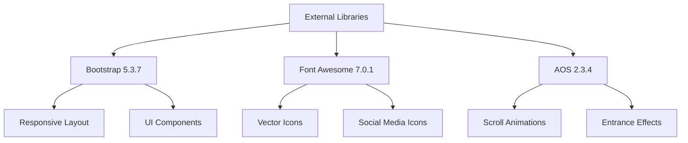

# Technology Stack & Dependencies

<cite>
**Referenced Files in This Document**   
- [package.json](file://package.json)
- [angular.json](file://angular.json)
- [tsconfig.json](file://tsconfig.json)
- [tsconfig.app.json](file://tsconfig.app.json)
- [tsconfig.spec.json](file://tsconfig.spec.json)
- [src/main.ts](file://src/main.ts)
- [src/app/app.component.ts](file://src/app/app.component.ts)
- [src/app/app.config.ts](file://src/app/app.config.ts)
- [src/app/home/home.component.ts](file://src/app/home/home.component.ts)
- [src/app/contact/contact.component.ts](file://src/app/contact/contact.component.ts)
- [src/app/footer/footer.component.html](file://src/app/footer/footer.component.html)
- [src/app/contact/contact.component.html](file://src/app/contact/contact.component.html)
- [src/styles.scss](file://src/styles.scss)
</cite>

## Table of Contents
1. [Core Framework: Angular 20](#core-framework-angular-20)
2. [Type Safety with TypeScript 5.9.2](#type-safety-with-typescript-592)
3. [UI Libraries Integration](#ui-libraries-integration)
4. [Build Tooling with Angular CLI 20.3.3](#build-tooling-with-angular-cli-2033)
5. [Configuration Files](#configuration-files)
6. [Dependency Management](#dependency-management)

## Core Framework: Angular 20

The kvs_website application is built on Angular 20, specifically version 20.3.2, as defined in the package.json dependencies. Angular serves as the core framework providing a component-based architecture that structures the application into reusable, self-contained components such as HeaderComponent, FooterComponent, and HomeComponent. The application bootstraps using the modern standalone component approach through `bootstrapApplication()` in main.ts, eliminating the need for a traditional NgModule-based bootstrap process.

The component architecture follows Angular's decorator-based pattern where each component is defined with the `@Component` decorator specifying its selector, template, and styles. Components are organized in a feature-based directory structure with dedicated folders for each major section (home, collections, contact, about-us, header, footer). The application leverages Angular's reactive programming model through RxJS (version 7.8.0), which enables asynchronous data handling and event management throughout the application.

The component hierarchy begins with AppComponent as the root component, which imports and uses other key components like HeaderComponent and FooterComponent directly through the `imports` array in the component metadata. This modular approach allows for better code organization, reusability, and maintainability across the application.

**Section sources**
- [package.json](file://package.json#L13-L20)
- [src/main.ts](file://src/main.ts#L1-L7)
- [src/app/app.component.ts](file://src/app/app.component.ts#L7-L12)
- [src/app/app.config.ts](file://src/app/app.config.ts#L6-L8)

## Type Safety with TypeScript 5.9.2

The application utilizes TypeScript 5.9.2 as specified in the devDependencies of package.json, providing robust type safety and enabling modern JavaScript features while maintaining code quality and developer productivity. TypeScript compilation is configured through multiple tsconfig.json files that define compiler options for different aspects of the application.

The base tsconfig.json file sets strict compilation options including `strict: true`, `noImplicitOverride: true`, and `strictTemplates: true`, which enforce type safety across the entire codebase. These settings help catch potential bugs at compile time rather than runtime, improving code reliability. The configuration targets ES2022 for both module and script compilation, ensuring compatibility with modern JavaScript environments while providing access to the latest language features.

TypeScript's module resolution is set to "bundler" mode, which aligns with modern build tooling practices. The configuration also enables experimentalDecorators, which is required for Angular's decorator-based syntax. Additional configuration files (tsconfig.app.json and tsconfig.spec.json) extend the base configuration with specific settings for application code and testing environments respectively, creating a consistent typing experience across all contexts.

**Section sources**
- [package.json](file://package.json#L40)
- [tsconfig.json](file://tsconfig.json#L4-L27)
- [tsconfig.app.json](file://tsconfig.app.json#L1-L16)
- [tsconfig.spec.json](file://tsconfig.spec.json#L1-L16)

## UI Libraries Integration

The application integrates several key UI libraries to enhance its visual presentation and user experience. These libraries are incorporated through the angular.json configuration file, which specifies how external assets are included in the build process.

Bootstrap 5.3.7 is integrated to provide responsive layout capabilities and UI components. It's included by adding the Bootstrap CSS and JavaScript files to the styles and scripts arrays in angular.json, ensuring they're available application-wide. This allows the application to leverage Bootstrap's grid system, responsive utilities, and component styles without requiring individual imports in each component.

Font Awesome 7.0.1 is used for iconography throughout the application, with icons appearing in various components including the contact page and footer. The library is included via the angular.json configuration, and icons are implemented using standard Font Awesome CSS classes (e.g., fas fa-map-marker-alt, fab fa-facebook-f) in component templates. This provides a comprehensive set of scalable vector icons that enhance the visual communication of interactive elements.

AOS (Animate On Scroll) 2.3.4 is integrated to create scroll-triggered animations that enhance the user experience. The library is initialized in component lifecycle hooks (ngOnInit) with specific configuration options like duration and animation persistence. This creates engaging visual effects as users navigate through different sections of the website, with animations triggered when elements enter the viewport during scrolling.

**Diagram sources**
- [package.json](file://package.json#L21-L23)
- [angular.json](file://angular.json#L35-L44)
- [src/app/home/home.component.ts](file://src/app/home/home.component.ts#L98-L103)
- [src/app/contact/contact.component.ts](file://src/app/contact/contact.component.ts#L19)
- [src/app/footer/footer.component.html](file://src/app/footer/footer.component.html#L7-L10)
- [src/app/contact/contact.component.html](file://src/app/contact/contact.component.html#L13-L40)

## Build Tooling with Angular CLI 20.3.3

The application leverages Angular CLI 20.3.3 as its primary build tool, providing a comprehensive suite of development utilities that streamline the development workflow. The CLI version is specified in package.json under devDependencies with @angular/cli at version 20.3.3, ensuring compatibility with the Angular 20 framework.

The angular.json configuration file defines the build architecture, specifying the application's root (src), browser entry point (main.ts), and output path (dist/frontend). The build process is optimized for both development and production environments, with separate configurations that adjust optimization settings, source maps, and bundle budgets accordingly.

Key CLI commands are defined in package.json scripts, including "ng serve" for the development server, "ng build" for production builds, and "ng test" for executing unit tests. The development server provides hot module replacement and automatic browser reloading, significantly improving developer productivity. Production builds include optimization features like minification, tree-shaking, and bundle budget enforcement to ensure optimal performance.

The CLI also supports code generation through schematics, allowing for rapid component creation with consistent structure and naming conventions. This is configured in angular.json to use SCSS as the default style format, maintaining consistency across all generated components.

**Section sources**
- [package.json](file://package.json#L5-L9)
- [angular.json](file://angular.json#L1-L149)

## Configuration Files

The application utilizes a comprehensive configuration system with multiple JSON files that control different aspects of the build and development process. These configuration files work together to define the application's behavior, compilation settings, and project structure.

The angular.json file serves as the primary project configuration, defining build targets, development server settings, and asset inclusion. It specifies the application's architecture including the output path, index file, browser entry point, and asset handling. Notably, it configures the inclusion of third-party libraries (Bootstrap, Font Awesome, AOS) through the styles and scripts arrays, ensuring these resources are properly bundled with the application.

The TypeScript configuration is managed through a hierarchy of tsconfig files. The base tsconfig.json establishes global compiler options with strict type checking enabled. This configuration is extended by tsconfig.app.json for application code and tsconfig.spec.json for testing code, creating specialized environments for different purposes while maintaining consistent base settings.

Additional configuration files include package.json for dependency management and script definitions, and firebase.json for Firebase deployment settings. The .firebaserc file specifies the Firebase project configuration, indicating the application is deployed using Firebase Hosting.

**Section sources**
- [angular.json](file://angular.json#L1-L149)
- [tsconfig.json](file://tsconfig.json#L1-L28)
- [tsconfig.app.json](file://tsconfig.app.json#L1-L16)
- [tsconfig.spec.json](file://tsconfig.spec.json#L1-L16)
- [package.json](file://package.json#L1-L42)
- [firebase.json](file://firebase.json)
- [.firebaserc](file://.firebaserc)

## Dependency Management

The application employs npm for dependency management, with dependencies clearly defined in the package.json file. The dependency strategy follows Angular's recommended practices, separating runtime dependencies from development dependencies while maintaining version compatibility across the technology stack.

Production dependencies include the core Angular framework packages (@angular/*) at version 20.3.2, ensuring consistency across all Angular modules. The rxjs library is included at version 7.8.0, providing the reactive programming capabilities that Angular relies on for event handling and data streams. Third-party UI libraries are specified with caret ranges (^) to allow for compatible updates while preventing breaking changes.

Development dependencies are carefully selected to support the development workflow, including @angular/cli 20.3.3 for build tooling and testing frameworks like Jasmine and Karma. TypeScript is pinned to version 5.9.2 with a tilde range (~) to allow patch updates while preventing minor version changes that might introduce compatibility issues.

The configuration enforces strict type checking and module resolution settings in tsconfig.json, which helps prevent common dependency-related issues. The build process is configured with bundle budgets in angular.json to monitor and control the size of generated bundles, ensuring optimal performance and preventing accidental bloat from dependency imports.

**Section sources**
- [package.json](file://package.json#L12-L41)
- [tsconfig.json](file://tsconfig.json#L7-L11)
- [angular.json](file://angular.json#L48-L71)