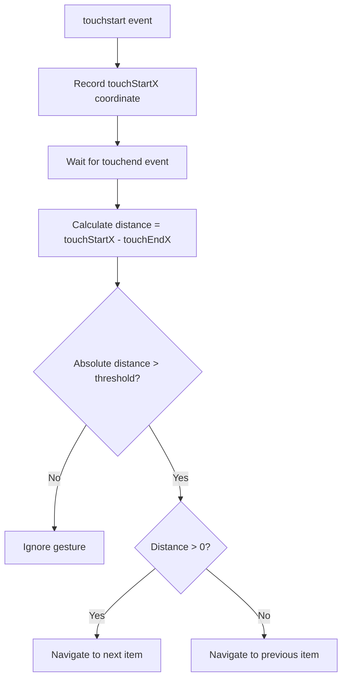
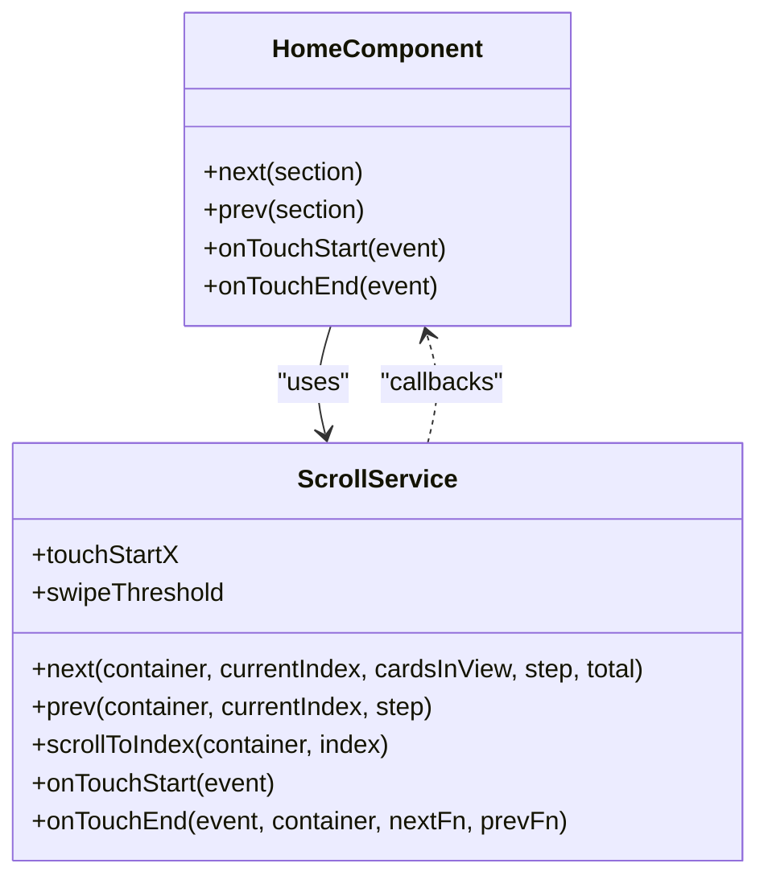

# Touch & Mobile Interaction

<cite>
**Referenced Files in This Document**   
- [home.component.ts](file://src/app/home/home.component.ts)
- [scroll.service.ts](file://src/app/home/service/scroll.service.ts)
- [home.component.html](file://src/app/home/home.component.html)
- [home.component.scss](file://src/app/home/home.component.scss)
</cite>

## Table of Contents
1. [Touch Event Handling System](#touch-event-handling-system)
2. [Touch Coordinate Tracking and Gesture Detection](#touch-coordinate-tracking-and-gesture-detection)
3. [Integration with ScrollService](#integration-with-scrollservice)
4. [Touch Behavior Prevention and Optimization](#touch-behavior-prevention-and-optimization)
5. [Challenges and Solutions](#challenges-and-solutions)
6. [Testing Considerations](#testing-considerations)

## Touch Event Handling System

The touch gesture support for horizontal scrolling is implemented through Angular's `@HostListener` decorators in the `HomeComponent`. The component captures three key touch events: `touchstart`, `touchmove`, and `touchend`, which are essential for detecting swipe gestures on mobile devices.

The `@HostListener('touchstart', ['$event'])` decorator captures the initial touch point when a user begins interacting with the collections or products carousel. This event triggers the `onTouchStart` method in the `ScrollService`, which records the starting X-coordinate of the touch. Similarly, the `@HostListener('touchend', ['$event'])` decorator captures the completion of the touch interaction, triggering the `onTouchEnd` method to calculate the swipe distance and direction.

The implementation is designed to work specifically with elements that have the `.cards` class and are within either the `.collections-section` or product sections, ensuring that touch events are properly scoped to the relevant UI components. This targeted approach prevents interference with other touch interactions on the page.

**Section sources**
- [home.component.ts](file://src/app/home/home.component.ts#L164-L178)

## Touch Coordinate Tracking and Gesture Detection

The touch coordinate tracking system is implemented in the `ScrollService` class, which maintains the state of touch interactions through the `touchStartX` property. When a `touchstart` event occurs, the system captures the initial X-coordinate using `event.touches[0].clientX`, establishing the reference point for calculating swipe distance.

The gesture detection algorithm uses a threshold-based approach to distinguish intentional swipes from accidental touches. The `swipeThreshold` is set to 50 pixels, meaning that a horizontal movement must exceed this distance to be recognized as a valid swipe gesture. This threshold prevents unintended scrolling from minor finger movements or taps.

During the `touchend` event, the system calculates the distance traveled by subtracting the ending X-coordinate (`event.changedTouches[0].clientX`) from the starting X-coordinate. If the absolute value of this distance exceeds the threshold, the system determines the swipe direction: a positive distance indicates a swipe to the left (triggering the next item), while a negative distance indicates a swipe to the right (triggering the previous item).

**Diagram sources**
- [scroll.service.ts](file://src/app/home/service/scroll.service.ts#L41-L51)

**Section sources**
- [scroll.service.ts](file://src/app/home/service/scroll.service.ts#L8-L9)
- [scroll.service.ts](file://src/app/home/service/scroll.service.ts#L41-L51)

## Integration with ScrollService

The touch event handling system is tightly integrated with the `ScrollService` methods to translate gestures into scroll commands. The `onTouchEnd` method in `ScrollService` accepts callback functions (`nextFn` and `prevFn`) that are executed based on the detected swipe direction. These callbacks are bound to the `next` and `prev` methods in `HomeComponent`, creating a clean separation between gesture detection and scroll logic.

The `next` and `prev` methods in `ScrollService` calculate the new scroll index based on the current position, step size, and container dimensions. The `scrollToIndex` method then performs the actual scrolling by calculating the target position based on the card width (including margin) and using the native `scrollTo` method with smooth behavior.

This integration allows for consistent scrolling behavior across both programmatic navigation (via arrow buttons) and touch gestures, as both interaction methods ultimately call the same `scrollToIndex` function. The service-based architecture also enables easy testing and potential reuse of the scrolling logic in other components.

**Diagram sources**
- [home.component.ts](file://src/app/home/home.component.ts#L139-L155)
- [scroll.service.ts](file://src/app/home/service/scroll.service.ts#L13-L38)

**Section sources**
- [home.component.ts](file://src/app/home/home.component.ts#L164-L178)
- [scroll.service.ts](file://src/app/home/service/scroll.service.ts#L13-L51)

## Touch Behavior Prevention and Optimization

The implementation includes several optimizations to ensure smooth horizontal swiping on mobile devices. The CSS for the carousel containers uses `overflow-x: scroll` combined with scrollbar hiding techniques (`-ms-overflow-style: none`, `scrollbar-width: none`, and `::-webkit-scrollbar { display: none }`) to provide a clean visual experience while maintaining scroll functionality.

The `cards` container uses `display: flex` with fixed-width cards (`flex: 0 0 $card-width`) and consistent margins, ensuring predictable scrolling behavior. The `scroll-snap-type: x mandatory` property enhances the user experience by snapping to card boundaries, providing tactile feedback during swipes.

On mobile devices (screen width ≤ 767px), the arrow buttons are hidden via CSS (`@media (max-width: 767px) { display: none }`), relying entirely on touch gestures for navigation. This mobile-first approach prioritizes touch interactions on smaller screens while maintaining button controls for larger devices.

The system also prevents default touch behaviors that might interfere with horizontal scrolling, such as vertical page scrolling, by allowing the touch events to propagate naturally while the horizontal scroll container handles the X-axis movement.

**Section sources**
- [home.component.scss](file://src/app/home/home.component.scss#L874-L884)
- [home.component.scss](file://src/app/home/home.component.scss#L860-L862)

## Challenges and Solutions

Several challenges were addressed in the implementation of touch gesture support. One key challenge was preventing touch event propagation issues, particularly on mobile devices where vertical scrolling might interfere with horizontal swiping. The solution was to rely on the natural event flow rather than explicitly preventing default behaviors, allowing the browser to handle touch events appropriately while the scroll container manages horizontal movement.

Multi-touch handling is implicitly managed by using only the first touch point (`event.touches[0]` and `event.changedTouches[0]`), which prevents complications from multiple fingers on the screen. This approach ensures consistent behavior regardless of whether the user uses one or multiple fingers, as only the primary touch point is considered for gesture detection.

Performance optimization for 60fps scrolling is achieved through several mechanisms: using the native `scrollTo` method with `behavior: 'smooth'`, minimizing DOM manipulation during scroll operations, and leveraging CSS hardware acceleration for transforms. The threshold-based gesture detection also reduces unnecessary calculations by ignoring minor touch movements.

A potential challenge not fully addressed in the current implementation is velocity-based scrolling, where the speed of the swipe could influence the number of items scrolled. The current system uses a fixed step size, which provides predictable behavior but doesn't support flick gestures for faster navigation.

**Section sources**
- [scroll.service.ts](file://src/app/home/service/scroll.service.ts#L41-L51)
- [home.component.scss](file://src/app/home/home.component.scss#L874-L884)

## Testing Considerations

Testing touch interactions requires consideration of various mobile devices and browsers. The current test suite includes basic unit tests for both `HomeComponent` and `ScrollService`, verifying that the components are created successfully. However, comprehensive testing of touch functionality would require additional test cases.

Key testing considerations include:
- Testing across different screen sizes and resolutions to ensure consistent touch coordinate calculations
- Verifying behavior on various mobile browsers (Safari on iOS, Chrome on Android, etc.)
- Testing with different touch input methods (finger, stylus, etc.)
- Validating the threshold detection to ensure it prevents accidental scrolling while remaining responsive to intentional swipes
- Checking performance on lower-end devices to ensure smooth 60fps scrolling

Additional integration tests should be implemented to verify the complete touch interaction flow, from `touchstart` to `touchend`, ensuring that the correct navigation methods are called based on swipe direction and distance. End-to-end tests using tools like Cypress or Puppeteer could simulate actual touch events to validate the user experience across different device types.

**Section sources**
- [home.component.spec.ts](file://src/app/home/home.component.spec.ts#L1-L24)
- [scroll.service.spec.ts](file://src/app/home/service/scroll.service.spec.ts#L1-L17)